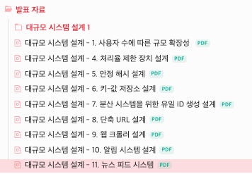

대학교 마지막 학년이자 첫 회고록이기도 하다.
작년 보안 공부를 해오면서 시스템에 대한 기초가 부족하다고 생각했었다. 그래서 보안이 아닌 개발 공부를 처음부터 다시 시작했다.

### 상반기

#### 개인 공부

상반기에 주로 했던 공부는 Go 언어, 쿠버네티스 그리고 오픈스택이다.
Go는 한번이라도 쿠버네티스 코드를 분석하고 싶다는 마음으로 시작했다. 기본적인 이론을 익히고 웹 서버를 개발했다. 비록 시작을 마이크로서비스로 구현해서 깔끔하게 마무리 하지 못했지만 Go 언어에 대한 애정은 생겼다.

- [Todopoint 서버코드 개선기 - 1. 공동 에러 처리하기](https://s0okju.github.io/p/go-code-refactor-error-1/)

내가 만든 Go 웹 애플리케이션을 쿠버네티스에 배포하고 싶었다. 처음에는 클라우드를 활용하고 싶었지만 생각보다 CSP의 쿠버네티스는 비싸서 포기했다. 마침 집에 쓰지 않은 데스크톱이 있었고 전부 포맷하여 오픈 스택 서버를 구축하게 되었다.
Multipass -> devstack -> Kolla ansible 순으로 중간에 배포 플랫폼을 바꾸는 과정에서 내가 리눅스의 리도 모르구나를 알게 되었다.
환경 세팅을 마무리하는데 정말 많은 시간이 걸렸다. 대략 한달 정도 걸렸지만 중간에 다양한 오류를 마주하면서 문제를 해결하는 방법을 터득한 것 같다.

- [Category: Ops - S0okJu.dev](https://s0okju.github.io/categories/ops/)

쿠버네티스는 긴 시간동안 천천히 책을 읽어가면서 수행했던 것 같다. 지금 생각해보면 가장 아쉬운 공부가 쿠버네티스이지 않을까 싶다.

#### 스터디 - 대규모 시스템 설계 1,2

위의 책은 현직자가 많이 읽는 것으로 알고 있다. 그래도 큰 그림을 알고 싶었고, 현직자분들로 구성되어 있는 대규모 시스템 설계 책 스터디에 참여하게 되었다.
솔직히 말하자면 어려웠다. 다른 스터디원들은 자신의 경험담과 함께 내용을 설명했지만 본인은 함께 설명할 만한 것이 없었다. 그래서 관련 기술 블로그를 찾아서 내용을 첨부했다.
학생때는 기술적인 것만 집중해서 수행한다면 현직에 종사하시는 분들은 서비스의 도메인 특징에 맞게 기술을 선택한 것이 큰 차이점이라고 생각했다. 그래서 스터디원들의 의견 하나하나가 중요했고 배울점이 많았다.

#### 기타 활동

아는 대학교 지인의 웹 서버를 개발하고 있으며 인증 로직이 필요하다고 말씀하셨다. 그래서 짧게나마 Spring Boot를 공부하고 Google OAuth 처리를 개발했다. 해당 프로젝트 팀장이 스프링 부트에 열정적인 사람이었는데 친절하게 알려준 덕분에 스프링 부트 공부를 수월하게 할 수 있었다.

- [Spring - Spring Boot 간략하게 알아보기](https://s0okju.github.io/p/basic-spring-1/)

자바와 같은 클래스 지향 언어는 자주 사용해보지 않아서 Interface는 언제 쓰며 어떤 것을 클래스로 작성해야 할까?에 대해 고민을 많이 했었다. 그래서 다른 사람들의 깃허브 레포지토리를 찾아가면서 어떻게든 해결했다.

### 하반기

#### 상반기에 했던 모든 것들을 하나로

직무로는 SRE가 되고 싶었다. 학교를 다니고 있는 입장에서 어느 기업에 소속되어 활동하는 것은 한계가 있었다. 그래서 시나리오 기반으로 시스템 아키텍쳐를 구성하고 필요한 기술들을 활용해보자! 라는 생각을 했다. 그리고 쇼핑몰이라는 가상의 도메인을 설정하여 차근차근 한 단계씩 시스템을 성장해보자는 마음으로 프로젝트를 수행했다.

- [Projects – S0okJu Tech Labs – Medium](https://medium.com/s0okju-tech/projects/home) 의 OpsAthlan 시리즈

여담으로 마이크로서비스 웹 서버 개발 프로젝트는 선택에 근거는 무조건 있어야 한다는 뼈저린 조언을 남겼다. 그래서 차근차근 성장하는 시나리오를 설정하게 된 것이다.

- [왜 TodoPoint 프로젝트를 실패했는가?](https://s0okju.github.io/p/todopoint-final-review/)

#### 클라우드 자격증

그 이전까지 프라이빗 클라우드(OpenStack)을 집중적으로 공부했지만 현실적으로 많은 기업들이 퍼블릭 클라우드 사용 기술을 요구한다.
다행히 프라이빗 클라우드를 통해 전반적인 내용은 알고 있어서 공부하는데 수월했다. 공부의 일환으로 관련 자격증을 취득했다.

- NCP Associate
- AWS Solution Architect

자격증 공부는 퍼블릭 클라우드를 이해하는데 큰 도움이 되었다. AWS는 상황을 우선 제시하고 해결 방안을 선택해야 하는 문제가 많았다. 수 많은 리소스에 대한 포괄적인 이해와 활용 능력이 필요했고 이를 연습하게 된 계기가 되었다.

#### 아쉬운 부분을 보완하다.

상반기를 보면 쿠버네티스 공부가 부족한 것에 대해 아쉬움이 남았다고 말했다. 한 해가 마무리 되던 시기에 쿠버네티스 관련 프로젝트를 수행하게 되었다. 쿠버네티스 오퍼레이터 제작과 컨테이너 모니터링 환경 구성 담당이 되었다. 자세한 내용은 2025년 블로그에서 확인할 수 있을 것이다.

### 올해의 평점

올해는 모든 과정이 의미가 있었다. 그래서 별점으로 ⭐️⭐️⭐️⭐️ 4점을 주고 싶다.
