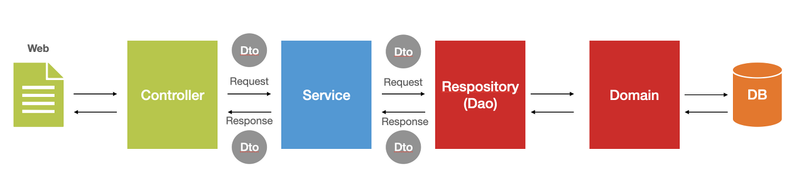
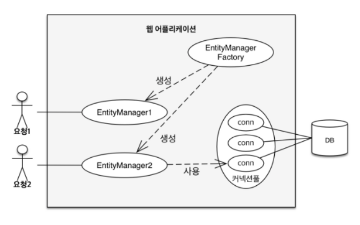

## 스프링 부트

스프링 부트의 특징은 아래의 문장으로 정리 가능하다.

> 스프링 프레임워크는 IoC/DI를 통해 객체 간의 의존 관계를 설정하고, AOP를 통해 핵심 관점과 부가 관점을 분리해 개발하며, PSA를 통해 추상화된 다양한 서비스들을 일관된 방식으로 사용하도록 한다.

- IoC : 객체의 생성과 관리를 개발자가 하는 것이 아니라 프레임워크가 대신하는 것
- DI : 외부에서 객체를 주입받아 사용하는 것
- AOP : 프로그래밍을 할 때 핵심 관점과 부가 관점을 나누어서 개발하는 것
- PSA : 어느 기술을 사용하던 일관된 방식으로 처리하는 것

IoC/DI를 통해 객체 간의 의존 관계를 설정하고, AOP를 통해 핵심 관점(service)과 부가 관점(Repository)를 분리해 개발하며, PSA(JpaRepository)를 통해 추상화된 다양한 서비스들을 일관된 방식으로 사용하도록 한다.

```java
// Service
public interface UserService {
	void createUser(UserRegisterCommand command);
    User getUserById(Long userId);
    UserLoginResponse loginUserByEmail(String email);
    Boolean logoutById(String userId);
}

@Service
public class UserServiceImp implements UserService{

    @Autowired // IoC/DI
    private UserRepository userRepository;

    @Autowired
    private UserMapper userMapper;

    @Override
    public void createUser(UserRegisterCommand command) {
        try {
            userRepository.save(new UserEntity(command.getEmail(), command.getPassword(), command.getUsername()));
        }catch (DataAccessException e){
            throw new DefaultException(ResponseMessage.DATA_ACCESS_ERROR,"user");
        }catch (Exception e){
            throw new DefaultException(ResponseMessage.DB_UNEXPECTED_ERROR,"user");
        }

    }
}

// UserRepository
// Crud에서 인터페이스 구현체가 자동으로 만들어진다.
// PSA
public interface UserRepository extends JpaRepository<UserEntity,Long>,UserCustomRepository{
}
```

### 의존성 주입

의존성 주입은 스프링 컨테이너가 생성한 객체(빈)을 주입받는 것을 의미한다. 이때 빈은 스프링 컨테이너가 생성하고 관리하는 객체를 의미한다.

주입을 받을때는 @Autowired를 사용하고, 빈을 등록하고 싶으면 @Component를 선언하면 된다. 프레임워크에 사용되는 대부분의 핵심 어노테이션은(@Repository, @Service 등) @Component가 포함되어 있다.

의존성 주입에 대해서는 [inung_92님의 velog, [Spring]스프링 기초 - DI](https://velog.io/@ung6860/Spring%EC%8A%A4%ED%94%84%EB%A7%81-%EA%B8%B0%EC%B4%88-DIDependency-Injection)을 참고하길 바란다.

## 스프링 웹 계층


- presentation 계층
  - HTTP 요청 및 응답 처리
- 비즈니스 계층
  - 비즈니스 로직 구현
- 퍼시스턴트 계층
  - 스토리지 관련 로직 추가

위와 같은 구조는 Layered Architecture라고 한다. 이때 레이어 간 응집성을 높이고 의존도를 낮추기 위해서는 계층 간 호출 시 인터페이스를 통해 호출해야 한다. 즉, 상위 계층은 직접적으로 하위 계층을 호출하지 않고 추상적인 인터페이스에 의존한다.

> Q. 응집도란?
>
> 응집도란 한 모듈 내부의 처리 요소들이 서로 관련되어 있는 정도를 말한다. 즉, 모듈이 독립적인 기능을 수행하지 또는 하나의 기능을 중심으로 책임이 잘 뭉쳐있는지를 나타내며 모듈이 높은 응집도를 가질수록 좋다.
>
> 출처 - [https://madplay.github.io/post/coupling-and-cohesion-in-software-engineering](https://madplay.github.io/post/coupling-and-cohesion-in-software-engineering)

> Q. 의존성을 왜 낮춰야 하는 걸까?
>
> A. 의존성이란 다른 객체의 영향을 받고, 다른 객체에 따라 결과가 좌우되는 것이다. 의존성을 낮춰 객체들 간 전파되는 변경에 대한 영향을 최소화 시켜, 유지보수 시 원활하게 하기 위해서이다.
>
> 출처 - [](https://velog.io/@ung6860/Spring%EC%8A%A4%ED%94%84%EB%A7%81-%EA%B8%B0%EC%B4%88-DIDependency-Injection)[https://velog.io/@ung6860/Spring스프링-기초-DIDependency-Injection](https://velog.io/@ung6860/Spring%EC%8A%A4%ED%94%84%EB%A7%81-%EA%B8%B0%EC%B4%88-DIDependency-Injection)

> Q. 의존성을 낮추는 방법?
>
> A. 기본적으로 의존성을 클래스 내부에서 new 연산자를 사용하는 것이 아닌 외부로부터 객체의 의존성을 주입받아야한다. 외부로부터 의존성을 주입받는 것의 의미는 '의존성 주입'에 초점을 맞추는게 아니라 '의존성 탈피를 위하여 외부로부터 주입'이라는 부가적인 설명에 초점을 맞추어야한다.

### Presentation

웹 클라이언트의 요청 및 응답 처리한다.

```python
@RestController
@RequestMapping("/membership/");
public class RegisterMembershipController {

  @Autowired
	private MembershipService membershipService;

	@PostMapping(path = "register")
	public Membership createmembership(@RequestBody MembershipRequest request){

		MembershipCommand command = MembershipCommand.builder()
			.name("hello").builder();

		return membershipService.createMembership(command);
}

```

보통은 @Controller를 통해 controller를 지정해줄 수 있다. rest api를 구현했는데, 이에 적합한 @RestController가 있다. `@RestController`는 @Controller + @ResponseBody라고 보면 된다. 자세한 사항은 [망나니 개발자님의 블로그](https://mangkyu.tistory.com/49)를 참고하길 바란다.

### Service

비즈니스 로직을 처리하는 계층이다.

```java
public interface MembershipService{
    Membership createMembership(MembershipCommand command);
}

@Service
public class MembershipServiceImp implements MembershipService{
    @Autowired
    MembershipRepository membershipRepository;

    @Override
    Membership createMembership(MembershipCommand command){
        membershipRepository.save(command);
    }
}
```

핵심 비즈니스 로직은 연산으로 구성된 인터페이스를 정의하고 그에 대한 구현을 따로 작성하는 것이 좋다. 그래서 컨트롤러가 인터페이스에 의존하게 되는데, 나중에서 서비스 구현이 변경되더라도 인터페이스에 의존돼 컨트롤러를 변경할 필요가 없다는 것이다.

### Repository

저장소에 접근하는 영역으로 DAO(Data Access Object) 영역이라고 부른다. @Repository를 사용하여 Spring repository를 지정해준다. 주목할 점은 인터페이스 내용이 비어 있더라도 스프링 데이터가 JPA 런타임에 인터페이스 구현체를 자동으로 만들어준다.

```java
@Repository
public interface MembershipRepository extends CrudRepository<Membership,Long> {

}
```

### DTO

계층 간에 데이터 교환을 위한 객체를 의미한다.



처음 공부 했을 때 “Dto 다 똑같은 객체겠군… 오류 발생하면 난리나겠네”라고 생각했다. **각 계층마다 Dto가 다를 수 있다.**
아래의 예시를 보면 Controller → Service에서는 Dto가 Membership 객체를 사용했다. 하지만 Membership 도메인과 실제 엔티티와 다를 경우라면 어떨까? Service → Repository에서는 Dto가 MembershipEntity가 되는 것이다.

```java
// Controller
membershipService.createMembership(member);

// MembershipService
public interface MembershipService{
    Membership createMembership(Membership member);
}

@Component
public class MembershipMapper {
	MembershipEntity MapToEntity(Membership member){
		return new MembershipEntity(
			 // ... 생략
			);
	}
}

@Service
public class MembershipServiceImp implements MembershipService{
    @Autowired
    MembershipRepository MembershipRepository;

    @Override
    Membership createMembership(Membership membership){
        MembershipRepository.save(MembershipMapper.MapToEntity(membership));
    }
}
```

## 테스트

소프트웨어 개발 시 테스트 단계는 필수다. 이 단계에서는 작성한 코드를 기반으로 검증한다. 테스트는 크게 단위 테스트와 통합 테스트가 존재한데, 단위 테스트를 집중적으로 설명하고자 한다.

단위 테스트란 하나의 모듈을 기준으로 독립적으로 진행되는 가장 작은 단위의 테스트이다. 특정 부분만 독립적으로 테스트하기 때문에 빠르게 문제 여부를 확인할 수 있게 된다.

자세한 사항은 [망나니 개발자님의 블로그](https://mangkyu.tistory.com/143)를 참고하길 바란다.

## 데이터베이스


### JPA(Java Persistent API)

관계형 데이터베이스를 사용하는 방식을 정의한 인터페이스이다. 이를 구현한 ORM 프레임워크로는 hibernate가 있다.

JPA는 다양한 쿼리 방법을 지원한다.

- JPQL
- QueryDSL
- Native SQL
- JDBC API 직접 사용

> 요즘은 QueryDSL를 사용하는 추세라고 한다.

### 앤티티

DB의 테이블과 매핑되는 객체로 DB 테이블과 직접 연결된다.

#### 영속성 컨텍스트

엔티티를 관리하는 가상 공간이다.

- 1차 캐시
  - 캐시키는 엔티티의 키로 둬서, 조회시 1차적으로 영속성 컨텍스트 내에 있는 값을 반환한다.
- 쓰기 지연
  - 빈번한 context swtiching에 대한 overhead를 줄여주기 위해 한꺼번에 모았다가 처리한다.
- 변경 감지
  - 영속성 컨텍스트 내에 있는 캐시와 변경된 entity값을 비교해서 엔티티 변경 감지 후 DB에 자동 반영
  - 비즈니스 로직, DB 상에 있는 로직의 꼬이는 것을 방지

> Q. 왜 영속성 테스트를 사용하는 것인가?
>
> A. 트랜잭션의 횟수나 방식을 효율적으로 관리해 서버의 속도를 늘리고, 중복되는 쿼리를 줄일 수 있다.

WAS가 시작되면 EntityMangerFactory가 생성되고, 트랜잭션마다 생성되는 EntityManager를 관리한다. 이때 EntityManager는 Entity의 생명 주기를 관리한다.(관리 상태, 비영속 상태, 삭제된 상태)

> 스프링 부트는 EntityManagerFactory를 하나만 생성해서 관리하고, 의존성 주입해서 사용함. 빈을 하나만 생성해서 동시성 문제를 해소했다.



### Spring data api

인터페이스 및 주석 세트를 제공해서 데이터 액세스 계층을 쉽게 구축할 수 있도록 한다. JPA를 한 단계 추상화시킨 Repository라는 인터페이스를 제공함으로써 이뤄진다.

스프링 데이터의 공통적인 기능에서 JPA의 유용한 기술이 추가 (스프링 데이터 인터페이스를 상속받아서 간단한 트랜잭션 처리 가능)

## Reference

- [Spring - ORM, JPA, Hibernate, JDBC 총정리](https://velog.io/@murphytklee/Spring-ORM-JPA-Hibernate-JDBC-%EC%B4%9D%EC%A0%95%EB%A6%AC)
- [[JPA] 객체지향 쿼리, JPQL](https://ict-nroo.tistory.com/116)
- [[TDD] 단위 테스트(Unit Test) 작성의 필요성 (1/3)](https://mangkyu.tistory.com/143)
- [[Spring]스프링 기초 - DI(Dependency Injection)](https://velog.io/@ung6860/Spring%EC%8A%A4%ED%94%84%EB%A7%81-%EA%B8%B0%EC%B4%88-DIDependency-Injection)
