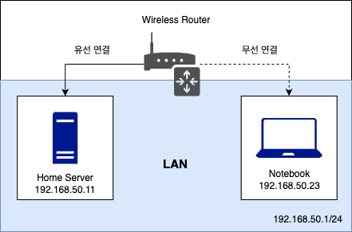
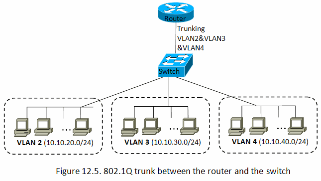
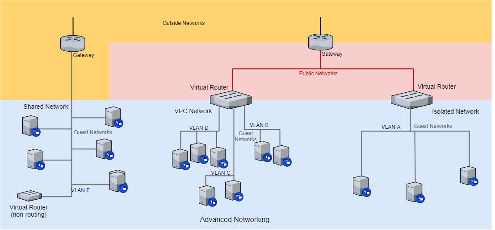
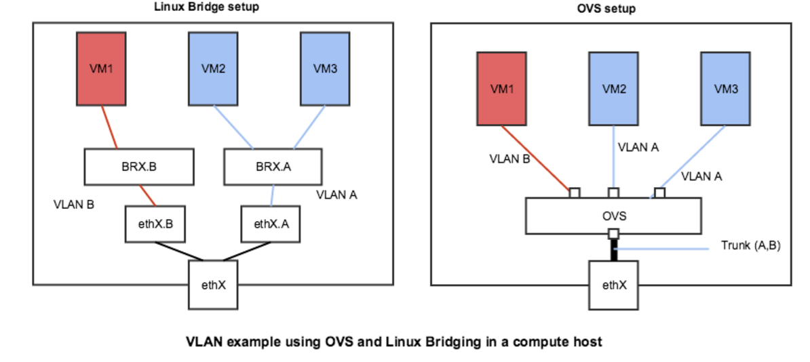

## LAN이란

LAN(Local Address Network)은 위키백과에 의하면 네트워크 매체를 이용하여 가까운 지역을 한데 묶은 컴퓨터 네트워크[^1]입니다.
그런데 이 말 자체는 상당히 추상적이라고 생각합니다. 여러 글을 찾던 중 [네트워크 엔지니어 환영의 기술 블로그](https://aws-hyoh.tistory.com/)에서 [LAN에 대해 잘 설명한 글](https://aws-hyoh.tistory.com/85)을 알게 되었습니다.

> 집과 같은 소규모 네트워크에서부터 사무실, 회사와 같은 중규모 이상의 네트워크에 이르기까지 **동일한 IP 대역과 동일한 Subnet Mask를 사용**한다면 크기와 상관 없이 LAN이라고 부를 수 있다.
>
> 출처 - [네트워크 엔지니어 환영의 기술블로그 : LAN 쉽게 이해하기 ](https://aws-hyoh.tistory.com/85)

예시를 들어보겠습니다. 저는 현재 홈 서버를 운영하고 있습니다. 기기의 IP주소를 확인하게 되면 192.168.50.x라는 동일한 IP 대역을 가지고 있습니다. 다시말해 저는 LAN을 쓰고 있다고 보면 됩니다.

여기 문제가 발생하게 됩니다. 만약에 다양한 IP 대역을 쓰고 싶다면 어떻게 해야할까요? 물리적인 장치를 추가하는 방법이 있습니다만 상황에 따라서는 불가능할 수 있습니다. 또 다른 해결 방안으로 VLAN이 있습니다.

## VLAN

하나의 단일 네트워크는 하나의 브로드캐스트 영역이며 이러한 구간을 LAN이라고 합니다. 이때 VLAN은 LAN 논리적으로 브로드캐스트 도메인을 나누는 영역이라고 표현할 수 있습니다. 즉 하나의 스위치 만으로도 **여러 개의 네트워크 대역을 사용**할 수 있게 되는 것입니다.

**VLAN은 네트워크를 분할만하지 서로 통신하는 기능을 제공하지 않습니다.** 위의 그림처럼 VLAN2의 패킷을 VLAN3에 보낼 수 없게 됩니다. 그러므로 L3 스위치 또는 라우터를 사용하여 VLAN 간의 라우팅을 수행해야 합니다.

> L3 스위치와 라우터는 초기에는 기술적인 차이가 있었으나 기술의 발전으로 차이가 거의 없다고 합니다.  
> L3 스위치가 L2 스위치 + 라우터의 특징을 가지고 있으며, VLAN을 사용하기가 더 효율적이라고 합니다. [^2]

VLAN은 이와 같은 설명이 전부는 아닙니다. 스위치 간 어떻게 통신할지 등등 관련된 이야기가 많습니다. 그러나 이해를 위해 네트워크를 분할한다는 점만 알아주세요.

## VLAN과 Cloud Network

퍼블릭 클라우드에서는 VPC를 정의한 후 Private, Public 서브넷을 정의하게 됩니다. 당연한 말이지만 물리적인 장치와 1:1 매칭하다보면 "어떻게?" 라는 물음만 남는 것 같습니다. 자료를 찾아보면서 내린 결론은 클라우드 네트워킹의 핵심은 **가상화**라는 것이었습니다.

Cloud에서는 가상 라우터를 통해 Network(VPC)를 구성하고, VLAN을 활용하여 Subnet을 구성하게 됩니다. 그리고 클라우드 리소스는 Subent에서 ip를 할당받아 네트워크 범위 내에서 통신하게 됩니다.

## 다음 이야기 - Openstack를 통해 알아보는 클라우드 네트워크

Openstack은 Cloud OS로 오픈소스입니다. AWS와 같은 퍼블릭 클라우드 내부구조는 공개되지 않았지만 Openstack를 통해 큰 틀의 클라우드 구조를 파악할 수 있습니다.  
Openstack은 네트워크 구성 시 OVS를 사용합니다. Openstack에서도 다른 퍼블릭 클라우드처럼 Subnet 개념이 존재하며 VLAN 기술을 사용하게 됩니다.

> OVS는 다중 계층 스위치의 오픈소스 구현체로 여러 프로토콜 및 표준을 지원하면서 하드웨어 가상화 환경을 위한 스위칭 스택을 제공합니다.[^3]

현재 홈서버로 Openstack를 활용하고 있습니다. 다음 글에서 홈서버를 통해 어떻게 네트워크가 구성되었는지 자세히 말씀 드리겠습니다.

# Reference

- https://aws-hyoh.tistory.com/75

[^1]: https://ko.wikipedia.org/wiki/%EA%B7%BC%EA%B1%B0%EB%A6%AC_%ED%86%B5%EC%8B%A0%EB%A7%9D
[^2]: 그림으로 배우는 네트워크 원리, Gene 저자, 영진닷컴
[^3]: https://en.wikipedia.org/wiki/Open_vSwitch
