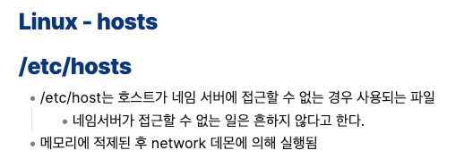

나는 소규모 작문 스터디를 통해 [글또](https://zzsza.notion.site/ac5b18a482fb4df497d4e8257ad4d516)를 알게 되었다. 스터디 모집 설명글에는 글또 합격을 위한 글쓰기 연습이라고 적혀 있었다. 남은 한 기수가 마지막이 될 것이다는 모집 페이지를 보고 모집 알림 메일을 신청했다.  
잊혀질때 쯤 글또 모집 메일을 받게 되었다. 나의 일생, 자기소개 등 다양한 질문에 대한 답을 글로 써가면서 몇년동안의 노력을 정리했고 나의 바램과 함께 글또에 합격하게 되었다.

## 글또에서 나의 방향

우선 글또는 소모임부터 시작해서 커피챗까지 다양한 활동이 있다. 글쓰기와 사람들과의 소통 두 마리 토끼를 잡을 수 있다면 좋겠지만 시간 관계상 모두 챙길 수 없을 것 같았다. 그래서 나는 **글쓰기에 초점**을 맞추기로 결심했다.

## OT를 들으면서...

OT를 들으면서 가장 기억에 남은 문장이 있다.

> 공부하고 글쓰기

지금까지 기술 관련된 글을 써왔다. 글쓰는 과정에서 공부를 했고 그 과정에서 많은 수정 작업이 수행되었다. 단점은 뒤로 갈수록 힘이 빠진다는 점이었다. 분명히 논리적으로 맞지 않음에도 수정을 멈추고 바로 블로그에 업로드했다. 이러한 패턴을 알아서 그런지 위의 문장은 나의 잘못된 글쓰기의 태도를 상기시켜줬다.

## 지금까지 나는 어떤 글쓰기를 해왔나?

초반에는 완벽하게 써야한다는 생각이 글쓰기를 어렵게 만들었다. 해결책으로 기술 관련된 것만큼은 가급적이면 가볍게 정리하려고 노력했다. 추가적으로 공부할때마다 내용을 추가했고 page를 임베딩하여 내용을 연결하는 형식을 사용했다.

단점으로는 블로그에 **글을 쓸때마다 내가 정리해둔 이론을 보지 않는다는 점**이었다. 시간이 지날수록 내용을 추가하지 않은 점도 문제였다.

메모라는 제목에 파일만 계속 생겨나면서 온라인 노트는 혼잡스러운 메모장이 되어 있었다.

## 글또에서 쓰고 싶은 글

지금까지 해왔던 것처럼 **사이드 프로젝트를 통해 배운 내용 위주**로 작성할 것 같다.  
기본적인 이론은 책과 다른 사람들의 정성스러운 글만으로도 충분하다고 생각한다. 좋은 내용은 출처를 제대로 남기면서 문제를 해결하는 과정을 글로 작성하고자 한다.

## 글또할 결심

나는 6개월 간의 글쓰기를 수행하면서 지켜야 하는 나만의 규칙을 생각했다.

### 즉각 정리하기

새로운 이론을 공부하게 되면 그냥 넘어가는 것이 아니라 중요하다고 생각하는 부분을 작성하는 것이다. 또한 기존에 있는 내용을 정리하면서 남겨진 파일을 정리하는 것이다.
즉각 정리하는 것이 글또 활동에 필요하다고 생각한다.  
OT에서 말했듯이 충분한 학습을 위해서는 내용을 글로 정리하는 것이 필요하다. 단순한 눈과 귀로 학습하는 것은 단편적으로 이해할 수 있어도 다른 지식과의 연결성을 제때 파악하지 못할 수 있다. 지금까지의 글쓰기에서도 연결성을 파악하지 못해 중간에 중단된 경험이 많아 이번 기회에 제대로 실천하고 싶다는 생각이 들었다.

### 어려운 것을 쉽게 풀어쓰기

화려한 언어로 글쓰는 것은 의외로 쉬울 수 있겠다는 생각이 든다. 오히려 쉬운 예시로 설명하는 것이 많은 학습량을 요구하는 것 같다. 반대로 독자라고 생각했을때 전문성 있는 간결한 문장은 이해가 안될때가 많았다. 길지만 쉬운 내용이 머리 속에 잘 남았다.  
이번 글쓰기에는 어렵고 복잡한 내용이 있으면 쉽게 풀어써보려고 한다. 물론 같은 조가 인프라를 전문적으로 공부하는 사람들 밖에 없다. 그래도 인프라 직군은 알아야 하는 범위가 많고 조 내에 관심 많은 사람이 많기에 더욱 쉽게 써야 한다고 생각한다.

### 글의 완성 = 3번 읽어보기

글의 완성을 논하면 끝도 없다고 생각한다. 주관적인 영역이라서 답도 없다. 그래서 나는 글의 완성은 3번은 검토하고 글을 업로드할 것 같다.

### 약속 잘 지키기

이건 글 제출 뿐만 아니라 모임에서 약속한 모든 것이 해당된다. 더 나아가 "같은 조에 있는 사람들의 글을 읽고 코멘트 남기기"라는 약속도 하고 싶다.  
글을 쓰는 것도 중요하지만 읽고 의견을 말하는 것도 중요하다고 생각한다. 인상 깊은 글이라면 감상평을 표현할 수 있는 사람이 될 수 있도록 코멘트 남기기 약속도 지키고 싶다.
