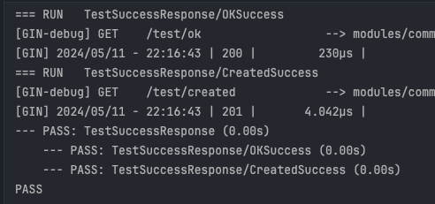

Go를 활용하여 직접 2~3개의 서비스를 만들고 나니, 구현할때 지나쳤던 에러들이 큰 눈덩이로 변해서 덮쳐왔다.
문제가 생긴 지점은 명확했지만, 그것보다는 문제 발생의 근본적인 원인을 찾고자 했었다. 내가 생각한 가장 큰 원인은 **테스트 코드의 부재**였다.
테스트의 장점은 누구나 알고 있을 것이다. 코드의 안전성을 확보할 수 있으며 문제 발생 시 빠르게 수정할 수 있다는 것이다. 현재 코드에는 숨겨진 구멍들이 존재하는데, 이를 해결하기 위해서는 단위 테스트, 통합 테스트가 필요했다.
기존에 있던 코드를 활용하여 테스트 코드로 작성하려고 시도했으나, 지금까지 적은 Go 코드는 테스트를 용이하도록 작성되지 않았다. 특히 인터페이스를 적절하게 사용하지 않아서 Mock를 사용하는데 어려움이 생기기도 했다.
그래서 처음부터 다시 제작하고자 한다.

나는 동일한 코드에 대해 이번까지 포함해서 2번 변경했다. 어떻게 변경했는지 알아보자

## 초기 - Go 한달차의 적응기

### 에러 타입과 상태 타입

1차에서는 `ErrorType`으로 특정 에러 타입을 정의하는데 사용할 타입을 지정해줬다.

```go
type ErrorType int

type Error struct {
	// Code is a custom error code
	ErrorType ErrorType
	// Err is a error string
	Err error
	// Description is a human-friendly message.
	Description string
}

type ErrorRes struct {
	// Code is http status code
	Code int `json:"code"`
}
```

모든 서비스들이 사용할 경우, 각 서비스가 사용할 에러 코드를 일리리 지정했다. map를 활용하여 에러 타입에 해당되는 상태 코드를 매핑했다.

```go
const (
	// Common
	SUCCESS             ErrorType = 0
	INVALID_JSON_FORMAT ErrorType = 1001
	INVALID_URI_FORMAT  ErrorType = 1002

	// Member
	INVALID_MEMBER  ErrorType = 2001
	ERROR_MEMBER_DB ErrorType = 2101

	// Task
	ERROR_TASK_DB ErrorType = 3101
)

var codeMap = map[ErrorType]int{
	// Common
	INVALID_JSON_FORMAT: http.StatusBadRequest,
	INVALID_URI_FORMAT:  http.StatusBadRequest,

	// Member
	INVALID_MEMBER:  http.StatusUnauthorized,
	ERROR_MEMBER_DB: http.StatusInternalServerError,

	// Task
	ERROR_TASK_DB: http.StatusInternalServerError,
}
```

### 에러 반환

직접 커스텀한 에러값을 입력값으로 해서 context를 활용해 Json 형태로 반환해줬다.

```go
// getCode is get Status code from codeMap.
func getCode(flag ErrorType) *ErrorRes {
	return &ErrorRes{Code: codeMap[flag]}
}

func ErrorFunc(ctx *gin.Context, err *Error) {
	res := getCode(err.ErrorType)
	log.Println(err)

	ctx.AbortWithStatusJSON(res.Code, res)
	return
}
```

"저렇게 하면 오류가 제대로 반환되지 않을텐데?"라고 생각하는 사람이 있을 것이다. 저때 당시 gin이 에러를 응답하는 매커니즘을 잘 몰라 단순하게 AbortWithStatusJson으로 응답하도록 했다. 비록 결과는 에러 json + 성공 json 둘다 나왔지만 말이다.

## 1차 - Middleware가 있었다고요?

gin의 오류 처리 매커니즘을 제대로 이해하지 못해 단순하게 응답을 처리했다. 이제는 Middleware를 제작함으로써 에러 응답 반환이 수월하도록 구현했다.

### 에러 상태 타입

ErrorType -> WebCode로 이름을 변경했으며, 에러뿐만 아니라 상태 전체를 표시했다.
여기서 눈치 빠르신 분은 알겠지만 에러 타입에는 상태값을 직접 포함하도록 구현했다. 왜냐하면 상태 코드를 추가할 일이 많은데 작업을 두번해야 하기 때문이다.

```go
TaskCreationSuccess    WebCode = 220101
SubtaskCreationSuccess WebCode = 220151
```

예로 220101 이라면 2(Task Service)/201(Status code)/01(Unique number)로 구성하도록 했다.

### 에러 타입과 반환

이전에는 에러 타입을 Error라고 정했지만 gin 내부의 에러를 쓰면서 헷갈리기 시작했다. 그래서 NetError로 이름을 변경했으며, Description field는 잘 사용하지 않는 것 같아 삭제했다.

```go
type NetError struct {
    Code codes.WebCode
    Err  error
}

func NewNetError(code codes.WebCode, err error) *NetError {
    logrus.Errorf("Code : %d, Error : %v", code, err)
    if err != nil {
       return &NetError{Code: code, Err: err}
    }
    return &NetError{Code: code, Err: nil}
}
```

에러는 동일하게 code만 반환하도록 구현했다.

```go
// Response
type ErrorResponse struct {
	Code codes.WebCode `json:"codes"`
}

func NewErrorResponse(code codes.WebCode) *ErrorResponse {
	return &ErrorResponse{Code: code}
}
```

### 성공

응답값을 생각해보면 크게 두 가지가 존재한다.

- 데이터가 없는 경우
- 데이터가 있는 경우

이 두가지를 나눠서 별도의 함수를 만들었다.

```go
func SuccessWith(ctx *gin.Context, code codes.WebCode, data any) {
    status := codes.GetStatus(code)
    res := NewSuccessResponseWith(code, data)
    ctx.Header("Content-Type", "application/json")
    ctx.AbortWithStatusJSON(status, res)
}
func Success(ctx *gin.Context, code codes.WebCode) {
    status := codes.GetStatus(code)
    ctx.Header("Content-Type", "application/json")

    res := NewSuccessResponse(code)
    ctx.JSON(status, res)
}
```

에러 반환 로직은 gin Middleware를 사용했다. 자세한 사항은 [[Gin - 예외처리 2. 커스텀 예외처리 구현하기]] 를 참고하길 바란다.

## 2차 - 프론트엔드를 하고나니...

왜 백엔드와 프론트엔드가 짝꿍이 맞아야 하는지 알 것 같았다.
플러터의 경우에는 응답값과 똑같은 필드를 가진 모델로 반환해야 한다. 만약에 정확하게 받지 못하면, 아무런 값도 받을 수 없다.(심지어 상태값도 말이다.) 플러터로써는 해결 방안을 찾지 못해서 **서버측에서 성공이든 오류든 모두 동일한 형태로 반환하도록 구현해야 했었다.**

### Response Format

위에서 1차, 2차를 보면 구체적인 메세지가 없었다. 메세지를 넣지 않은 이유는 클라이언트에게 저런것까지 보여줄 필요가 없다고 생각해서였다. 그러나 앱개발하면서 정보가 없어서 정말 힘들었다. 😥  
Error Response의 Best Practice를 찾아보니 대부분 자체적인 code와 이를 설명하는 메세지가 포함되어 있었다.[^1] 이번에 수정한 응답에서는 메세지를 추가하기로 했다.

### 에러 상태 타입

일단 지금까지 사용했던 에러 코드보다 길이를 더 축소시켰다. 그래서 자주 사용하는 상태 코드를 백의 자리로 두고, 1씩 카운트를 추가하면서 에러 코드를 정의했다.
또한 에러코드에 매핑되는 에러 메세지를 추가함으로써, 동일한 에러 메세지를 반환하도록 했다. 메세지는 정확하게 적지 않고, 문제를 전반적으로 보여줄 수 있도록 작성했다.

```go
const (
    // 1xx is Bad Request error code
    InvalidHeader ErrorCode = 101
    InvalidBody   ErrorCode = 102
    InvalidQuery  ErrorCode = 103

    // 2xx is Unauthorized error code
    BadAuthenticationData ErrorCode = 201
    TokenExpired          ErrorCode = 202

	...
)

var errorMessage = map[ErrorCode]string{
    InvalidHeader: "The provided header values are invalid.",
    InvalidBody:   "The body of the request is invalid.",
    InvalidQuery:  "The query parameters are invalid.",
	...
}
```

### 에러 타입

`netErrorOptions` 라는 옵션을 추가시켰는데, 여기에는 서비스의 메타 정보가 포함되어 있다.

```go
// NetError have options and ErrorCode that contains status code.
type NetError struct {
    // options is metadata about service    options
    netErrorOptions
    // Type is a unique data that contains http status code.
    Code ErrorCode
    // Description is an error details.
    Description string
    // Err is an error message.
    Err error
}
```

메타 정보로써 태그가 있는데, 서비스 이름을 문자열로 표시하는 것이다.
태그는 서버에서 디버깅을 조금더 수월하게 하기 위해서 도입했다. 오류코드가 모두 동일해서 어떤 서비스의 오류인지 명시하는 용도로 사용된다.

```go
// netErrorOptions is meta data about service
type netErrorOptions struct {
    // tag is the service name
    tag string
}
```

이 태그는 애플리케이션을 시작할때 한번만 설정하도록 함으로써, 모든 NetError가 해당 tag를 가지도록 구현했다.

```go
var (
    opts netErrorOptions
)

// netErrorOptions is meta data about service
type netErrorOptions struct {
    // tag is the service name
    tag string
}

// SetTag sets the service name
func SetTag(tag string) {
    mu := sync.Mutex{}
    mu.Lock()
    defer mu.Unlock()

    opts.tag = tag
}
```

### 에러 반환

에러는 크게 두 가지로 나눠져 있다.

- Status: 응답의 타입 ("Success" or "Error")
- Data : 에러 데이터 혹은 성공 시 반환할 데이터

```go
// BaseResponse is common response that use in success and failed
type BaseResponse struct {
    Status string      `json:"status"`
    Data   interface{} `json:"data"`
}
```

다만 생성자를 만들때 성공, 실패 여부를 따로 만들었다. 그 이유는 입력하는 값이 다 달랐기 때문이다.

성공한 경우 반환하고자 하는 데이터를 Data 필드에 넣기만 하면 된다.

```go
func NewSuccessBaseResponse(data interface{}) *BaseResponse {
    return &BaseResponse{
       Status: "Success",
       Data:   data,
    }
}
```

그러나 오류인 경우는 다르다. 반환할 오류 타입은 형식화되어 있으므로, `ErrorResponse` 구조체를 따로 만들어서 Data 필드에 저장했다.

```go
// ErrorResponse is the error response format
type ErrorResponse struct {
    Code    ErrorCode `json:"code"`
    Message string    `json:"message"`
}

func NewErrorBaseResponse(data NetError) *BaseResponse {
    res := ErrorResponse{Code: data.Code, Message: GetErrorMsg(data.Code)}
    return &BaseResponse{
       Status: "Error",
       Data:   res,
    }
}
```

BaseResponse가 반환되면, 메소드로 응답값을 반환하도록 구현했다.

```go
// Failed response failed formatted response.
// It converts NetError to ErrorResponse to extract necessary things.
func (b BaseResponse) Failed(ctx *gin.Context) {
    res := b.GetErrorData()
    status := parseStatusCode(res.Code)
    ctx.AbortWithStatusJSON(status, b)
    return
}

// OKSuccess uses when status code is 200
func (b BaseResponse) OKSuccess(ctx *gin.Context) {
    ctx.Header("Content-Type", "application/json")
    ctx.AbortWithStatusJSON(200, b)
}
```

## 테스트

gin 테스트 사례[^2]를 참고해서 성공했을 경우의 테스트 코드를 작성해보았다.
테스트 코드는 테이블 중심 테스트(Table-Driven Test) 방식[^3]을 채택했다. 단위 테스트가 비슷한 구조로 이뤄져 있는 경우, 테이블 중심 테스트로 수행하면 코드 중복을 피할 수 있어 로직을 변경하거나 새로운 케이스를 추가하기 쉽다는 장점이 있다.
작성한 테스트 코드에는 테스트 구조가 비슷하고, 라우팅 설정 등 공통된 부분이 많아서 테이블 중심 테스트를 선택하게 되었다.

```go
func setupRouter() *gin.Engine {
    r := gin.Default()
    r.Use(errorutils.ErrorMiddleware())

    return r
}

func TestSuccessResponse(t *testing.T) {
    r := setupRouter()
    res := errorutils.NewSuccessBaseResponse(nil)

    // Set table
    tests := []struct {
       description  string
       fn           func(*gin.Context)
       expectedCode int
       path         string
    }{
       {
          // Ok Success
          description: "OKSuccess",
          fn: func(c *gin.Context) {
             res.OKSuccess(c)
          },
          expectedCode: 200,
          path:         "/test/ok",
       },
       {
          // Created Success
          description: "CreatedSuccess",
          fn: func(c *gin.Context) {
             res.CreatedSuccess(c)
          },
          expectedCode: 201,
          path:         "/test/created",
       },
    }
    for _, tc := range tests {
       t.Run(tc.description, func(t *testing.T) {
          w := httptest.NewRecorder()
          req, _ := http.NewRequest("GET", tc.path, nil)

          // Specific handler function and serve
          r.GET(tc.path, tc.fn)
          r.ServeHTTP(w, req)

          if w.Code != tc.expectedCode {
             t.Errorf("Expected %d, got %d", tc.expectedCode, w.Code)
          }
       })
    }
}
```

테스트 코드를 실행하면 아래와 같은 결과를 얻을 수 있다.



## 마치며

하나의 간단한 CRUD가 있는 서비스 2개를 가지고 코드를 여러번 수정했다. 그 과정에서 다양한 오류를 만났고, 테스트 코드의 중요성도 확실히 알았다.
특히 이번에 테스트 코드를 작성하면서 오류를 많이 마주 했는데, 이를 재빠르게 수정하면서 테스트의 중요성을 느끼게 되었다.

[^1]: https://pjh3749.tistory.com/273
[^2]: https://gin-gonic.com/docs/testing/
[^3]: https://bugoverdose.github.io/development/go-table-driven-tests/
