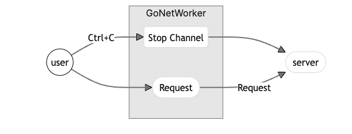

개인적으로 운영 모니터링을 공부하고 싶었다. 문제는 클라이언트가 없다는 것이었다.
대안으로 스트레스 테스트 도구를 사용해서 극한의 상황을 확인할 수 있다.
나는 **현실적인 상황을 재현**하고 싶었다. 그래서 사용자가 직접 내 서버를 사용한 것처럼 패킷을 보내는 도구를 만들기로 결심했다.

## GoNetWorker

GoNetWorker는 Go를 활용한 가상 운영 시뮬레이션 도구이다.[^1]
미리 설정한 endpoint 정보를 기반으로 서버에 랜덤으로 request를 보내는 도구이다.

### endpoint 정의 - works.json

테스트를 하기 위해서는 endpoint에 대한 정보를 정확하게 기입해야 한다.

- settings
  - request를 보내기 위한 설정 정보
- works
  - request를 보낼 대상에 대한 정보
- tasks
  - url의 경로 정보

```json
{
  "settings": {
    "sleep_range": 5 // request 전송 시 대기시간 범위
  },
  "works": [
    {
      "uri": "http://localhost",
      "port": 8080,
      "tasks": [
        {
          "path": "/users/1",
          "method": "GET"
        }
      ]
    }
  ]
}
```

### 구조

GoNetWorker는 사용자가 특별한 행동을 취하기 전까지 지속적으로 request를 보낸다. 초기에는 `ctrl + c`를 클릭했을 경우 실행이 중단될 수 있도록 구현했다.

```go
go func() {
	for {
		select {
		case <-stopChan:
			fmt.Println("Received interrupt signal. Shutting down...")
			return
		default:
			work := config.Works[rand.Intn(len(config.Works))]
			task := work.Tasks[rand.Intn(len(work.Tasks))]

			wg.Add(1)
			client := &http.Client{}
			go makeRequest(work, task, client, &wg, config.Settings.SleepRange)

			randomSleep := time.Duration(rand.Intn(config.Settings.SleepRange)) * time.Second
			time.Sleep(randomSleep)
		}
	}
}()
```

세부적인 구조는 아래와 같다.



## 예시

```bash
go run main.go
```

GoNetWorker로 실행되면 아래와 같이 랜덤으로 request를 보내게 된다.


서버에서 확인하면 아래와 같이 정상적으로 request를 받았음을 알 수 있다.


## 보완할 점

초기 버전이라 추가해야할 점이 많다. 다음 글에서는 아래의 기능을 추가하고 찾아오겠다.

1. Get으로 전송할 경우 보완
   1. path에 식별자가 있을 경우
   2. parameter가 있을 경우
2. Post로 전송할 경우
3. go를 빌드하기 위한 makefile

[^1]: 이렇게 설명하는게 맞는지 모르겠다.
