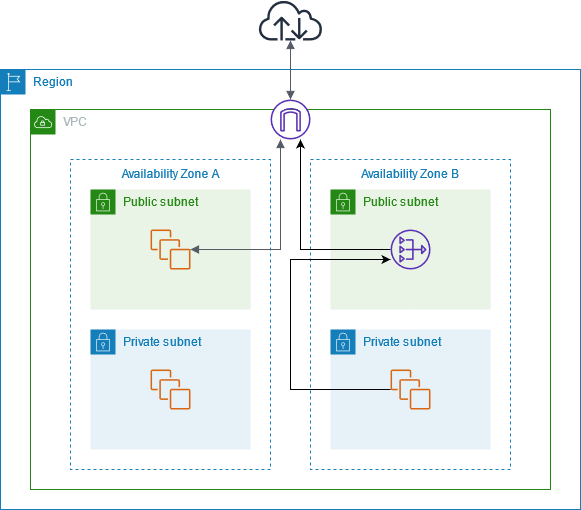
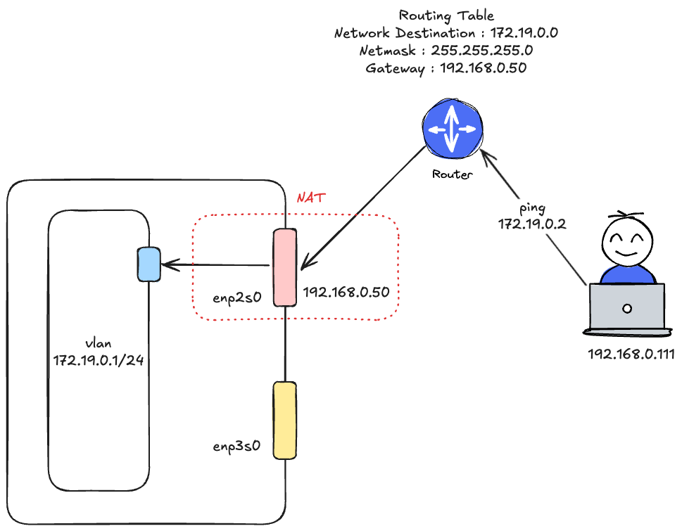

## CTF 프로젝트
CTF란 해킹 대회로 참가자가 의도적으로 취약한 프로그램이나 웹사이트에 숨겨진 플래그를 찾는 게임[^1]입니다. 대표적인 CTF 사이트로는 [드림핵](https://dreamhack.io/)이 있습니다. 
현재 해킹 동아리 소속으로 주변에 CTF에 활발하게 참가하는 친구들이 많이 있습니다. 저 또한 CTF는 아니지만 문제 제작에 관심이 많습니다. 해킹이라는 관심사를 가진 인원이 모여 CTF에 대한 아이디어를 나누게 되었고, 이후 직접 사이트를 구축하고 대회를 개최하기로 결정했습니다. 

## CTF 제작 필수 요소 - 컨테이너 
CTF 문제 중에는 호스팅된 취약한 웹사이트가 필요할 수 있고, 취약한 운영체제 환경이 필요할 수 있습니다. 각각 하나의 환경을 구성해서 사용자에게 배포할 수 있습니다. 이럴경우 다른 사용자의 문제 풀이를 알 수 있고 다른 사용자가 발빠르게 문제를 해결하면 다른 사용자는 문제를 풀 수 없게 됩니다. 그렇다면 해킹 대회의 의미가 없어질 것입니다. 문제 환경의 분리가 필요하다고 판단했고 경량화된 실행 환경인 컨테이너를 사용하기로 결정했습니다.

## 쿠버네티스
쿠버네티스는 러닝 커브가 있는 플랫폼입니다. 저 또한 쿠버네티스의 기본 개념만 알지 온전히 사용해본 경험은 없었습니다. 하지만 **컨테이너를 관리한다는 측면에서 쿠버네티스만큼 좋은 플랫폼이 없어서 선택하게 되었습니다.** 

Python Docker SDK에서 서비스를 개발하고 있을때 제가 고민했던 것이 있었습니다.
1. 30분 후에는 컨테이너를 중단시켜야 하는데 어떻게 해야하지?	
2. 2개 이상의 컨테이너가 필요한 경우에는 어떻게 논리적으로 분리해서 관리하고 모니터링하지?
3. Health Check 어떻게 하지?

모든 고민의 해결방안은 **직접 구현**해야 한다는 것이었습니다. 직접 구현하는 것보다는 증명된 플랫폼을 활용하는 것이 적절하다고 판단했고 쿠버네티스를 선택하게 되었습니다. 

## 운영 플랫폼 선정 - Openstack
[OpenStack이란](https://www.redhat.com/ko/resources/openstack-platform-datasheet)이란 풀링된 가상 리소스를 사용하여 [프라이빗](https://www.redhat.com/ko/topics/cloud-computing/what-is-private-cloud) 및 [퍼블릭](https://www.redhat.com/ko/topics/cloud-computing/what-is-public-cloud) 클라우드를 구축하고 관리하는 오픈소스 플랫폼를 뜻합니다.[^2]
이번 프로젝트에서 인프라 담당을 맡게 되면서 홈서버를 가지고 CTF를 운영하게 되었습니다. 
저는 홈서버에 Openstack를 구축하고 활용한 경험이 있습니다. Openstack를 사용하면서 가장 편리했던 부분은 **IaC를 통해 인프라를 쉽게 관리할 수 있다는 점**이었습니다. 또한 다양한 스토리지 종류가 있으며 역할에 따라 활용할 수 있다는 것도 큰 매력이었습니다. 
운영 난이도는 높지만 클라우드만이 가질 수 있는 장점을 활용하고 싶어 Openstack을 선택하게 되었습니다. 

## 서버 구축 - 제한된 환경에서 느낀 것
집에 있는 홈서버를 다른 장소로 이전하게 되었습니다. 이후 Openstack 서버를 현재 환경에 맞게 설정해야 했습니다. 작업에는 네트워크 설정이 큰 비중을 차지했습니다. 설정 과정에서 느낀점을 적어보고자 합니다. 

### NAT Gateway 의 필요성 
Public Cloud에서 Private Subnet 내에 있는 인스턴스가 인터넷과 접속하기 위해서는 NAT Gateway가 필요합니다. 



위의 상황과 유사하게 서버의 사설 네트워크 대역에 접근해야 할 일이 있었습니다. 예로 172.19.0.2에 접근하고 싶은데 같은 네트워크 대역에 있지 않으므로 접근할 수 없습니다. 그러나 `enp2s0` 네트워크 인터페이스를 NAT로 사용하면 172.19.0.2에 접근할 수 있게 됩도다. 



서버에 enp2s0가 NAT이며 사설 네트워크인 enp2s0.191에 트래픽을 허용해주는 방화벽 규칙을 추가합니다.
```sh
# enp2s0 인터페이스를 통해 나가는 모든 트래픽의 소스에 NAT 수행 
sudo iptables -t nat -A POSTROUTING -o enp2s0 -j MASQUERADE
# enp2s0에 들어와 br-ex로 나가는 ICMP 트래픽을 허용한다.
sudo iptables -A FORWARD -i enp2s0 -o enp2s0.191 -p icmp -j ACCEPT
# br-ex로 들어와서 enp2s0로 나가는 ICMP 트래픽을 허용한다.
sudo iptables -A FORWARD -i enp2s0.191 -o enp2s0 -p icmp -j ACCEPT
```

Private Subnet 내에 있는 리소스가 외부 인터넷과 통신할 수 있도록 NAT Gateway가 필요합니다. 
이는 온프로미스 환경에서도 해당됩니다. 온프로미스 환경에서 사설 네트워크에 접근하기 위해서는 NAT 기능이 필요하며 이는 **공용(Public) 네트워크 인터페이스로 구성**되어 있어야 합니다. 그래야 외부와 연결하여 통신할 수 있게 됩니다. 
Public Cloud에서 NAT Gateway를 Public Subnet에 배치하는 이유도 온프로미스와 동일할 것입니다. 

현재 프로젝트에서는 NAT를 활용하지 않습니다. vlan을 외부 네트워크 인터페이스로 활용하고 싶었으나 실패했습니다. 결국 enp2s0를 Public IP 할당에 사용되는 외부 네트워크 인터페이스(**br-ex**)로 사용할 것입니다. 

### IP 부족
**새로운 장소에서 가장 큰 고민거리는 IP Pool 설정**이었습니다. Openstack은 Floating IP Pool 내에서 외부에 노출할 IP를 할당받게 됩니다. 실제 운영을 위한 IP, 개발을 위한 IP 등 생각보다 IP를 할당받아야 하는 경우가 많습니다. 
현재 환경에서는 다양한 서버의 IP가 불규칙적으로 할당되어 있습니다. 또한 많은 사람이 인터넷을 활용하는 공간이기에 무분별하게 IP를 할당할 수 없었습니다. 

꼭 필요한 IP 개수에서 일시적으로 할당받을 것을 고려해 10개를 할당했습니다. 
- 쿠버네티스 : Master, node 2개
- 개발 관련 : Jenkins
- 기타(일시적) : MySQL 관리용 등등..

## 마치며
지금까지 프로젝트가 왜 이러한 플랫폼을 선택했는지 설명했습니다. 또한 서버를 다른 곳에 이전하게 되면서 생긴 경험을 보여드렸습니다. 
다음편에는 전체적인 구성도와 함께 찾아오겠습니다. 


[^1]: https://en.wikipedia.org/wiki/Capture_the_flag_(cybersecurity)
[^2]: https://www.redhat.com/ko/topics/openstack
