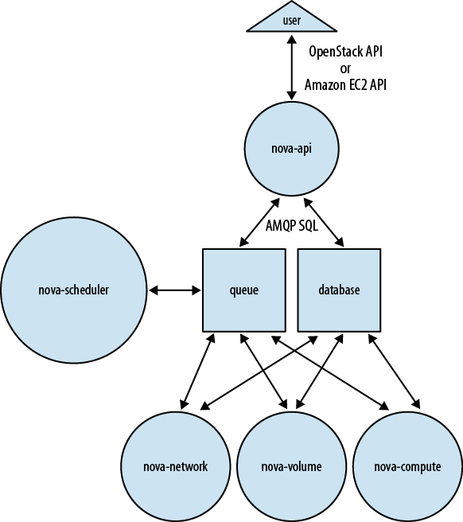
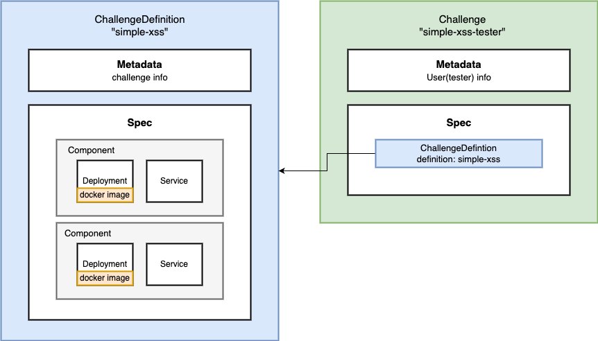
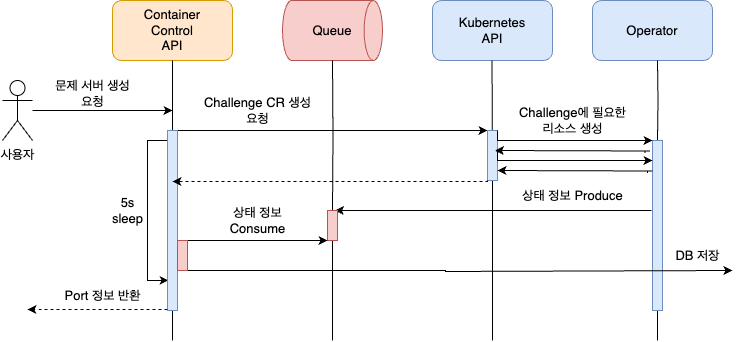

이전까지 Challenge Operator 관련된 글만 작성했습니다. Challenge의 라이프 사이클을 전반적으로 설명해야 하는 만큼 많은 분량을 할애했습니다. 이번 Challenge Control API 부분은 이번 글로 모두 정리하고자 합니다.

## 아키텍쳐 설계

### 아케텍쳐

전반적인 아키텍쳐는 아래와 같습니다.

#### CTF-WEB

그림에 클라이언트 부분이 없다고 생각할 수 있는데 CTF-WEB의 경우 Flask Server로 이뤄져 있으나 html을 리다이렉트 하는 구조이기 때문에 하나로 표현했습니다.

#### Container Control API

본래 CTF-WEB 하나로 병합하여 사용할 예정이었습니다. 그러나 **Control API가 처리해야 하는 다른 플랫폼(Queue, Kubernetes)가 많다는 점과 비교적 에러 사항이 많다는 점**을 감안하여 다른 서비스 형태로 분리하기로 했습니다. 즉, **불필요한 오류 확산을 막기 위해 분리**했다고 보시면 됩니다.


### 왜 Control API는 필요한가?

우선 **사용자와 상호작용**을 해야 하기 때문에 명령어를 받는 서비스가 필요합니다. 클라이언트는 `kubectl apply ` 에 해당되는 명령어를 쿠버네티스 서버에 전송해야 합니다. 클라이언트에서 쿠버네티스 명령어를 실행시킨다는 것은 쿠버네티스 마스터 노드에 대한 엔드 포인트가 그대로 노출된다는 것과 같습니다. 즉, 치명적인 보안 문제로 이뤄지지 않을까요?

> 쿠버네티스는 `.kube` 라는 config 파일을 통해 쿠버네티스 클러스터를 관리하게 됩니다. 여기에 쿠버네티스 클러스터의 엔드포인트를 확인할 수 있습니다.

### Control API-Operator 사이에 큐를 둔 이유

> 이번 글에서는 지속해서 Control API 입장에서 작성할 것입니다.

Control API 입장에서는 **어떠한 절차를 통해 Challenge의 상태 변화를 얻어서 데이터베이스에 저장**해야 합니다. Control API가 할 수 있는 방법은 크게 두 가지입니다.

1. Control API가 지속해서 쿠버네티스에게 Challenge 상태 여부를 물어본다.
2. 쿠버네티스가 상태가 변할때마다 Control API에게 물어본다.

결국 누가 먼저 물어볼 것인가를 선정해야 합니다. 선정 기준이 프로젝트마다 다르겠으나 저는 **구현 난이도**를 고려했을때 2번인 "쿠버네티스가 상태가 변할때마다 Control API에게 물어본다."를 선택했습니다.

이전 편에서도 제가 쿠버네티스를 선택한 이유는 컨테이너를 비동기적으로 탐색하여 실시간으로 상태 정보를 가져오기 어려움을 겪었기 때문입니다. 이와 유사한 문제의 늪에 빠지게 됩니다. 클라이언트는 Challenge가 무슨 상태인지 모르기 때문에 지속적으로 쿠버네티스에게 물어볼 것이고, 동기적으로 처리하면 속도가 느려질 것이니 비동기적으로 처리해야 할 것입니다.

Operator는 내부적으로 Challenge의 상태 정보를 관리합니다. 그러므로 Challenge의 상태가 변경될때마다 Control API에게 보내는 방법은 어떨까요? 이러한 방식은 하나의 문제점을 가지게 됩니다. 동기로 처리를 하면 응답값이 올때까지 기다려야 하기 때문에 Operator의 속도가 느려질 가능성이 있습니다. 또한 Opeator 내부에는 비동기로 처리되기 때문에 무슨 문제가 발생할지 예상이 가지 않습니다.  
그러나 해결 방법은 있습니다. Operator와 Control API 사이에 큐를 둠으로써 데이터 누락 문제도 해결하고 속도도 향상시킬 수 있습니다. 예로 Operator가 None -> Running 상태로 변경시켰을때 Queue에 Running으로 변경했다는 메세지만 전송한 후 Operator의 나머지 로직을 처리하게 됩니다. 즉, 응답이 올때까지 기다릴 필요가 없겠죠?


#### Challenge Controller의 스터디 케이스: Nova Architecture

Challenge Controller 시스템의 전반적인 컨셉은 OpenStack의 Nova의 아키텍쳐를 많이 활용했습니다.

> Nova는 AWS의 EC2라고 생각하시면 됩니다.

저희 프로젝트는 쿠버네티스 리소스를 활용한다는 점에서 Nova와 확실히 다르겠으나 **API를 통해 컴퓨팅 리소스를 제어한다는 컨셉은 동일하니까요.**

제가 활용한 컨셉은 아래와 같습니다.

1. 제어부(api)와 리소스 처리부(nova-compute, nova-volume ...) 분리
2. 제어부와 리소스 처리부 사이 이벤트 기반 처리 - Queue 배치

저희 프로젝트에서는 Control API가 nova-api에 해당되는 것이고, Operator가 nova-compute라고 생각하시면 됩니다.



> "제어부와 리소스 처리부 분리" 관련 간단한 이야기
> 무조건 Nova Architecture를 차용했다고 해서 Operator를 별도로 제작한 것은 아닙니다. 그저 분리하여 이벤트 처리 기반으로 시스템을 제어하는 것이 많이 활용되는 방식이라고만 인식했습니다. 즉, Operator를 별도로 제작하는 것이 기술적인 고난도 도전이 아닌 선택지 중 일부로 받아들인 것입니다.

## Control API 제작

> 자세한 사항은 HexaCTF 6. Kubebuilder를 활용한 ChallengeDefinition&Challenge Type 구현를 참고하시길 바랍니다.

커스텀 리소스인 ChallengeDefinition과 Challenge를 확인해볼까요?

- ChallengeDefinition : 문제 상세 정보를 나타내며 챌린지 정보, 구성 리소스를 컴포넌트 단위로 정의한다.
- Challenge : 사용자(문제 풀이자)가 생성하는 문제의 단위로 참조된 ChallengeDefinition을 기반으로 리소스를 생성하고 삭제한다.



사용자가 생성하는 문제를 Challenge 단위로 정의함으로써 **사용자 요청에 대한 형식이 간소화되고, 사용자 명령을 제어한다는 역할에 충실할 수 있게 됩니다.**  
사용자는 요청 시 사용자 정보와 문제를 전송하게 됩니다. 이러한 고유한 정보를 조합하여 Challenge 이름을 생성(`challenge-{challenge_id}-{username}`)했으며 쿠버네티스 python sdk를 통해 쉽게 추가하고 삭제할 수 있습니다.

```python
	 	user_challenge_repo = UserChallengesRepository()

        # Challenge definition 조회
        challenge_definition = ChallengeRepository.get_challenge_name(challenge_id)
        if not challenge_definition:
            raise ChallengeNotFound(error_msg=f"Challenge definition not found for ID: {challenge_id}")

        # Challenge name 생성 및 검증
        challenge_name = f"challenge-{challenge_id}-{username}"
        if not self._is_valid_k8s_name(challenge_name):
            raise UserChallengeCreationError(error_msg=f"Invalid challenge name: {challenge_name}")

		# ...

        # Challenge manifest 생성
        challenge_manifest = {
            "apiVersion": "apps.hexactf.io/v1alpha1",
            "kind": "Challenge",
            "metadata": {
                "name": challenge_name,
                "labels": {
                    "apps.hexactf.io/challengeId": str(challenge_id),
                    "apps.hexactf.io/user": username
                }
            },
            "spec": {
                "namespace": namespace,
                "definition": challenge_definition
            }
        }

        challenge = self.custom_api.create_namespaced_custom_object(
            group="apps.hexactf.io",
            version="v1alpha1",
            namespace=namespace,
            plural="challenges",
            body=challenge_manifest
        )
```

### 포트 번호는 Challenge 상태 정보에 있다.

Challenge API는 생성을 요청하면 커스텀 리소스인 Challenge의 포트 번호를 가져와야 합니다. 이 과정을 어떻게 해결했는지 설명하겠습니다.

Operator 부분으로 돌아와 Challenge는 Deployment, Service로 구성되어 있으며 Service는 NodePort를 통해 외부로 노출합니다. 그렇다면 **Control API가 요구하는 포트 번호는 Service에서 노출한 NodePort일 것입니다.**

> Challenge는 외부에 노출되는 엔드 포인트는 단 하나 뿐입니다.

여기서 Control API는 쿠버네티스를 Service를 조회하도록 구현하는 것이 좋을까요? 아니면 Challenge에 정보가 포함되는 것이 좋을까요? 당연히 **Challenge 정보에 포트 정보가 포함되는 것이 Control API의 역할에 충실하게 구현할 수 있는 방법일 것입니다.**

Operator에서는 Service가 생성이 완료되면 Challenge 상태값에 저장할 수 있도록 구현했습니다.

```go
	// Service가 존재하는지 확인
	err := r.Get(ctx, types.NamespacedName{
		Name:      identifier.GetServicePrefix(),
		Namespace: challenge.Namespace,
	}, service)

	if err != nil {
		if errors.IsNotFound(err) {
			log.Info("Creating new service",
				"name", identifier.GetServicePrefix(),
				"namespace", challenge.Namespace)

			// ...

			if err := r.Create(ctx, service); err != nil {
				log.Error(err, "Failed to create Service")
				return err
			}

			log.Info("Successfully created service",
				"name", identifier.GetServicePrefix())

			if service.Spec.Type == corev1.ServiceTypeNodePort {
				challenge.Status.Endpoint = int(service.Spec.Ports[0].NodePort)
				log.Info("NodePort created",
					"port", service.Spec.Ports[0].NodePort)
			}

			if err := r.Status().Update(ctx, challenge); err != nil {
				log.Error(err, "Failed to update Challenge status with NodePort information")
				return err
			}

			return nil
		}
		log.Error(err, "Failed to get Service")
		return err
	}
```

Control API에서는 Challenge 생성 요청을 하면 Challenge의 상태값에서 포트 번호를 가져오기만 하면 됩니다.

```python
        challenge = self.custom_api.create_namespaced_custom_object(
            group="apps.hexactf.io",
            version="v1alpha1",
            namespace=namespace,
            plural="challenges",
            body=challenge_manifest
        )
```

### "언제" 컨테이너 빌드가 끝날 것인가? = "언제" 포트 번호가 설정될 것인가?

Control API가 Service를 조회를 하든, Operator가 포트 번호를 상태값으로 저장을 하든 똑같은 문제점이 있습니다. 바로 **포트 번호가 생성되는 시점이 컨테이너 빌드 시간에 영향을 크게 받는다는 의미입니다.** 포트번호 생성 시간이 컨테이너 빌드 시간과 같다고 봐도 무방합니다.

프로젝트에 대해 간단하게 설명하자면 해킹 문제는 출제자, 문제 유형에 따라 다른 플랫폼을 활용합니다.  
시스템 문제는 대부분 리눅스 기반 베이스 이미지를 활용합니다. 어떤 리눅스 이미지를 사용하더라도 빌드 시간이 비슷하다는 특징을 가지고 있습니다.  
그러나 웹은 상황이 다릅니다. 출제자에 따라서 SpringBoot, Flask 등 다양한 빌드 시간을 가진 플랫폼을 사용하기도 합니다.  
위의 내용을 하나로 정리하자면 **"문제에 따라서 빌드 시간이 다르다."는 의미이며 이는 "문제마다 포트번호를 반환하는 시간이 다르다"라고 해석하셔도 됩니다.**

#### 해결 방안 - 5초 sleep

Control API에서 Challenge 요청 이후에 5초 sleep하는 방식을 채택했습니다.



채택 이유는 **구현하기 쉬웠고, 5초라는 기간은 대부분의 문제의 포트번호를 반환하기 충분했기 때문입니다.** 다만 부족할 수 있으므로 재시도 로직을 넣었습니다.

```python

        challenge = self.custom_api.create_namespaced_custom_object(
            group="apps.hexactf.io",
            version="v1alpha1",
            namespace=namespace,
            plural="challenges",
            body=challenge_manifest
        )

        time.sleep(5)
        # status 값 가져오기
        status = challenge.get('status', {})
        endpoint = status.get('endpoint')

        # status가 아직 설정되지 않았을 수 있으므로, 필요한 경우 다시 조회
        if not status:
            time.sleep(3)
            challenge = self.custom_api.get_namespaced_custom_object(
                group="apps.hexactf.io",
                version="v1alpha1",
                namespace=namespace,
                plural="challenges",
                name=challenge['metadata']['name']
            )
            status = challenge.get('status', {})
            endpoint = status.get('endpoint')
```

#### 위의 해결 방안은 최선이 아니다.

> 5초라는 기간은 **대부분**의 문제의 포트번호를 반환하기 충분했기 때문입니다.

위의 대부분이라는 의미는 5초 + 재시도를 하더라도 포트번호가 반환되지 않은 문제가 있을 수 있다는 의미입니다. 실제 저희 프로젝트에서 9개의 문제 중 단 한 해킹 문제가 빌드 시간이 sleep+재시도 기간보다 길어서 포트번호가 바로 반환되지 않는 문제가 발생하기도 했습니다.

> 빌드 시간이 긴 컨테이너는 대부분 스프링 부트입니다. ^ㅇ^

**결국 포트번호 제때 얻기 위해서는 실시간 처리가 필요하게 됩니다.**

> 다만 이 문제는 CTF-WEB 팀과 상의해야 하는 부분이 많기 때문에 보류하기로 했습니다.

## 마치며

Control API는 단순히 클라이언트 명령어만 제어하기 위해 제작되었습니다. 그러나 실시간으로 사용자에게 포트번호를 전송하지 못한 점이 아쉽기도 했습니다. 이는 협의 후 수정될 예정이며, 문제가 해결되면 다른 글로 찾아 뵙겠습니다.

## 다음 글은...

HexaCTF 초기 글에 인프라 구축에 대한 내용이 있습니다. 이후 개발 과정에서 서버를 집에서 다른 장소로 옮기게 되었습니다. 다음 글에서는 다른 장소에 있는 서버를 어떻게 관리할 것인지를 초점으로 인프라 구축에 관한 내용을 작성하겠습니다.
