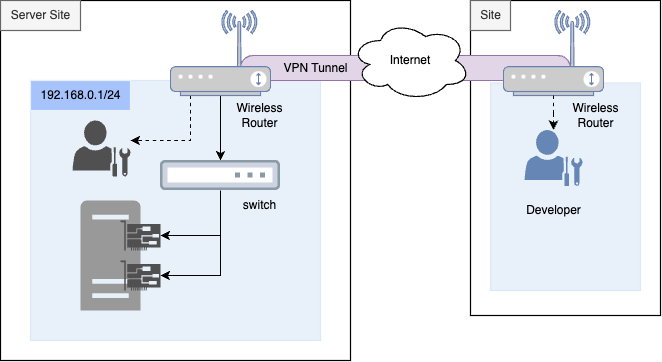
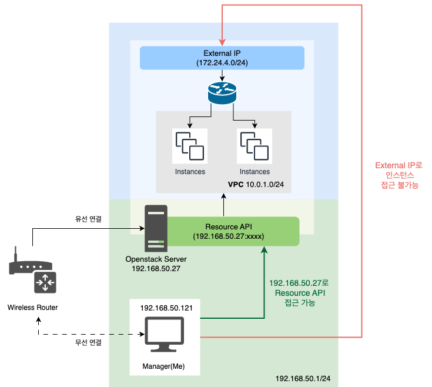
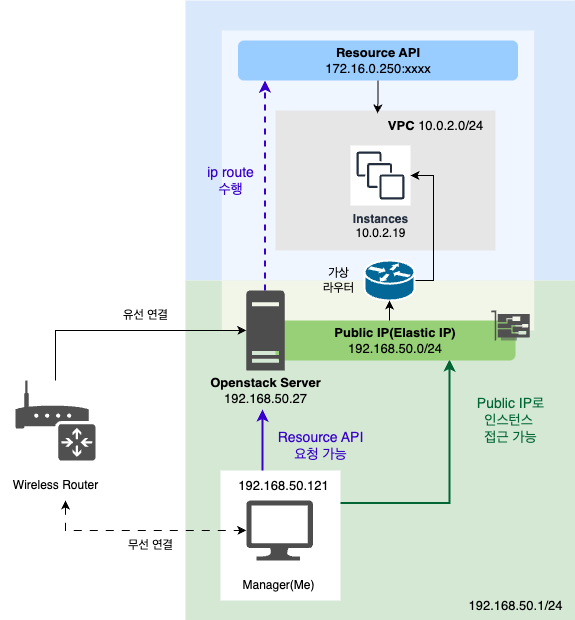
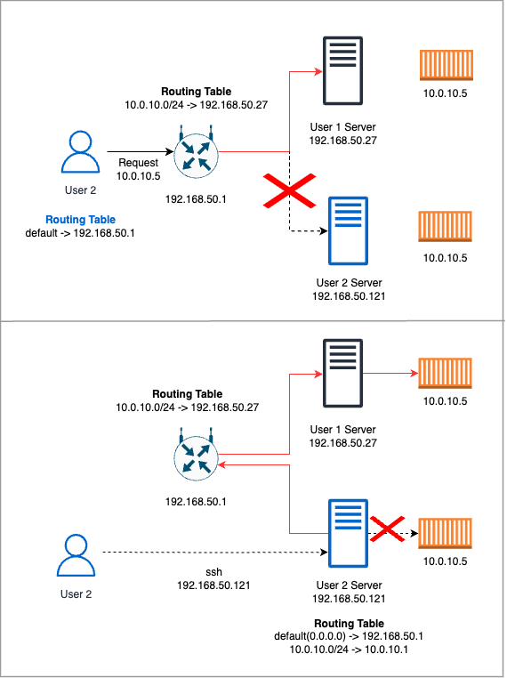
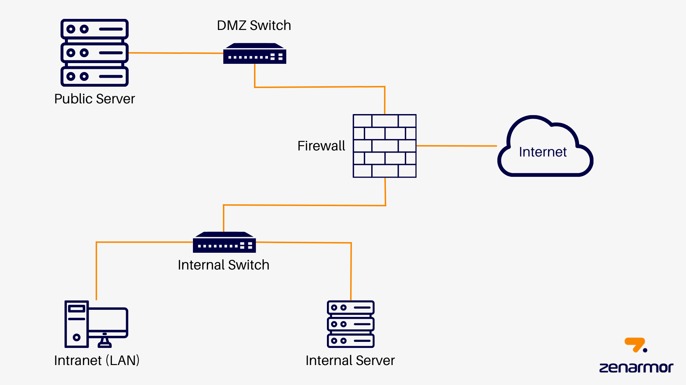
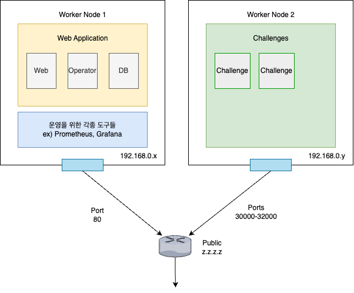

- 2025-03-15 - 내용 수정

## 들어가며

간략한 인프라 구성도입니다.

여기서 눈에 띄는 점이 2가지가 있습니다.

1. 한 서버(OpenStack)에 NIC가 2개
2. 일부 사용자는 VPN 사용하여 접속한다

이제부터 왜 오픈스택 서버에 2개의 NIC를 삽입했는지 설명하겠습니다.

## NIC 1개 삽입 시 문제점

OpenStack은 기본적으로 2개의 네트워크 인터페이스가 요구됩니다. 그래서 설치가 비교적 간단한 DevStack이든 kolla-ansible이든 **하나의 물리적 NIC로만 구성한다면 운영체제에서 하나의 논리적 네트워크 인터페이스를 만들어서 설정해야 합니다.**  
하나의 NIC로만 구성하면 172.24.4.0/24(상황에 따라 다름)와 같은 네트워크 인터페이스를 생성하여 Provider Network를 구성하게 됩니다. 그러나 **Provider Network로부터 IP를 사설 IP(172.24.4.x)로 할당받으므로 외부 컴퓨터(Manager)에서 직접 접근할 수 없습니다.**

결국 Floating IP가 할당된 가상머신에 접근하기 위해서는 서버 내에 NAT 설정을 해야 합니다.

실제 프로젝트에서는 Provider Network를 물리 네트워크 인터페이스에 연결시키고 Management Network는 논리 네트워크 인터페이스로 연결했습니다. 즉 Floating IP를 `192.168.50.x`로 할당을 받을 것이며 아무런 라우팅 설정 없이 직접 접근할 수 있도록 구성했습니다. 왜냐하면 Management Network에서는 하나의 IP만 활용되지만, 많은 가상 머신을 만들면서 Provider Network를 통해 2개 이상의 IP가 필요하기 때문입니다.

대신 서버의 IP로 구성된 Resource API에 접근하기 위해서는 별도의 라우팅 설정이 요구됩니다. 라우팅 설정하는 방법은 크게 두 가지입니다.

1. 라우터에 라우팅 규칙 설정
2. 클라이언트(Manager), 서버의 라우팅 테이블 수정

### 1. 라우터에 라우팅 규칙 설정의 문제점

> 그곳에는 많은 서버들이 있다.

서버가 있는 장소가 제 것만 있으면 1번은 당연한 선택지일 것입니다. 그러나 제 서버 이외에도 다른 사람들의 서버가 있으며 그것들 또한 가상화 솔루션 서버로 이뤄져 있습니다.
공용으로 사용되는 라우터에 라우팅 테이블을 설정하면 문제가 하나 발생하게 됩니다. **다른 서버 이용자가 의도치 않게 OpenStack의 사설 네트워크와 동일한 IP에 접속을 요청하면 OpenStack 서버로 패킷이 전송되는 문제가 발생할 수 있습니다.**

실제 경험해보지 않았지만 제가 예상한 문제 시나리오는 크게 두 가지 입니다.

1. 다른 사용자(User2) 가 자신의 서버에 접근을 요청할 경우
2. 다른 사용자가 User 2의 서버에 접속하여 가상 머신에 접근을 요청할 경우

시나리오의 모든 전제 조건은 라우팅 테이블의 최고 우선순위가 default(0.0.0.0) -> 라우터 게이트웨이인 경우 입니다. **다시 말해 라우팅 테이블의 우선순위를 수정하면 아래의 문제는 어느 정도 해소할 수 있습니다.**

그러나 4~5대의 각 서버 사용자에게 연락을 드려 일리리 조사를 하는 것도 여간 번거로운 일이 아닙니다. 그래서 다른 방법을 생각해야 합니다.

### 2. 클라이언트, 서버에 네트워크 규칙 추가의 문제점

> 네트워크 규칙 정보는 상태를 영구적으로 저장하지 않는다.

다른 방법으로는 클라이언트와 서버에 라우팅을 설정하면 됩니다.

1. 클라이언트

- 192.168.50.27(서버 IP)를 통해 10.0.10.0/24에 해당되는 패킷을 전송하는 라우팅 룰 추가합니다.

2. 서버

- 물리 인터페이스에서 패킷을 송신하여 10.0.10.0/24 수신을 허락합니다.

> 자세한 사항은 [서버 구축기 - 4. Kolla-ansible 설치 시 마주한 네트워크 문제](https://s0okju.github.io/p/server-setup-4/) 을 참고하시길 바랍니다.

문제는 iptable, route 룰 모두 영구적으로 상태를 저장하지 않습니다. **컴퓨터, 서버를 한번 끄면 route, iptable 규칙이 사라집니다.**
물론 컴퓨터 부팅 후 규칙을 저장하는 init script를 제작하여 영구적으로 만들 수 있으며, iptable의 경우 도구를 활용하여 영구적으로 상태를 저장할 수 있습니다.

저는 노트북을 통해 서버에 자주 접속합니다. 제 노트북에서도 내부적으로 가상 머신을 활용하곤 합니다.
이런 상황에서 2번처럼 영구적으로 저장하게 된다면 어떻게 될까요? 서버에 설정한 라우팅 규칙을 잊어 동일한 네트워크 대역의 가상머신에 접근을 요청하게 된다면? 결국 **유연성이 떨어진다는 문제**가 발생하게 됩니다.

## NIC 2개 삽입한 이유

위의 문제를 종합하면 **또다른 서버를 공유하고 있는 환경에서 가상 네트워크 인터페이스에 직접 접근하기 위한 적절한 라우팅 설정이 어렵다는 것입니다.**
결국 위의 문제를 해결하기 위해서는 OpenStack 관련 모든 네트워크 대역을 물리 네트워크 인터페이스로만 구성하면 됩니다. 그렇다면 추가적인 라우팅 규칙을 설정할 필요가 없습니다.

### NIC 스위치들은 모두 어디에 연결될까?

동일한 네트워크 대역을 가지기 위해 NIC는 **모두 동일한 스위치에 연결**됩니다. 즉 192.168.50.1/24 대역이라면 서버는 192.168.50.27로 할당받고 Floating IP로도 192.168.50.122 이런 식으로 할당받는 것이죠. **Provider Network는 서버와 동일한 대역의 IP를 가지게 됩니다.**

### 이유 1. Resource API, Floating IP 직접 접근할 수 있다.

대부분의 인프라 리소스는 Terraform을 활용해 배포합니다. Kubernetes의 경우 Kubespray를 활용해서 배포하기 때문에 별다른 선택지는 없었고, 그 이외에는 관리가 편리하여 Terraform을 활용하게 되었습니다.

만약에 NIC가 2개라면 위에서 설명한 라우팅 설정을 할 필요가 없어집니다. 왜냐하면 Resource API는 서버의 IP(`192.168.50.27`)이고, Provider Network는 동일한 대역인 `192.168.50.x`으로 접근할 수 있으니까요.

### 이유 2. 포트 충돌을 해소할 수 있다.

**이건 NIC 2개를 선택한 이전에 오픈 스택을 선택한 이유이기도 합니다.**

HexaCTF 플랫폼 자체는 2개의 워커 노드를 가진 쿠버네티스 내에서 작동됩니다.
문제를 해결하는 사람(이용자)가 접근해야 하는 사이트는 크게 두 가지 이며 배포된 장소가 다릅니다.

1. HexaCTF 웹사이트 - Worker Node 1
2. Challenge 서버 - Worker Node 2

#### 오픈 스택이 아닌 경우 = 단일 IP로만 구성된 경우

HexaCTF 관련 서비스들은 모두 NodePort를 통해 외부와 통신합니다. 웹사이트는 고정 NodePort 포트 번호를 지정해도 Challenge 서버는 NodePort 범위(30000~32767)내에 랜덤으로 포트 번호가 정해지기 때문에 **포트 번호 충돌 가능성이 존재**합니다. 예로 웹 사이트를 30000으로 열어도 Challenge 서버가 30000 포트 번호로 생성되면 충돌이 발생하게 되는 것이죠.

> Challenge는 사용자가 동적으로 생성되는 쿠버네티스 커스텀 리소스입니다. 사용자는 Challenge 요청하여 NodePort의 포트 번호를 얻으면 http 혹은 nc을 통해 시스템에 접속하게 됩니다.

그럼 누군가는 이렇게 생각할 수 있을 것 같습니다.

> Q. Worker Node 1에 배포된 애플리케이션은 NodePort가 고정되어 있으니 다른 포트 번호로 포트 포워딩 시키면 되지 않을까요? 예로 쿠버네티스 워커 노드에서는 애플리케이션을 30010로 열지만 실제 서버에는 5010번으로 iptable 규칙을 수정하면 되잖아요?
>
> A. 그것도 좋은 방법이라고 생각합니다. 실제로 서버는 정전이 많이 발생되는 환경이기에 iptable 규칙이 영속적으로 유지될 수 있도록 설정해야 합니다. iptable 규칙이 포함된 별도의 스크립트를 작성하면 포트 충돌 문제는 해소할 수 있습니다.

스크립트를 작성하여 부팅 시 적용시키는 방법이 있습니다. 그러나 이것저것 추가하고 삭제하면서 스크립트를 업데이트 하지 않아 포트 충돌 문제가 발생할 수 있습니다.  
관리를 잘하면 별다른 문제가 발생하지 않습니다. 그러나 **유동적으로 추가되고 삭제되는 것들을 일리리 관리하는 것은 실수가 많이 발생한다고 생각하여 스크립트 작성은 좋은 선택지로 보고 있지 않습니다.**

#### 오픈 스택을 활용할 경우 = 개별 IP 소유

개별적으로 IP를 가지게 되면 포트 충돌 문제를 완전히 해소할 수 있습니다.
Worker Node 1, 2는 서로 다른 IP를 가지고 있기 때문에 포트 번호가 겹치더라도 서로 다른 서비스로 인식되니까요.

### 이유 3. 역할 별 접근 제어가 가능하다.

HexaCTF는 크게 3가지 사용자가 있습니다.

1. 시스템 운영자( or 문제 등록자)
2. 개발자
3. 사용자

#### 오픈 스택이 아닌 경우 = 단일 IP로만 구성된 경우

단일 IP인 경우를 생각해 봅시다.
모든 애플리케이션을 NodePort로 열었습니다. 그리고 나서 라우터에 포트 포워딩을 수행합니다.
문제는 저희가 사용하고 있는 라우터는 포트 범위 기반으로 포트포워딩은 못하고 DMZ로 열어야 합니다. 모든 포트를 열어야 하는 상황인거죠.

DMZ란 내부 네트워크에 존재하지만 외부에 접근할 수 있는 특수한 영역을 의미합니다. 주로 외부에 많이 노출되는 FTP, Web Server에 DMZ를 구성하며 불필요한 서비스 노출을 최소화하기 위해 주로 활용됩니다.

만약에 단일 IP로 할경우 포트 포워딩을 할때 단일 IP에 전체의 포트를 외부에 오픈하게 됩니다. 이러한 환경에서 악의적인 사용자가 오픈한 포트를 스캔한 후 관리자 서비스에 접근할 수 있습니다. 이는**역할을 명확하게 분리하지 않아 발생한 불필요한 노출 문제이며, 명백하게 보안 문제로 이어지게 됩니다.**

> Q. 방화벽을 설치하면 되잖아요!  
> A. 이럴 경우에는 하드웨어 방화벽이 필요합니다.. 돈이 없어요.. 🥹

#### 오픈 스택을 활용할 경우 = 개별 IP 소유

오픈스택을 활용하여 모든 리소스에 IP를 할당하면 위와 같은 문제를 해결할 수 있습니다. 우선 인터넷을 연결할 수 있는 서비스와 그렇지 않는 서비스를 IP를 통해 명확하게 나눌 수 있게 됩니다. 즉 서비스를 분류하는 기준이 포트 번호가 아닌 IP로 확장된 것이죠.

##### 사용자

Worker Node1, 2에 각각 사설 IP를 할당하여 단일 포트만 오픈해야 하는 서비스는 포트 포워딩을 통해 인터넷과 연결해주고, 범위로 지정해야 할 경우에는 DMZ로 인터넷과 연결해주면 됩니다.

이런 식으로 구성하면 사용자는 Worker Node 1 내에 배포된 애플리케이션과 Worker Node 2에 배포된 Challenge 서비스만 접근할 수 있게 되어 불필요한 노출을 최소화하게 됩니다.

##### 운영자 혹은 개발자

하지만 운영자와 개발자도 쿠버네티스 내에 배포된 각종 도구 혹은 다른 서비스에 접근해야 합니다.  
그렇다면 어떻게 접근할까요? 바로 **VPN**을 활용하는 것입니다. 즉 별도의 인터넷 연결 없이 사설 IP에 접근할 수 있습니다.

> **가상사설망**(假想私設網) 또는 **VPN**([영어](https://ko.wikipedia.org/wiki/%EC%98%81%EC%96%B4 "영어"): virtual private network)은 공중 [네트워크](https://ko.wikipedia.org/wiki/%EB%84%A4%ED%8A%B8%EC%9B%8C%ED%81%AC)를 통해 한 회사나 몇몇 단체가 내용을 바깥 사람에게 드러내지 않고 통신할 목적으로 쓰이는 사설 통신망이다.
>
> - 출처: [위키백과](https://ko.wikipedia.org/wiki/%EA%B0%80%EC%83%81%EC%82%AC%EC%84%A4%EB%A7%9D)

이런식으로 구성하면 개발자와 관리자는 안전하게 관련 서비스에 접근할 수 있으며, 그 이외의 사용자는 해당 서비스에 접근할 수 없게 됩니다.

## 정리

NIC를 2개로 삽입한 이유, 오픈 스택을 활용한 이유 등 선택의 이유는 복합적입니다. 그래서 순차적으로 원인과 결과를 명확하게 말하기 어려운 것 같습니다.

핵심은 아래와 같습니다.

> 외부와 통신해야 하는 모든 시스템은 동일한 네트워크 대역에서 직접 접근할 수 있는 사설 IP를 가져야 하며, 필요에 따라 인터넷에 노출시킬 수 있다.

## 마치며

이번 글은 여러가지 의미로 작성하기 어려웠습니다. 사설 IP인데 운영체제에서 만든 네트워크 인터페이스를 통해 할당받은 IP는 똑같이 사설 IP라고 설명해야 하나? 여러가지 고민이 많았던 것 같습니다.

다음 글에서는 쿠버네티스로 애플리케이션을 어떻게 구성하고 배포했는지 설명하겠습니다.

## 참고

- [OpenStack 환경에서의 OVS 네트워크 흐름 심층 분석 - 오픈소스컨설팅 테크블로그](https://tech.osci.kr/ovs_network_flow/)
- [VPN 쉽게 이해하기](https://aws-hyoh.tistory.com/161)
- [What is a DMZ (Demilitarized Zone) Network? - zenarmor.com](https://www.zenarmor.com/docs/network-security-tutorials/what-is-dmz)
