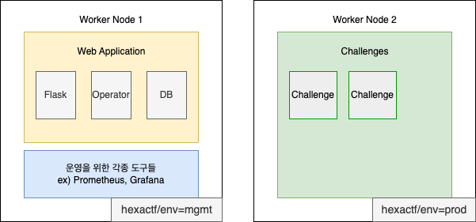
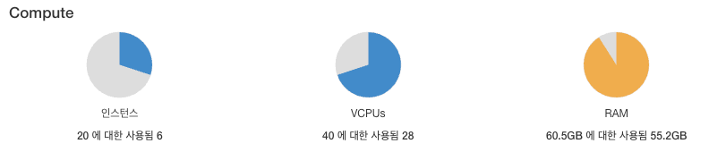
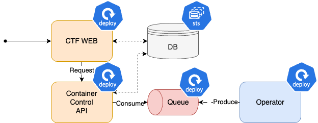

이제부터 워커 노드를 2개 선정한 이유와 쿠버네티스에 웹 애플리케이션을 배포하면서 느낀점을 작성하겠습니다.

## 쿠버네티스 워커 노드 구성

초기에 저는 사용자가 배포한 Challenge만의 독립적인 환경이 필요했습니다. 그래서 워커 노드를 2개 설치한 후 `nodeSelector`를 활용하여 애플리케이션 역할에 따라 각 노드에 배치될 수 있도록 구성했습니다.  
하나의 워커 노드에 웹 애플리케이션과 기타 모니터링 도구를 배치하고 다른 하나에는 Challenge 서버만 배치하도록 설계했습니다.



### 질문 1. 왜 워커 노드가 3개가 아닌가요?

아래의 질문을 할 수 있을 것 같습니다.

> "프로그램 역할에 따라 노드 별로 배치한다고 하셨잖아요. 그렇다면 노드 3개 배포해야 하는 것 아닌가요? "

위의 질문은 옳은 말이지만 **서버 리소스가 부족**하여 노드 3개를 배포하지 못했습니다.
쿠버네티스는 배포할때 Kubespray 플랫폼을 활용합니다. Kubespray에 워커 노드를 배포할때는 모두 동일한 이미지와 리소스 타입이 적용됩니다. 워커 노드에 이미지를 ubuntu:20.04에 리소스 타입으로 2vCPU, 4GB로 선택했다면 워커 노드 모두 동일하게 적용되는 것이죠.

#### 쿠버네티스 인스턴스에 배치된 리소스 양

> 워커 노드는 메모리 선정 기준이 확실히 있었으나 나머지는[ kublr에서 제시한 기준표](https://docs.kublr.com/installation/hardware-recommendation/)의 2배를 산정해서 생성했습니다. 넉넉하면 좋지 않을까 하는 마음으로 리소스를 늘렸던 것 같습니다.

- 마스터 노드 : 4vCPU, 8GB
- 워커 노드: 8vCPU, 16GB

그러나 실제 하드웨어는 64GB의 메모리를 가지고 있으며 Jenkins, NFS 서버, OpenStack 서버의 메모리 양을 고려했을때 워커 노드를 3개를 배치할 수 없었습니다.



### 질문 2. 워커 노드의 메모리를 16GB로 선택한 이유

> CPU는 연산할때 주로 많이 쓰이는 리소스입니다. 그러나 CTF 대회 문제 중에서 연산 집중적인 문제가 큰 비중을 차지하지 않습니다. 전반적으로 CPU 사용량이 무난하다고 판단해 추가적인 CPU 사용 기준을 설정하지 않았습니다.

Challenge의 최대 사용량을 계산했을때 16GB 메모리가 적당하다고 생각하고 있습니다.

출제할 문제의 베이스 이미지는 쿠버네티스 클러스터를 배포할 때 알 수 없습니다. 미리 예측해서 배포해야 합니다. 그러므로 최대 사용 가능한 컴퓨팅 자원량을 계산하여 자원 부족으로 인해 문제가 발생하지 않도록 설계해야 했습니다.

**Challenge 문제에 쿠버네티스 limit quota를 활용해 리소스의 최대 사용량을 설정할 것입니다. 이 정도를 토대로 총 예상 사용량을 계산하기로 결정했습니다.**

#### Challenge 서버의 특징

Challenge 서버는 **특정 기능 하나만 구현되어 있어 단순하다는 특징**을 가지고 있습니다. 또한 한명만 서버에 접속할 수 있죠.
CPU, 메모리 활용 관점에서 예측하면 다음과 같습니다.

1. CPU - 빌드 초기에 많이 쓰인다. 그 이외에는 무난할 것 같다.
2. 메모리 - 메모리 상한선이 정해져 있을 것 같다.

> [실제 대회를 운영하면서](https://s0okju.github.io/p/hexactf2025-review/) 예상한 패턴이 어느정도 맞긴 했습니다.

#### 메모리 사용량만 고려한 이유

우선 CPU는 선정 기준을 아직까지도 감을 찾지 못했습니다. 🥹 이건 실무에서 한번 배우고 싶네요.

메모리는 CPU과 다르게 초기에 데이터를 적재한 후에 실행되는 특징을 가지고 있습니다. CPU가 사용 후 바로 반납하는 느낌이라면 메모리는 누적의 느낌이 강합니다.(개인적인 생각입니다.)
메모리는 관리를 제대로 하지 않으면 빨리 소모되는 자원인 셈이죠. 그러므로 limit, request quota로 사용 가능한 최대 메모리 용량를 지정하여 불필요한 사용량을 줄이는 것이 중요하다고 생각했습니다.

#### 예상 사용 메모리 용량 계산

Challenge를 활용하는 CTF 문제는 주로 Web, System입니다. System은 가벼운 리눅스 이미지를 활용하며 자원 사용량의 편차가 크지 않습니다. 반면 Web의 경우에는 어떤 이미지를 활용했냐에 따라 편차가 매우 큽니다. 그러므로 상한선을 선택할 때는 스프링부트 플랫폼의 평균 메모리 사용량 256MB를 기준으로 계산했습니다.

> 256MB(스프링부트 기준 메모리 양) x 3(사용자 당 동시 실행 컨테이너 수) x 20(사용자) = 15GB

15GB는 제가 생각한 최대 메모리 사용량이라고 생각합니다. 사용자 수가 2배, 3배로 크게 증가하지 않는 한 예상 범위 내로 메모리를 활용할 것으로 보입니다.

> **여담**
> System 문제와 Web 문제의 메모리 사용량은 2배 ~ 4배 차이로 상당히 큽니다. 대회마다 문제 양과 유형이 크게 변화하지 않기 때문에 메모리 사용량을 비율로 계산할까 고민했습니다.
> 실제 대회에 참가한 친구들에게 물어보니 Web 문제에 가장 많이 도전하고 시간 투자를 많이 한다고 합니다. 그래서 Web 문제의 최대 메모리 사용량을 기준으로 선택했습니다.

#### Challenge request, limit quota

저는 모든 Challenge의 Deployment에 아래와 같은 resource quota를 설정했습니다.

```yaml
resources:
  limits:
    cpu: "500m"
    memory: "512Mi"
  requests:
    cpu: "250m"
    memory: "256Mi"
```

왜 최대 사용량을 256MB으로 지정했으면서 실제로는 512MB로 선정했는지 궁금하셨을 것 같습니다.

> 왜 DevOps, SRE가 개발 경험이 있어야 하는지 뼈저리게 느꼈습니다. 경험이 없으니 전반적으로 감을 잡을 수 없었습니다.

Challenge 서버에서 기능은 하나 뿐이고 사용자도 실질적으로 한명이기 때문에 리소스 사용량이 크게 변하지 않을 것이라고 생각했습니다. 그런데 눈으로 직접 보지 않는 이상 모르겠다는 생각을 했습니다.  
마침 참여가 확정된 사용자는 예상보다 적어서 사용 패턴을 확인할 겸 limit를 512MB로 선정하게 되었습니다.

## 쿠버네티스 HexaCTF 서비스 아키텍처 설계 및 회고

웹 애플리케이션은 hexactf라는 네임 스페이스에 배포했습니다.
hexactf 내에 있는 애플리케이션은 모두 하나의 Helm으로 배포했습니다.

> Operator 배포 방식에 대한 자세한 내용은 [HexaCTF9](https://s0okju.github.io/p/hexactf-9/)를 참고하시길 바랍니다.

> 눈썰미 좋으신 분들은 알겠지만 Queue 또한 메세지를 저장해야 하므로 Statefulset으로 배포해야 합니다.



### 아쉬운 점

가장 아쉬운 점은 모든 애플리케이션을 하나의 Helm으로 배포한 것입니다.

1. 데이터베이스

운영하면서 DB에 진짜 오류가 많았습니다. `kubectl logs` 로 매일 문제점을 파악했는데요. 로그만으로는 명확한 원인은 파악할 수 없었지만 [InterfaceError가 빈번하게 나타나는 것을 보아 Connection leak 문제라고 생각했습니다. ](https://hiwony.tistory.com/85)

```
pymysql.err.InterfaceError: (0, '')
```

그래서 문제의 근거를 찾고자 Prometheus의 ServiceMonitor 연결을 시도했으나 실패했습니다. 시간이 없어서 끝까지 해보지는 못했습니다.  
대회가 끝나고 다시 생각해보니 Operator로 MariaDB를 따로 배포하면 좋지 않았을까 하는 아쉬움이 있습니다. 내부적으로 모니터링 기능을 쉽게 설정할 수 있으며 상황에 따라서 확장과 관리가 용이하기 때문입니다.

2. 큐

사진에는 Queue라고 적었지만 정확하게 Kafka입니다.

> Kafka를 선정한 이유는 한번이라도 써보고 싶었기 때문입니다. ^-^! 쓰고 나서 후회했습니다.

눈썰미가 좋으신 분들은 알고 계셨겠지만 Queue 또한 StatefulSet으로 배포해야 합니다. 큐에는 메세지가 저장되어 있기 때문에 상태를 저장해야 하기 때문입니다.  
프로젝트에서는 운이 좋게도 큐에 문제가 생기지 않아 데이터 유실이 되지 않았습니다. 그러다 대회를 마무리하고 나서 보니 배포 리소스를 잘못 설정했다는 것을 깨닫게 되었습니다.

Queue도 프로젝트의 Helm으로 관리하는 것이 아닌 분리해서 Operator로 관리하는 것이 좋다고 생각했습니다. 데이터베이스와 동일한 이유로 확장과 관리가 용이하기 때문입니다.

## 배포 프로세스 회고

### 작은 일도 수작업은 힘들다.

프로젝트 당시 **자동화는 하나도 하지 않고 수작업으로 변경사항을 일리리 확인하고 빌드하고 배포**했습니다.

젠킨스 서버는 존재합니다. 그런데 주요 목적은 **수동**으로 HexaCTF 웹 애플리케이션, Challenge 이미지를 빌드하여 이미지 레지스트리에 전송하는 용도였습니다.

초기에는 프로젝트가 소규모이므로 CI/CD는 필요없다는 의견이 대다수였습니다. 저도 어느 정도 동의했으며 한 사람(본인)이 모든 배포 프로세스를 수용할 수 있을 것이라고 생각했습니다.

대회 일주일 전에 git pull, helm upgrade 명령어만 무한 반복으로 치니 다양한 생각이 들었습니다.

- Helm으로 동시에 배포했는데 애플리케이션 하나는 이전 버전으로 롤백하고 다른 애플리케이션은 업그레이드 버전을 활용해야 하는 경우 -> 하나로 배포하는게 아니라 팀 단위로 쪼개서 CI/CD 쓸걸
- Helm upgrade 했는데 빌드 과정을 생략하여 변경 사항이 반영되지 않은 경우 -> 젠킨스로 이미지를 자동으로 빌드할걸
- branch를 잘못 설정했으면서 수동으로 빌드하기 눌러 구버전으로 이미지 빌드하기 -> 젠킨스로 이미지를 자동으로 빌드했으면 내가 브랜치를 잘못 썼다는 걸 알았을텐데
- helm 파일 수정본이 반영되지 않는 경우 -> ArgoCD 쓸걸
- 문제 발생 시 팀원에게 직접 알리기 -> CI/CD에 있는 알림 기능을 활용할걸
- 기타 등등 ...

휴먼 이슈로 인해 예상보다 문제는 많았고 자동화를 안한 것을 뼈저리게 후회했습니다.


## 마치며

웹 애플리케이션 배포에 대해 기술적으로 작성할만한 것은 없었습니다. 자동화라는 좋은 시스템을 버리고 선사 시대의 방식으로 수행했으니까요. 그만큼 몸소 느낀점이 많으며 제목도 배포가 아닌 "회고"로 지은 것 같습니다.

이제 기술적인 내용은 끝입니다. 5개월 끝에 드디어 글을 모두 작성할 수 있었네요.  
다음에 "HexaCTF 시리즈 어워드"를 마지막으로 시리즈를 마치겠습니다.
