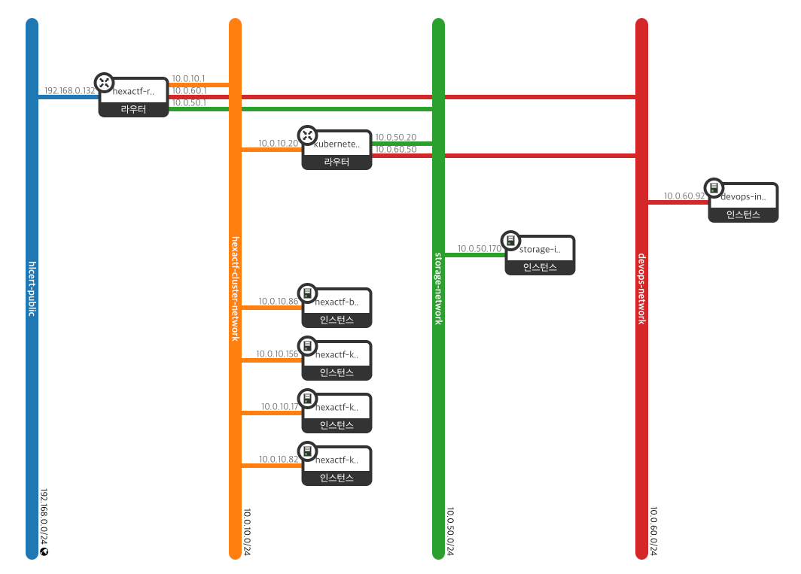
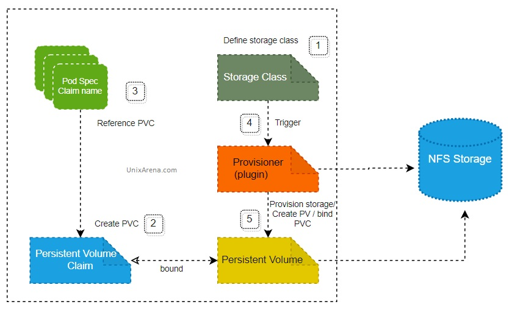
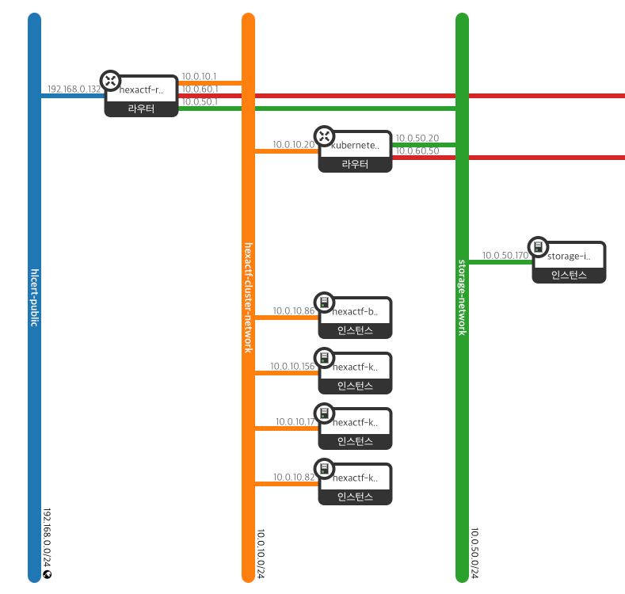
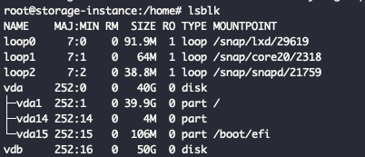
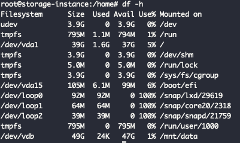
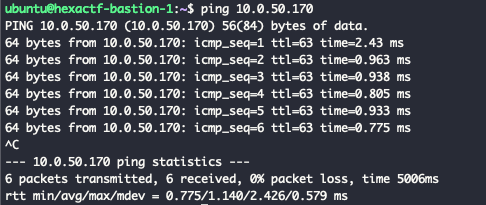
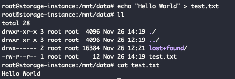
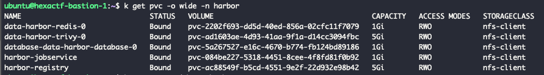
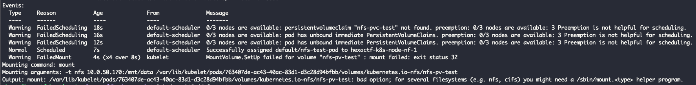

## 전체 아키텍쳐 구성도

저희 프로젝트는 크게 3개의 서브넷을 가지게 됩니다.

- Kubernetes Subnet
  - Kubernetes Master, Worker nodes
- Storage Subnet
  - NFS Server
- DevOps Subnet
  - Jenkins Server



## NFS 아키텍쳐 구성

### 왜 필요할까?

#### 상태값 저장

저희 프로젝트는 쿠버네티스 환경에서 수행하게 됩니다. 그 과정에서 데이터베이스와 같이 상태를 저장해야 하는 애플리케이션이 필요하게 됩니다. 관리자는 PV로 스토리지를 정의하고 상태 저장이 필요한 애플리케이션의 PVC를 활용하여 데이터를 영구적으로 저장하게 됩니다.
PV는 로컬 디스크에 저장하거나 NFS와 같은 통신이 필요한 스토리지 시스템으로 정의할 수 있습니다. 로컬 디스크에 저장한다는 것은 Worker node의 디스크에 저장한다는 말과 같습니다. 그러므로 데이터 저장소를 외부와 분리하고자 NFS를 사용하게 되었습니다.

#### Dynamic Provisioning

NFS를 선택한 핵심적인 이유입니다. 애플리케이션이 스토리지 사용을 위해 PVC를 요청하게 되면 요구사항에 맞는 PV에 바인딩하게 됩니다. 모든 작업마다 그에 상응하는 PV-PVC 쌍을 만들어야 한다는 것과 같습니다. 불편함을 해소하기 위해서 PVC 요청에 대한 PV를 생성하는 과정을 자동화는 Dynamic Provisioning을 활용하게 되었습니다.



### NFS in Nova vs Manila

데이터베이스를 구축하는 방법으로 EC2 Instance에서 DB 엔진을 직접 설치하듯이 NFS로 직접 인스턴스에 직접 설치할 수 있는 방법이 있습니다.
Openstack에는 NFS를 직접 설치할 수 있도록 [Manila](https://docs.openstack.org/manila/latest/)라는 파일 공유 서비스를 제공해줍니다.

공식문서에 의하면 NFS는 아래와 같은 기능을 목표로 삼습니다.[^1]

- Component based architecture: Quickly add new behaviors
- Highly available: Scale to very serious workloads
- Fault-Tolerant: Isolated processes avoid cascading failures
- Recoverable: Failures should be easy to diagnose, debug, and rectify
- Open Standards: Be a reference implementation for a community-driven api

그 이외에도 통합적인 대시보드, 모니터링, 로깅 도구를 활용할 수 있다는 것이 큰 장점입니다.
그럼에도 Manila가 아닌 **Nova에 NFS를 설치하는 방안**을 선택했습니다.
선택한 가장 큰 이유는 **어렵다**는 것입니다. 프로젝트 이전에 [데이터베이스 시스템인 trove를 설치한 경험이 있었습니다. ](https://medium.com/s0okju-tech/opsathlan-scenario-3-1-hello-mysql-28965a7bc466) 원인을 찾았지만 해결하지 못한 경험이 있었습니다. 클라우드에 적합한 시스템이라 네트워크, 인증 등 고려사항이 많다고 느꼈습니다. 소규모에 쉬운 방법으로 하나의 인스턴스에서 nfs-server에 설치하는 방식을 선택했습니다.

### NFS 설치하기

설치하기 이전에 NFS 요구사항에 대해 생각해보겠습니다.

#### NFS 네트워크 요구사항

- 쿠버네티스 서브넷과 통신해야 한다.
- nfs server를 설치하기 위해 외부와 통신해야 한다.

위의 요구사항에 맞게 storage subnet은 public, kubernetes subnet의 router로 연결했습니다.



### Terraform 으로 구성하기

#### 네트워크

storage라는 prefix를 가진 network와 subnet를 만들어줍니다. 그리고 라우터를 정의하여 서로 다른 네트워크를 연결합니다.
Openstack의 Neutron의 경우에는 크게 가상 라우터와 서브넷의 연결 관계로 구성됩니다. 이는 실제 물리적인 네트워크 환경처럼 라우터 인터페이스에 네트워크 케이블을 꽂는 형식과 유사합니다. 그래서 Neutron 내부에서는 서브넷이 할당된 네트워크에 논리 포트를 만들고 이를 라우터에 연결하게 됩니다.

```hcl

# Get the existing public network
data "openstack_networking_network_v2" "public_network" {
  name = var.public_network_name
}

# Get the existing public router
data "openstack_networking_router_v2" "public_router" {
  name = var.public_router_name
}

# Create the storage network
resource "openstack_networking_network_v2" "storage_network" {
  name = var.storage_network_name
}

# Create the storage subnet
resource "openstack_networking_subnet_v2" "storage_subnet" {
  name            = var.storage_subnet_name
  network_id      = openstack_networking_network_v2.storage_network.id
  cidr            = var.storage_subnet_cidr
  ip_version      = 4
  dns_nameservers = var.dns_nameservers
}

# Connect the storage subnet to the public router
resource "openstack_networking_router_interface_v2" "storage_router_interface" {
  router_id = data.openstack_networking_router_v2.public_router.id
  subnet_id = openstack_networking_subnet_v2.storage_subnet.id
}

```

서브넷을 라우터에 연결하기 위해서는 [openstack_networking_router_interface_v2](https://registry.terraform.io/providers/terraform-provider-openstack/openstack/latest/docs)함수를 사용하게 됩니다. 서브넷을 연결할 때 `subnet_id`를 사용할 수 있고 `port_id`를 사용할 수 있습니다.

subnet_id를 사용하게 되면 자동으로 해당 CIDR의 x.x.x.1 의 주소의 포트로 연결됩니다. 그러나 하나의 서브넷이 2개 이상일 경우 subnet_id를 두 번이상 사용하게 된다면 사용중인 port IP라는 에러 메세지를 확인할 수 있습니다.

```hcl
# Subnet_id를 사용하는 방법
resource "openstack_networking_router_interface_v2" "storage_router_interface" {
  router_id = data.openstack_networking_router_v2.public_router.id
  subnet_id = openstack_networking_subnet_v2.storage_subnet.id
}
```

그럴 경우 [openstack_networking_port_v2](https://registry.terraform.io/providers/terraform-provider-openstack/openstack/latest/docs/resources/networking_port_v2) 에서 사용할 port_ip를 지정해서 사용할 수 있습니다.

```hcl
# Port를 사용하는 방법
resource "openstack_networking_port_v2" "storage_kubernetes_router_port" {
  name           = "kubernetes-storage-port"
  network_id     = openstack_networking_network_v2.storage_network.id
  admin_state_up = "true"

  fixed_ip {
    subnet_id  = openstack_networking_subnet_v2.storage_subnet.id
    ip_address = "10.0.50.20"
  }
}

resource "openstack_networking_router_interface_v2" "storage_kubernetes_interface" {
  router_id = openstack_networking_router_v2.kubernetes_router.id
  port_id   = openstack_networking_port_v2.storage_kubernetes_router_port.id
}
```

#### 컴퓨팅 자원

NFS 서버와 관련된 인스턴스를 제작해보겠습니다.
NFS 서버는 2049, 111 포트를 활용합니다. NFS 서버는 쿠버네티스 서브넷과 주로 통신하므로 Kubernetes subnet인 10.0.10.0/24에서 요청하는 2049, 111 TCP, UDP 네트워크를 모두 허락해줍니다.

```hcl
# Create the NFS security group
resource "openstack_networking_secgroup_v2" "nfs_secgroup" {
  name        = "${var.storage_instance_name}-nfs-secgroup"
  description = "Security group for NFS access"
}

resource "openstack_networking_secgroup_rule_v2" "nfs_ingress" {
  direction         = "ingress"
  ethertype         = "IPv4"
  protocol          = "tcp"
  port_range_min    = 2049
  port_range_max    = 2049
  remote_ip_prefix  = "10.0.10.0/24"
  security_group_id = openstack_networking_secgroup_v2.nfs_secgroup.id
}

# ...  secgroup 일부 생략

# Create a port in the storage network for the instance
resource "openstack_networking_port_v2" "storage_port" {
  name               = "${var.storage_instance_name}-port"
  network_id         = openstack_networking_network_v2.storage_network.id
  security_group_ids = [openstack_networking_secgroup_v2.nfs_secgroup.id]
  fixed_ip {
    subnet_id = openstack_networking_subnet_v2.storage_subnet.id
  }
}

# Create a floating IP for the storage instance
resource "openstack_networking_floatingip_v2" "storage_fip" {
  pool = var.public_network_name
}

# Associate the floating IP with the storage instance's port
resource "openstack_networking_floatingip_associate_v2" "storage_fip_assoc" {
  floating_ip = openstack_networking_floatingip_v2.storage_fip.address
  port_id     = openstack_networking_port_v2.storage_port.id
}

```

그리고 50GB 블록 스토리지(Cinder)를 NFS 인스턴스에 붙여서 생성합니다. 인스턴스를 만들때 이전에 정의한 보안 그룹도 지정해줍니다.

```hcl
resource "openstack_blockstorage_volume_v3" "nfs-volume" {
  name = "bfs-volume"
  size = 50
}

# Create the storage instance
resource "openstack_compute_instance_v2" "storage_instance" {
  name            = var.storage_instance_name
  flavor_name     = var.storage_flavor_name
  image_name      = var.storage_image_name
  key_pair        = openstack_compute_keypair_v2.nfs_keypair.name
  security_groups = [openstack_networking_secgroup_v2.nfs_secgroup.name]

  network {
    port = openstack_networking_port_v2.storage_port.id
  }

  metadata = {
    ssh_user = "ubuntu"
  }
}

resource "openstack_compute_volume_attach_v2" "nfs-volume-attached" {
  instance_id = openstack_compute_instance_v2.storage_instance.id
  volume_id   = openstack_blockstorage_volume_v3.nfs-volume.id
}
```

> NFS는 Private Network 환경에만 사용합니다. 그러나 nfs 설정 시 외부와의 접근이 필요하므로 floating ip를 할당했습니다.

## NFS 서버 설정

### 환경 설정

NFS 서버는 50GB 블록 스토리지와 연결된 인스턴스로 이뤄져 있습니다. Horizon에서 인스턴스의 정보를 보면 부착된 볼륨을 확인할 수 있습니다.


ssh에 접속해보면 마운팅된 볼륨을 확인할 수 있습니다.



추후 쿠버네티스에서 사용될 모든 데이터는 볼륨 스토리지에 저장할 것입니다. 그러므로 볼륨을 ext4 형태로 포맷하여 `/mnt/data` 경로에 마운팅합니다.



`nfs-server` 라이브러리를 설치한 후 `/etc/exports` 파일을 수정합니다. 쿠버네티스 서브넷이 블록 스토리지에 있는 `/mnt/data` 에 읽고 쓸 수 있도록 권한을 설정합니다.

```
/mnt/data 10.0.10.0/24(rw,sync,no_subtree_check)
```

> 자세한 사항은 [\[Ubuntu\] NFS 서버 및 클라이언트 구성 - Dongle’s 개발노트](https://dongle94.github.io/ubuntu/ubuntu-nfs-setting/) 를 참고하시길 바랍니다.

### 테스트하기

우선 쿠버네티스에서 NFS 서버 IP인 `10.0.50.170`가 정상적으로 통신한지 확인합니다.



NFS 서버에 Hello World 문자열이 있는 `test.txt` 파일을 정의합니다.



마운팅에서 확인해보면 데이터가 정상적으로 저장되었음을 확인할 수 있습니다.

```bash
sudo mount 10.0.50.170:/mnt/server /mnt
```


## 활용하기 - Harbor in Kubernetes

Harbor를 설정하기 이전에 Dynamic provisioner를 설치합니다. [nfs-subdir-external-provisioner](https://github.com/kubernetes-sigs/nfs-subdir-external-provisioner#with-helm) 를 사용했으며 helm을 통해 쉽게 설치했습니다.

```bash
helm install nfs-subdir-external-provisioner nfs-subdir-external-provisioner/nfs-subdir-external-provisioner \
    --set nfs.server=10.0.50.170 \
    --set nfs.path=/mnt/data
```

> [Harbor Kubernetes Helm 설치 — Jeongchul Kim](https://jeongchul.tistory.com/728) 블로그를 참고하여 harbor를 설치했습니다.

values.ym의 `persistence` 에서 nfs-subdir-external-provisioner에서 생성한 storageClass를 정의합니다. 그리고 실행되면 정상적으로 작동됩니다.



만약에 설치하다가 아래와 같이 helper program이 필요하다는 에러 메세지를 볼 수 있습니다.

```
Output: mount: /var/lib/kubelet/pods/.../volumes/kubernetes.io~nfs/nfs-pv-test: bad option; for several filesystems (e.g. nfs, cifs) you might need a /sbin/mount.<type> helper program.
```

실제로 쿠버네티스에서 Mounting을 할때 `mount` 명령어를 사용합니다. 이는 `nfs-common` 패키지에 있는 명령어로 노드에 `nfs-common` 를 직접 설치해야 합니다.



## 마치며

지금까지 NFS를 구축하기 위해 Terraform으로 인프라 환경을 설정하고 인스턴스에 nfs 서버를 설정했습니다. 다음에는 Jenkins 인프라 환경을 구성하고 어떻게 Harbor Registry에 빌드한 도커 이미지를 Push하는지 작성하겠습니다.

[^1]: [OpenStack Shared Filesystems (manila) documentation — manila 19.1.0.dev52 documentation](https://docs.openstack.org/manila/latest/)
