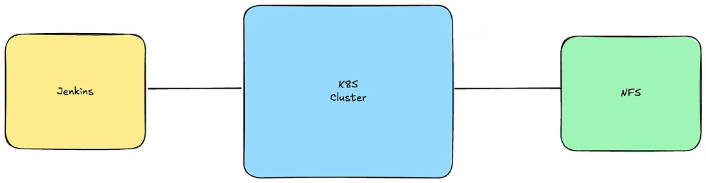
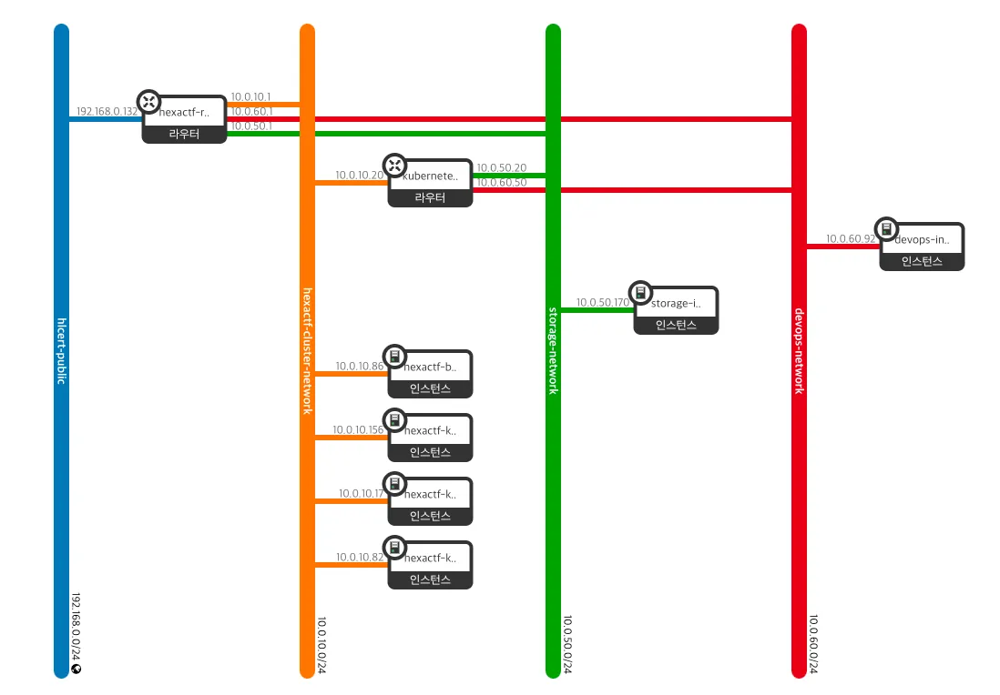
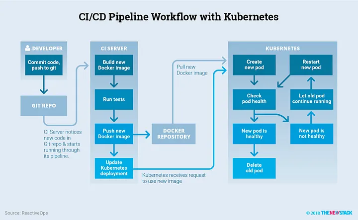
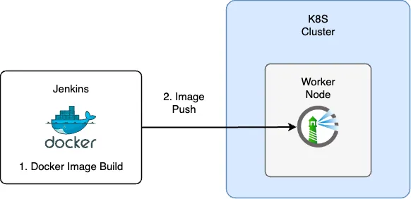
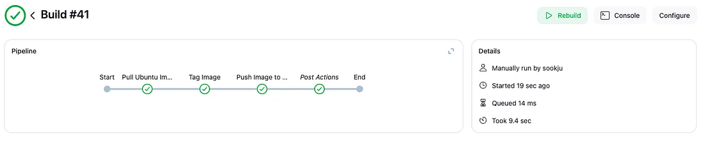

## Jenkins 환경 구성

### 어디에 젠킨스를 설치해야 할까?

쿠버네티스를 처음 공부했을때 “쿠버네티스 내에 데이터베이스를 운영하는 것이 과연 안전할까?”에 대해 의문점을 가지게 되었습니다. 데이터 손실이 우려된다는 과거의 의견과 달리 현재는 다양한 기업들이 DBaaS를 도입하고 있었습니다.[^1][^2]  
이런 흐름으로 젠킨스 또한 쿠버네티스 내에 운영할까요? 레딧과 같은 지식 공유 플랫폼을 종합해보면 쿠버네티스 내에 젠킨스를 운영하는
경우가 많이 보입니다.[^3]  
그러나 저희 프로젝트는 CI를 담당하는 팀원은 따로 있습니다. 완전한 역할 분리를 위해 인스턴스에 따로 젠킨스를 설치하게 되었습니다.

### Jenkins 배포

아래는 대략적인 아키텍쳐입니다. 여기서 중요한 점은 Jenkins 인스턴스와 쿠버네티스 노드와 연결되어야 합니다. 각각의 서브넷이 라우터로 연결하여 서로 통신할 수 있도록 설정해야 합니다.



Jenkins를 인스턴스로 배포하고 외부 IP(Floating IP)로 연결하는 부분은 생략하겠습니다.
이전 글에서 언급한 것처럼 하나의 라우터에 여러 개의 포트를 연결하고 싶다면 openstack_networking_port_v2 함수를 활용해야 한다고 말했습니다. 이도 동일하게 Jenkins가 포함되어 있는 서브넷에 포트를 생성하여 쿠버네티스 라우터에 연결합니다.

```hcl
resource "openstack_networking_port_v2" "devops_kubernetes_router_port" {
  name           = "kubernetes-devops-port"
  network_id     = openstack_networking_network_v2.devops_network.id
  admin_state_up = "true"

  fixed_ip {
    subnet_id  = openstack_networking_subnet_v2.devops_subnet.id
    ip_address = var.devops_port_address
  }
}

resource "openstack_networking_router_interface_v2" "devops_kubernetes_interface" {
  router_id = openstack_networking_router_v2.kubernetes_router.id
  port_id   = openstack_networking_port_v2.devops_kubernetes_router_port.id
}
```

배포를 모두 끝내면 아래와 같은 토폴로지를 확인할 수 있습니다.



## Harbor

### 쿠버네티스 환경에서 CI

쿠버네티스 환경에서 CI 과정은 컨테이너를 빌드하고 이미지를 저장하는 프로세스가 포함됩니다. 그 중 이미지를 저장하기 위해서는 도커 레지스트리가 필요합니다.



### 도커 레지스트리

도커 레지스트리는 도커 이미지를 관리하는 저장소 입니다. 저장소는 크게 public과 private이 있습니다. 내부적으로 사용할 예정이므로 private 레지스트리를 선택하게 되었습니다.

후보는 크게 두 가지입니다.

- Docker Registry
- Harbor

도커 레지스트리 선정 기준은 “깔끔한 UI를 가지고 있는가?” 입니다. 후보 중에는 기준에 부합한 플랫폼은 Harbor였습니다.


### 설치

공식 문서를 참고해서 helm 파일을 다운로드 받습니다.

```sh
helm repo add harbor https://helm.goharbor.io
helm fetch harbor/harbor --untar
```

가장 먼저 해야하는 것은 Volume에 대한 설정입니다. Harbor는 다양한 PVC를 요청합니다. 프로젝트는 Dynamic Provisioning을 위한 NFS 환경을 구축했습니다. 그러므로 values.yaml 에 strageClass만 값을 입력하면 됩니다.

```yaml
persistentVolumeClaim:
  registry:
    # Use the existing PVC which must be created manually before bound,
    # and specify the "subPath" if the PVC is shared with other components
    existingClaim: ""
    # Specify the "storageClass" used to provision the volume. Or the default
    # StorageClass will be used (the default).
    # Set it to "-" to disable dynamic provisioning
    storageClass: "nfs-client"
    subPath: ""
    accessMode: ReadWriteOnce
    size: 5Gi
    annotations: {}
  jobservice:
    jobLog:
      existingClaim: ""
      storageClass: "nfs-client"
      subPath: ""
      accessMode: ReadWriteOnce
      size: 1Gi
      annotations: {}
```

환경 설정을 다 하고 배포하면 정상적으로 작동됩니다.

## Jenkins — Harbor 연결하기

### HTTP로 연결하기

젠킨스 인스턴스가 쿠버네티스 내부에 있는 Harbor에 이미지를 저장해야 합니다. 저희 환경에서는 Harbor를 nodePort로 연결하여 도커 레지스트리에 연결할 수 있도록 설정하겠습니다.



Harbor와 같은 도커 레지스티의 경우 HTTPS로 연결하는 것을 권장합니다. 하지만 저희는 HTTP로 설정하겠습니다.
Harbor의 우선 nodePort를 30002로 설정한 후 externalURL 에 http가 포함된 URL를 설정해야 합니다.

```yaml
externalURL: http://10.0.10.156:30002
```

젠킨스 인스턴스에서 `/etc/docker/daemon.json` 파일에 HTTP를 적용할 harbor의 host를 명시해줍니다.

```yaml
{ "insecure-registries": ["http://10.0.10.156:30002"] }
```

도커를 재시작하면 위의 설정이 적용됩니다.

### Jenkins Pipeline 설정

Credential 설정등은 생략하겠습니다.
도커를 빌드하기 위해서는 크게 3가지 과정이 필요합니다.

1. 도커 빌드
2. 도커 이미지 Tagging
3. 도커 이미지 Push

젠킨스는 프로젝트 단위로 이미지를 관리합니다. 아래의 코드는 ubuntu 이미지를 빌드하여 test 프로젝트에 이미지를 push하는 것을 보여줍니다.

```
pipeline {
    agent any
    environment {
        DOCKER_REGISTRY = "10.0.10.156:30002"
        IMAGE_NAME = "ubuntu"
        TARGET_REPO = "test/ubuntu"
    }
    stages {
        stage('Pull Ubuntu Image') {
            steps {
                echo "Pulling the Ubuntu image from Docker Hub..."
                sh "docker pull ${IMAGE_NAME}:latest"
            }
        }
        stage('Tag Image') {
            steps {
                echo "Tagging the image for Harbor..."
                sh "docker tag ${IMAGE_NAME}:latest ${DOCKER_REGISTRY}/${TARGET_REPO}:latest"
            }
        }
        stage('Push Image to Harbor') {
            steps {
                echo "Pushing the image to Harbor..."
                withDockerRegistry([credentialsId: 'harbor-credentials', url: "http://${DOCKER_REGISTRY}"]) {
                    sh "docker push ${DOCKER_REGISTRY}/${TARGET_REPO}:latest"
                }
            }
        }
    }
    post {
        always {
            echo "Cleaning up Docker images..."
            sh "docker rmi ${IMAGE_NAME}:latest || true"
            sh "docker rmi ${DOCKER_REGISTRY}/${TARGET_REPO}:latest || true"
        }
    }
}
```

이미지를 push하면 정상적으로 작동됨을 확인할 수 있습니다.



[^1]: https://sungchul-p.github.io/db-on-k8s-case-study
[^2]: https://engineering.linecorp.com/ko/blog/declarative-cloud-db-service-using-kubernetes
[^3]: https://www.reddit.com/r/devops/comments/m3lc3r/jenkins_inside_kubernetes_or_not/
