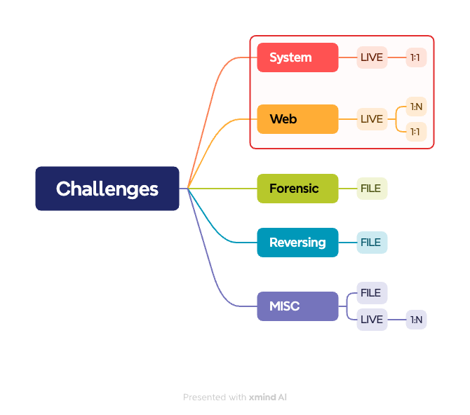
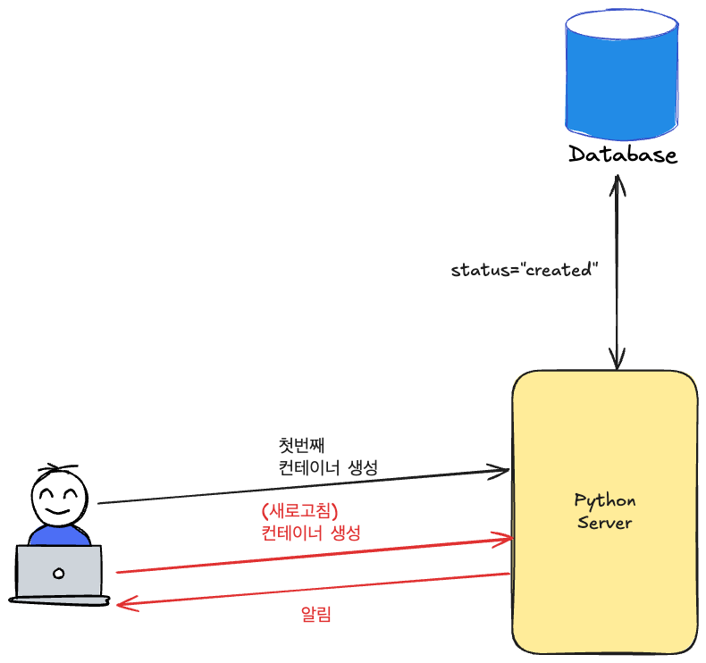
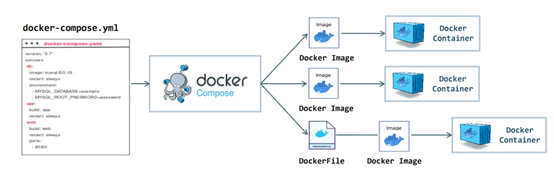

## CTF의 문제 특징

### 문제 종류

Challenge를 어떻게 구성할 것인가를 생각하기 전에 문제 배포 관점에서 CTF 문제 종류를 파악해야 합니다.
크게 5가지의 카테고리가 있으며 문제를 출제하는 방식은 크게 두 가지있습니다.

- Live : 실제로 운영중인 서버를 통해 문제를 푸는 경우
- File : 파일을 다운받아서 문제를 푸는 경우

Live 방식 중에서 두 가지를 더 나눌 수 있습니다.

- 1:1 : 한 사람당 고유한 서버에 접속해야 하는 경우, 주로 상태가 있는(Stateful) 애플리케이션 문제에 적합
- 1:N : 하나의 서버에 여러 사람이 접속해야 하는 경우, 주로 상태가 없는(Stateless) 애플리케이션의 문제에 적합

예를 한번 들어보겠습니다.
단순하게 nginx, server로만 구성된 간단한 XSS 문제가 있다고 생각해봅시다.  
자바스크립트 코드를 삽입해 악의적인 행위를 하는 공격 방법입니다.[^1] XSS CTF 문제에서는 의도한 악의적인 행위를 수행하면 플래그를 반환하게 됩니다.  
이때 여러 사람들이 동일한 XSS 문제 사이트 접속했을때 서로 영향을 받을까요? 그렇지 않습니다. 사용자는 자신만의 독립적인 환경에서 nginx가 반환하는 자바스크립트를 사용하고 있기 때문에 서로 영향을 받지 않게 되는 것입니다. 이런 문제 유형은 위에서 말한 1:N 방식을 사용하게 됩니다.

SQL Injection 문제를 생각해봅시다.
SQL Injection을 시도하기 위해 다양한 명령어를 시도하게 됩니다. 그 과정에서 문제를 해결한 사람의 데이터를 확인할 수 있게 됩니다. 이는 대회에 큰 영향을 주기 때문에 사용자마다 격리가 필요합니다.(서로 독립된 데이터베이스를 가져야 합니다.) 이런 문제 유형은 위에서 말한 1:1 방식을 사용하게 됩니다.

### 주목할만한 특징

Live 1:1 서비스는 자원 낭비를 최소화하기 위해 문제가 실행된지 30분 후에 자동으로 삭제가 됩니다. 대부분의 CTF 문제 풀이 사이트는 특정 문제에 제한 시간을 두는 등 많이 사용하는 방식입니다.

- Live 1:1 서비스 : 실행한지 30분이 지나면 삭제되어야 한다.

CTF 대회를 많이 경험해본 친구에게 제한 시간을 걸어두는 것에 대해 의견을 나눈 적이 있습니다. 친구가 말하길 중간에 시간 만료로 문제 사이트가 다운되더라도 일반적인 현상으로 받아들인다고 합니다.

## 문제 컨테이너 초기 구성 (1) - Docker 사용

Python Docker SDK를 활용해서 도커를 생성하고 삭제할 수 있습니다. 초기에는 간단하게 Docker SDK를 사용하는 방식을 채택했습니다.

### 컨테이너의 무한 증식을 막아라

동일한 프로젝트를 수행한 동아리원을 만나게 되었습니다. 프로젝트 관련된 이야기를 하다가 **컨테이너의 무한 증식으로 인한 서버 과부하 현상 해결이 필요하다는 의견을 받았습니다.**

제가 예상한 문제의 원인은 다음과 같습니다.

1. 문제 생성을 요청할때 문제 컨테이너 실행 상태를 검증하지 않거나 저장된 상태와 실제 상태에 불일치가 발생했다.
2. 컨테이너 이름에 사용자 식별값 + 난수가 섞여 있다.

문제 생성을 요청할때 문제 컨테이너 실행 상태를 검증하지 않았다면 데이터베이스에 값을 저장하면 됩니다. **문제는 저장된 상태와 실제 상태에 불일치가 발생을 어떻게 해결할 것인가 입니다.**

### 상태 불일치 해결방안은 간단하지만 구현하기 어렵다.

데이터베이스에 저장된 상태와 실제 상태의 불일치를 해결하는 방법은 **주기적으로 대상을 확인**하는 것이라고 생각합니다.
단순하게 하나의 애플리케이션만 주기적으로 상태를 확인하는 것은 비교적 구현이 쉽습니다. 그러나 컨테이너가 여러개인 경우에는 병렬 처리로 인해 구현 난이도가 올라가게 됩니다.

상태 불일치를 확인해야 하는 대상은 Live이면서 한사람당 하나의 컨테이너가 배포되어야 하는 1:1 서비스일 것입니다. 그런데 시간 만료로 인해 문제 컨테이너는 자주 삭제되고 생성됩니다. 2개의 1:1 문제를 출제한다고 가정했을때 10명이 문제에 접속한다고 한다면 컨테이너의 총합은 절대 작은 숫자는 아닙니다.  
이러한 상황에서 한정된 자원 내에 일반적인 방법(순차적)으로 서비스를 찾고 대상을 지속적으로 확인하는 것은 비효율적입니다. 그러므로 병렬처리 또는 동시성 처리를 통해 효율성을 높이는 작업이 필요하게 됩니다.

### 컨테이너 패키지 문제

SQL Injection 문제를 출제한다고 가정하겠습니다. nginx, server, db 컨테이너 3개가 필요하게 됩니다. 관리하는 사람 입장에서는 3개를 일괄적으로 관리하는 것이 효율적입니다.  
이와 같은 기능을 하는 것이 docker-compose입니다. docker-compose를 사용하여 여러개의 컨테이너를 하나의 서비스로 구성해서 관리할 수 있습니다.

그러나 별도의 파이썬 라이브러리로 제공되지 않고 subprocess에 명령어 형태로 구현해야 합니다. 구현하더라도 잘 안되는 경우가 있습니다.  
사용자마다 고유한 컨테이너를 가져야 한다는 것은 다른 말로 각각 고유한 컨테이너 이름을 가져야 한다는 것과 같습니다. 결국 일반적인 docker-compose 만으로는 문제 컨테이너를 만드는데 한계가 있으며 원활한 처리를 위해서는 직접 구조를 정의해야 합니다.

### 요구사항

1. 컨테이너 상태를 지속적으로 확인
2. 다양한 컨테이너를 하나의 구조로 직접 정의하고 관리

위의 요구사항을 충족하기 위해서는 기능을 처음부터 구현해야 합니다.
시간이 많이 소요되며 궁극적인 목표인 CTF 대회 개최와 멀어질 수 있다고 생각했습니다.

## 다음화 - Kubernetes 사용

지금까지 CTF 문제 컨테이너를 docker로 설계하면서 느낀 한계점에 대해 설명했습니다.  
팀원들과 상의해본 결과 docker만으로는 우리가 원하는 기술을 구현할 수 없다고 결론을 지었습니다. 그 대신 주기적으로 리소스의 상태를 확인할 수 있으며 CR를 통해 커스텀으로 리소스를 정의할 수 있는 쿠버네티스를 선택하게 되었습니다.  
다음 글에서는 쿠버네티스를 통해 어떻게 설계했는지 설명하겠습니다.

[^1]: [XSS(크로스 사이트 스크립트)란? 공격 유형부터 보안대책까지! | SK쉴더스](https://www.skshieldus.com/blog-security/security-trend-idx-06)
