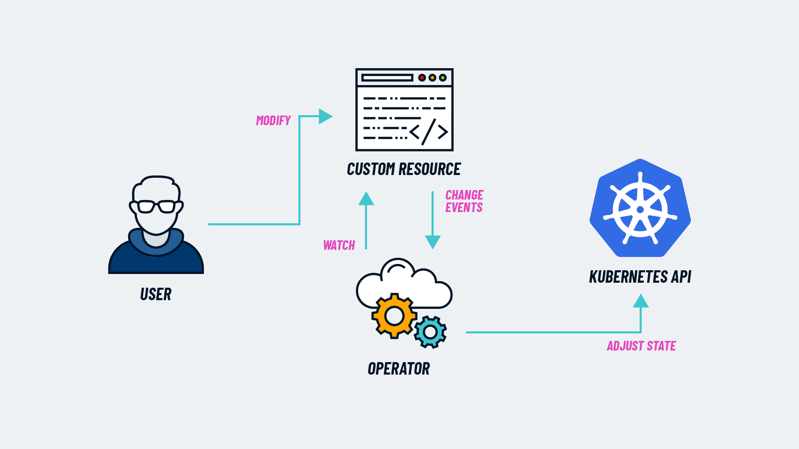
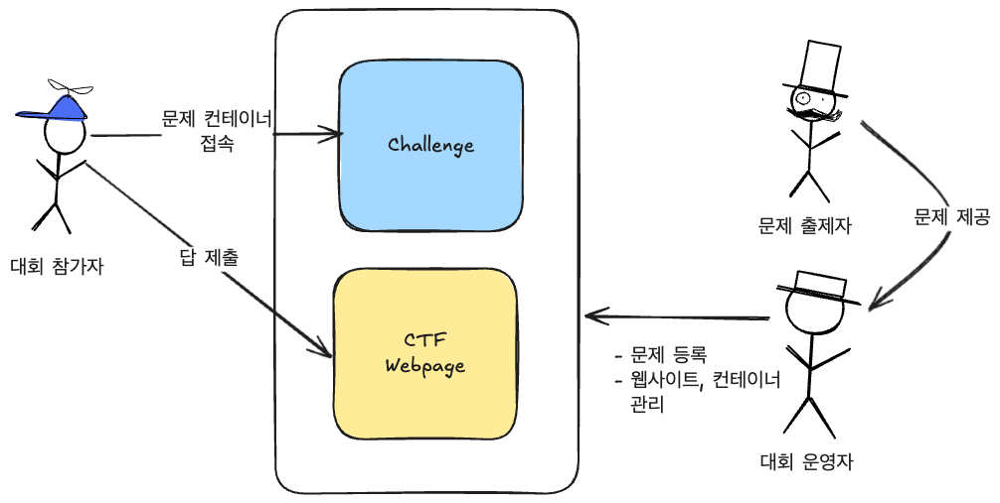
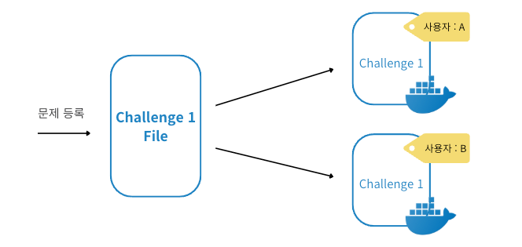
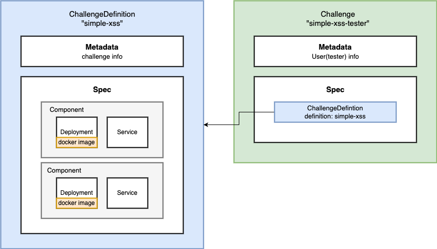

## 이전 이야기 

이전글에서는 문제 컨테이너(Challenge)의 특징과 그에 따른 요구사항을 정의했습니다. 
1. 컨테이너 상태를 지속적으로 확인할 수 있어야 함
2. 다양한 컨테이너를 하나의 구조로 직접 정의하고 관리할 수 있어야 함

Docker로 위의 기능을 구현하는 것은 기술적인 한계가 있으므로 Kubernetes를 선택했다고 말씀드렸습니다. Kubernetes를 통해 어떻게 CTF를 제작했는지 작성하겠습니다. 

## Kubernetes를 선택한 이유
글 초반에 두 가지의 요구사항은 충족되어야 한다고 말씀 드렸습니다. 쿠버네티스를 사용하면 요구사항을 충족할 수 있습니다. 

1. 컨테이너 상태를 지속적으로 확인할 수 있어야 함
쿠버네티스는 기본적으로 리소스의 상태를 주기적으로 확인하며 오류 발생시 재시작을 수행하는 특징을 가지고 있습니다. 별도의 구현 없이 지속적으로 컨테이너 상태를 확인하는 기능을 활용할 수 있습니다. 

2.  다양한 컨테이너를 하나의 구조로 직접 정의하고 관리할 수 있어야 함 

쿠버네티스는 CR를 제작하여 커스텀 리소스를 정의할 수 있습니다. Operator를 구현하여 커스텀 리소스의 상태를 관리할 수 있습니다.

## 이전 이야기 
이전글에서는 문제 컨테이너(Challenge)의 특징과 그에 따른 요구사항을 정의했습니다. 
1. 컨테이너 상태를 지속적으로 확인할 수 있어야 함
2. 다양한 컨테이너를 하나의 구조로 직접 정의하고 관리할 수 있어야 함

Docker로 위의 기능을 구현하는 것은 기술적인 한계가 있으므로 Kubernetes를 선택했다고 말씀드렸습니다. Kubernetes를 통해 어떻게 CTF를 제작했는지 작성하겠습니다. 

## Kubernetes를 선택한 이유
글 초반에 두 가지의 요구사항은 충족되어야 한다고 말씀 드렸습니다. 쿠버네티스를 사용하면 요구사항을 충족할 수 있습니다. 

1. 컨테이너 상태를 지속적으로 확인할 수 있어야 함
쿠버네티스는 기본적으로 리소스의 상태를 주기적으로 확인하며 오류 발생시 재시작을 수행하는 특징을 가지고 있습니다. 별도의 구현 없이 지속적으로 컨테이너 상태를 확인하는 기능을 활용할 수 있습니다. 

2.  다양한 컨테이너를 하나의 구조로 직접 정의하고 관리할 수 있어야 함 

> NOTICE!
> 물론 쿠버네티스가 쉽다는 것은 아닙니다. 현재로서 위의 요구사항을 직접 구현한 것보다는 쿠버네티스를 활용하는 것이 현실적으로 가능한 방법이라고 생각했습니다. 

## Challenge 개념 재정의 
기술적인 이야기를 말하기 앞서 도메인 정의가 필요합니다. 

### CTF 사용자 분류
- 대회 운영자
	- CTF 대회 사이트를 운영하는 사람
	- 문제 발생 시 즉시 해결해야 함 
- 문제 출제자
	- 문제 파일을 제작 후 운영자에게 제공
- 대회 참가자
	- CTF 사이트에서 제공한 문제를 해결 

대회 운영 방식마다 각 역할이 하는 범위는 달라질 것입니다. 그러나 저희 프로젝트에서는 문제 등록과 리소스 관리를 대회 운영자가 하기로 결정했습니다. 

### 개념 정의 
쿠버네티스를 적용하기 이전에 개념을 다시 정리해봅시다.

사전에 등록한 문제를 사용자가 실행시키기 위해서는 어떻게 해야할까요?  
등록하는 **사람은 문제(Challenge) 컨테이너에 대한 구성을 정의하고 사용자는 그 정의한 내용을 그대로 실행시키는 것입니다.** 생성된 문제들은 사용자 정보를 기준으로 식별되어야 합니다.

그렇다면 문제를 생성하기 위해서는 최종적으로 두 가지가 필요하게 됩니다. 
- 문제 정의서(ChallengeDefinition)
- 사용자의 정보가 포함된 문제(Challenge)

이제부터 문제 정의서와 사용자가 풀어야 하는 문제를 ChallengeDefinition과 Challenge라고 부르겠습니다. 

## CR로 ChallengeDefinition과 Challenge 정의하기 
### 프로젝트에서 Kubernetes Operator를 사용하는 방법
Kubernetes Operator는 사용자가 정의한 리소스(CR)를 관리하는 프로그램입니다. 즉, 오퍼레이터를 제작한다는 것은 사용자가 정의한 리소스를 모니터링하는 루프를 실행시키는 프로그램을 제작한다는 의미입니다.[^1]

**리소스를 모니터링한다는 것은 상태를 관리한다는 의미와 같습니다. 그 대상은 상태 라이프사이클을 가질 것입니다** Kubernetes Operator SDK (kubebuilder, kopf ...)를 활용하여 상태 라이프사이클을 정의하고 구현할 수 있게 됩니다. Kubernetes Operator의 활용은 요구사항 모두 충족할 수 있습니다. 

이번 프로젝트에서는 Challenge의 Controller로서 Kubernetes Operator를 구현할 예정입니다.

### CR(Custom Resource)&CRD(Custom Resource Definition)
직접 정의한 리소스의 스펙을 CRD(CustomResourceDefinition)으로 정의한 후 스펙에 맞게 CR(CustomResource)를 생성하는 YAML를 실행시키면 커스텀 리소스를 실행시킬 수 있습니다. 

>  CR&CRD에 대한 기술적인 내용은 ccambo님의  [Kubernetes 확장인 CRD와 CR 에 대한 개념 정리](https://ccambo.tistory.com/entry/Kubernetes-%ED%99%95%EC%9E%A5%EC%9D%B8-CRD%EC%99%80-CR-%EC%97%90-%EB%8C%80%ED%95%9C-%EA%B0%9C%EB%85%90-%EC%A0%95%EB%A6%AC) 를 참고하시길 바랍니다. 

원하는 리소스를 직접 정의해서 배포할 수 있다는 특징은 요구사항 2번인 "다양한 컨테이너를 하나의 구조로 직접 정의한다"를 가능하게 만들어줍니다. 
이번 프로젝트에서는 CR&CRD를 적극적으로 활용할 예정입니다. 

### ChallengeDefinition&Challenge 간단하게 정의하기 
이번 프로젝트에서는 두 개의 커스텀 리소스를 생성할 것입니다.

- ChallengeDefinition : 문제 상세 정보를 나타내면 챌린지 정보, 구성 리소스를 컴포넌트 단위로 정의한다. CTF 문제를 등록할때 `ChallengeDefinition`을 등록한다.
- Challenge : 사용자 정보를 metadata에 주로 저장하고 spec으로 `ChallengeDefinition`를 참조하여 정의한다. 주로 사용자가 챌린지 컨테이너를 생성하고 실행할때 `Challenge`를 정의하고 실행시킨다. 

#### 왜 저렇게 구성했을까요? 
구체적인 이유는 뒤에 구현과 함께 설명할 예정입니다. 간단하게 말씀드리자면 **모든 리소스가 사용자마다 식별 가능해야 합니다.**   
사용자의 고유 데이터, 문제의 고유 데이터를 가지고 ChallengeDefinition에 정의된 리소스들이 서로 식별 가능하도록 이름을 정할 것입니다. 그래야 동일한 리소스더라도 충돌이 발생하지 않을 것입니다. 

## 다음 이야기
지금까지 Challenge라는 개념을 재정의하고 Kubernetes 커스텀 리소스로써 어떻게 구성할 것인지 작성했습니다.   
다음 글에서는 어떻게 코드로 ChallengeDefinition, Challenge를 구현했는지 설명하겠습니다. 

## Reference
- [Kubernetes 확장인 CRD와 CR 에 대한 개념 정리](https://ccambo.tistory.com/entry/Kubernetes-%ED%99%95%EC%9E%A5%EC%9D%B8-CRD%EC%99%80-CR-%EC%97%90-%EB%8C%80%ED%95%9C-%EA%B0%9C%EB%85%90-%EC%A0%95%EB%A6%AC)
- [간단하게 알아보는 Kubernetes Operator의 개념과 Kopf 프레임웍](https://bcho.tistory.com/1391)

[^1]: 쿠버네티스 오퍼레이터. 제이슨 도비스, 조슈아 우드 지음, 에이콘
