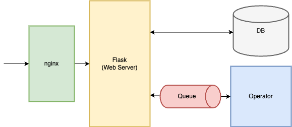

## 이전 이야기

이전 글에는 ChallengeDefinition, Challenge 개념을 정의하고 설계하는 과정을 설명했습니다.

이제부터 ChallengeDefinition과 Challenge의 속성은 무엇인지 코드와 함께 소개하겠습니다.

## ChallengeDefinition&Challenge 구성

HexaCTF는 두 개의 쿠버네티스 CR로 구성되어 있습니다.

- ChallengeDefinition : 문제 상세 정보를 나타내며 챌린지 정보, 구성 리소스를 컴포넌트 단위로 정의한다.
- Challenge : 사용자(문제 풀이자)가 생성하는 문제의 단위로 참조된 ChallengeDefinition을 기반으로 리소스를 생성하고 삭제한다.


이제부터 각각의 리소스가 어떤 구성요소를 가지고 있는지 설명하겠습니다.

### Challenge

Flask 서버는 Challenge 생성 요청을 통해 사용자 이름(username)과 문제 번호(challenge_id) 얻게 됩니다. 그리고 파이썬 쿠버네티스 라이브러리를 활용하여 Challenge CR을 실행시키게 됩니다.



요구사항을 정의하자면 **두 개의 정보 만으로도 Challenge를 생성할 수 있어야 하며 모든 문제가 실행 가능하도록 일관된 구조를 가지고 있어야 합니다.** 그래야 서버가 파일을 불러오는 형식이 아닌 Kubernetes API에 CR 생성을 요청할 수 있게 됩니다.

#### 파일을 불러오는 방식

Challenge의 구조가 문제 유형마다 다르면 Challenge CR 파일을 별도로 저장해서 호출해야 합니다. 파일이 아니더라도 어떻게 다른지를 저장해야 할 것입니다.

### 구조

#### Metadata

- name : 챌린지 이름
- namespace : Challenge를 실행시킬 namespace
- labels
  - username : 사용자 이름
  - challenge_id : Challenge id

#### Spec

- definition : ChallengeDefinition 이름

Metadata는 go map 형식으로 이뤄져 있습니다. 그러므로 손쉽게 key를 통해서 값을 가져올 수 있게 됩니다.
직접 구조체로 명시해야 하는 부분은 바로 `Spec` 입니다.

```go
type ChallengeSpec struct {
	// Definition: ChallengeDefinition 이름
	Definition string `json:"definition"`
}
```

Kubebuilder의 명령어를 통해 코드를 CRD로 변환시킨 후 설치하는 작업을 수행합니다. ([Kubebuilder 공식문서 Quickstart](https://book.kubebuilder.io/quick-start)) 모든 작업이 끝나면 아래의 yaml 파일을 통해 Challenge를 생성할 수 있게 됩니다.

```yaml
apiVersion: apps.hexactf.io/v1alpha1
kind: Challenge
metadata:
  name: ubuntu-instance-1
  namespace: default
  labels:
    apps.hexactf.io/challengeId: "1"
    apps.hexactf.io/user: "test"
spec:
  # 사용할 ChallengeDefinition의 이름
  definition: ubuntu-basic
```

주된 목표는 서버가 **사용자의 Challenge**를 만드는 것입니다. 다시 말해 서버가 사용자 정보가 담긴 yaml 파일을 선언하고 실행시켜야 한다는 의미와 같습니다.

사전에 문제 등록 과정이 있기에 사용자, Challenge에 대한 기본 정보는 저장되어 있습니다.
이후에 설명하겠지만 definition는 ChallengeDefinition의 이름으로 Challenge의 이름(제목)에 해당됩니다. 다른 말로 **Challenge id만으로도 definition을 알 수 있어 최소한의 정보로 Challenge를 생성할 수 있게 됩니다.**

```python
	 	user_challenge_repo = UserChallengesRepository()

        # Challenge definition 조회
        challenge_definition = ChallengeRepository.get_challenge_name(challenge_id)
        if not challenge_definition:
            raise ChallengeNotFound(error_msg=f"Challenge definition not found for ID: {challenge_id}")

        # Challenge name 생성 및 검증
        challenge_name = f"challenge-{challenge_id}-{username}"
        if not self._is_valid_k8s_name(challenge_name):
            raise UserChallengeCreationError(error_msg=f"Invalid challenge name: {challenge_name}")

		# ...

        # Challenge manifest 생성
        challenge_manifest = {
            "apiVersion": "apps.hexactf.io/v1alpha1",
            "kind": "Challenge",
            "metadata": {
                "name": challenge_name,
                "labels": {
                    "apps.hexactf.io/challengeId": str(challenge_id),
                    "apps.hexactf.io/user": username
                }
            },
            "spec": {
                "namespace": namespace,
                "definition": challenge_definition
            }
        }

        challenge = self.custom_api.create_namespaced_custom_object(
            group="apps.hexactf.io",
            version="v1alpha1",
            namespace=namespace,
            plural="challenges",
            body=challenge_manifest
        )

```

## ChallengeDefinition

ChallengeDefinition은 Challenge의 **인프라 구성을 기술하는 부분**입니다. "어떤 이미지를 컨테이너로 만들어서 어떻게 네트워크를 구성할건데?" 를 명시하는 구간입니다.

### 구조

##### Metadata

- name: 챌린지 이름(제목)

##### Spec

- isOne : 영속성 여부입니다. 값이 True인 경우 1:1 문제 유형으로 30분 후에 삭제되어야 합니다.
- component : 쿠버네티스 리소스인 Deployment & Service를 하나의 Component로 정의합니다.

Component 내에 있는 Deployment, Service는 기존의 yaml 선언 형식과 동일합니다.

```yaml
apiVersion: apps.hexactf.io/v1alpha1
kind: ChallengeDefinition
metadata:
  name: web-basic
  namespace: default
spec:
  isOne: false
  components:
    - name: web
      deployment:
        spec:
          replicas: 1
          template:
            spec:
              containers:
                - name: nginx
                  image: nginx:1.25
                  ports:
                    - containerPort: 80
	....
	 service:
        spec:
          ports:
            - name: http
              port: 80
              targetPort: 80
              protocol: TCP
          type: NodePort
```

#### ChallengeDefinition은 Deployment의 모든 필드를 지원하는 것이 아니다.

앞서 Component 내에 있는 Deployment는 기존의 yaml 선언 형식과 동일하다고 말씀을 드렸지만 일부는 지원하지 않습니다.

Kubebuilder를 활용하여 코드를 제작할때 라이브러리를 통해 쿠버네티스의 리소스를 활용합니다.
Service를 예로 들면 yaml에 정의된 필드가 구조체 형식으로 선언되어 있습니다. 쿠버네티스의 리소스는 라이브러리의 구조체를 활용하는 것이라고 보면 됩니다.

```go
type Service struct {
	metav1.TypeMeta `json:",inline"`
	// Standard object's metadata.
	// More info: https://git.k8s.io/community/contributors/devel/sig-architecture/api-conventions.md#metadata
	// +optional
	metav1.ObjectMeta `json:"metadata,omitempty" protobuf:"bytes,1,opt,name=metadata"`

	// Spec defines the behavior of a service.
	// https://git.k8s.io/community/contributors/devel/sig-architecture/api-conventions.md#spec-and-status
	// +optional
	Spec ServiceSpec `json:"spec,omitempty" protobuf:"bytes,2,opt,name=spec"`

	// Most recently observed status of the service.
	// Populated by the system.
	// Read-only.
	// More info: https://git.k8s.io/community/contributors/devel/sig-architecture/api-conventions.md#spec-and-status
	// +optional
	Status ServiceStatus `json:"status,omitempty" protobuf:"bytes,3,opt,name=status"`
}

```

라이브러리를 적절하게 사용하여 Component의 Deployment, Service를 선언합니다.
이번 프로젝트의 경우 Service는 라이브러리에서 제공하는 구조체를 모두 사용했지만 Deployment는 필요한 부분만 추출해서 선언했습니다.
라이브러리에서 제공하는 Deployment를 사용하면 **Deployment의 수많은 옵션이 포함된 구조체를 Copy하는 과정에서 용량이 초과되어 CRD 생성에 실패하게 됩니다.**

ChallengeDefinition의 Deployment에서는 컨테이너 구성 부분인 Containers와 Replicas만으로 구성했습니다.

```go
import (
	corev1 "k8s.io/api/core/v1"
	metav1 "k8s.io/apimachinery/pkg/apis/meta/v1"
)

// ChallengeDefinitionSpec defines the desired state of ChallengeDefinition.
type ChallengeDefinitionSpec struct {
	// INSERT ADDITIONAL SPEC FIELDS - desired state of cluster
	// Important: Run "make" to regenerate code after modifying this file

	// IsOne: 하나만 생성할 경우
	// False일 경우 일정 시간 내에서만 작동된다.
	IsOne bool `json:"isOne,omitempty"`

	// Components: Challenge를 구성하는 컴포넌트들
	Components []Component `json:"components,omitempty"`
}

// Component 는 이름과 리소스를 정의
type Component struct {
	Name       string            `json:"name,omitempty"`
	Deployment *CustomDeployment `json:"deployment,omitempty"`
	Service    *corev1.Service   `json:"service,omitempty"`
}

// Deployment 관련 구조체
// CustomDeploymentSpec 는 Replicas와 Template을 정의
// 자세한 내용은 Kubernetes Deployment API 문서 참고
// https://kubernetes.io/docs/concepts/workloads/controllers/deployment/

type CustomDeployment struct {
	Spec CustomDeploymentSpec `json:"spec,omitempty"`
}

type CustomDeploymentSpec struct {
	Replicas int32                 `json:"replicas,omitempty"`
	Template CustomPodTemplateSpec `json:"template,omitempty"`
}

type CustomPodTemplateSpec struct {
	Spec CustomPodSpec `json:"spec,omitempty"`
}

type CustomPodSpec struct {
	Containers []corev1.Container `json:"containers,omitempty"`
}

```

#### Component 구성 이유

이전 글에서 언급한 SQL Injection 사례 기억나시나요? 문제를 배포하기 위해서는 server- db가 필요하다고 말씀드렸습니다.

문제를 실행시키기 위해서는 server는 db가 어디에 있는지 알아야 합니다.
어떤 문제를 사용하면서 사용자가 누구인지 알았지만 어떤 서비스인지 알 수 있는 방법이 있을까요? 단순히 Deployment, Service를 나열하는 구조라고 했을때 애플리케이션의 특징에 맞는 prefix를 추가하면 됩니다. 그러나 일관성이 떨어질 수 있다고 생각하여 Component 단위로 Deployment, Service를 묶게 되었습니다.

#### Component 내 Label Selector

쿠버네티스에서 label은 중요한 역할을 합니다. 리소스 간 연결해주는 다리 역할을 합니다.

기본적으로 쿠버네티스는 Deployment의 네트워크를 정의하기 위해서는 label selector를 통해 Service와 연결합니다. 그렇다면 ChallengeDefinition을 정의할때 label을 사용자가 지정해야 할까요?

답은 **Operator가 자동으로 지정해줍니다.**

리소스의 이름에 대해 이야기를 해보겠습니다.
Challenge을 통해 생성된 리소스는 Challenge의 challenge_id, user 정보와 ChallengeDefinition에서 얻은 Component 이름을 조합한 고유한 prefix를 가지고 있습니다. 역할에 따라 deploy, svc를 추가로 붙여서 리소스의 이름을 정하게 됩니다.

```go
// ChallengeIdentifier
// 도메인에 맞는 식별자를 생성해주는 구조체
type ChallengeIdentifier struct {
	prefix string
	labels map[string]string
}

func NewChallengeIdentifier(challenge *hexactfproj.Challenge, component hexactfproj.Component) *ChallengeIdentifier {
	// prefix 생성 (리소스 이름에 사용)
	prefix := fmt.Sprintf("chall-%s-%s-%s",
		challenge.Labels["apps.hexactf.io/challengeId"],
		component.Name,
		challenge.Labels["apps.hexactf.io/user"])

	// 단일 레이블 맵 사용
	labels := map[string]string{
		"apps.hexactf.io/instance":   prefix,
		"apps.hexactf.io/name":       component.Name,
		"apps.hexactf.io/part-of":    challenge.Name,
		"apps.hexactf.io/managed-by": "challenge-operator",
	}

	return &ChallengeIdentifier{
		prefix: prefix,
		labels: labels,
	}
}

# ...
func (c *ChallengeIdentifier) GetDeploymentPrefix() string {
	return c.prefix + "-deploy"
}

func (c *ChallengeIdentifier) GetServicePrefix() string {
	return c.prefix + "-svc"
}

```

또한 Challenge로부터 생성된 Deployment 리소스는 아래와 같은 레이블을 추가로 가지게 됩니다. 그 중 `apps.hexactf.io/instance` Service의 `selector` 로 선언하여 서로 연결해줍니다.

```go
	prefix := fmt.Sprintf("chall-%s-%s-%s",
		challenge.Labels["apps.hexactf.io/challengeId"],
		component.Name,
		challenge.Labels["apps.hexactf.io/user"])

	// 단일 레이블 맵 사용
	labels := map[string]string{
		"apps.hexactf.io/instance":   prefix,
		"apps.hexactf.io/name":       component.Name,
		"apps.hexactf.io/part-of":    challenge.Name,
		"apps.hexactf.io/managed-by": "challenge-operator",
	}

```

#### 컴포넌트 간 통신은 어떻게해요?

SQL Injection 문제를 다시 생각해보겠습니다. Server는 데이터베이스와 통신하기 위해서 데이터베이스의 host 주소를 지정해줘야 합니다. host 주소를 어떻게 알 수 있을까요?

1. 자동으로 찾아준다. : 🥹
2. 직접 지정해준다. : IaC 도구처럼 서비스 이름을 지정해준다. 가변 인자를 삽입할 수 있는 로직을 구현해야 한다.
3. localhost로 설정한다. : 일관된 host를 가질 수 있다.

이걸 다르게 해석할 수 있습니다.

1. 자동으로 찾아준다. : 🥹
2. 직접 지정해준다. : 다른 컴포넌트의 Service를 지정할 수 있기 때문에 컴포넌트 간 통신이 가능합니다.
3. localhost로 설정한다. : 컴포넌트 간 통신이 불가능합니다. Pod 내 여러개의 컨테이너를 배포합니다.

3번인 **Pod 내에 다양한 컨테이너를 삽입하는 방향을 선택**했습니다.
서비스를 지원하려면 ChallengeDefinition 구조를 크게 바꿔야 합니다. 시간 여유도 없지만 기술적으로 부담이 됩니다. 또한 2개 이상의 컴포넌트를 제공하는 경우는 드물고 대부분 제한 시간 후에 삭제되는 유형(1:1)입니다. 현재로서 급한 기능은 아니기 때문에 제외했습니다.

## 다음 이야기

이번 글에서는 ChallengeDefinition과 Challenge type에 대한 구성 요소와 관련 코드를 보여드렸습니다.
이제부터 Operator 구현 시작이라고 생각합니다. "CR을 어떻게 상태 관리할래?"를 구현한 controller를 제작해야 합니다.
다음 글에는 controller 구현 부분인 "상태 관리 파트"로 찾아오겠습니다.
