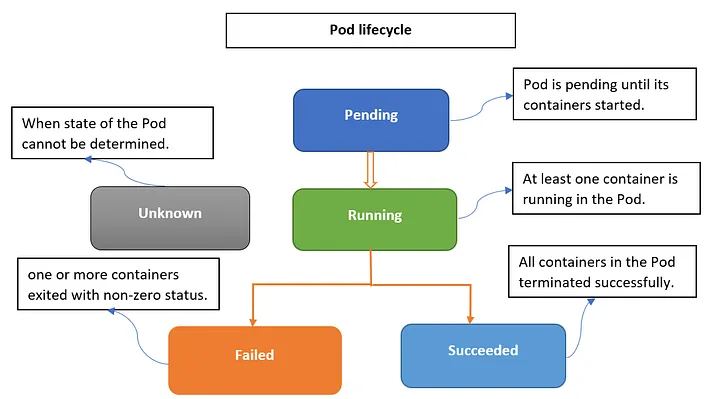
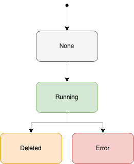
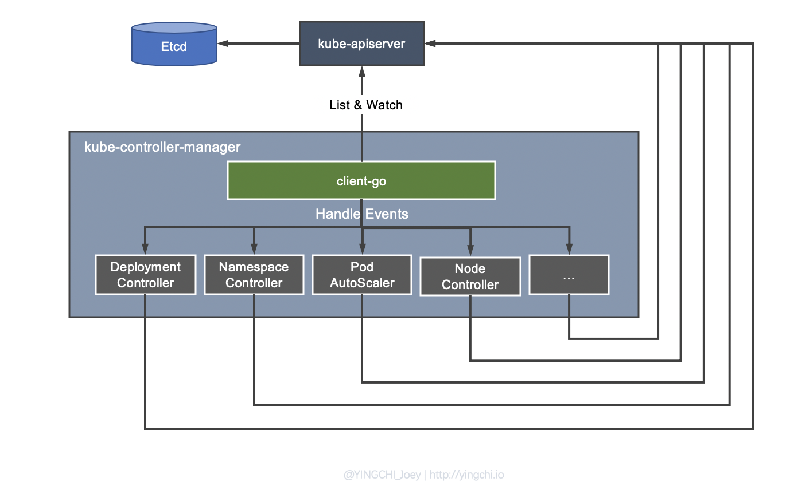

일반적으로 쿠버네티스의 파드는 라이프 사이클을 가지고 있습니다.



이처럼 Challenge CR도 자체 라이프 사이클을 가지고 있습니다.

## Challenge 상태

### Challenge Lifecycle

Challenge의 라이프 사이클은 크게 3가지 형태로 나뉩니다.

- None
- Running
- Error or Deleted



**Challenge 내부의 쿠버네티스 리소스가 정상적으로 생성, 삭제되었는지를 기준**으로 상태가 결정됩니다.

Challenge의 상태값이 무조건 필요한 이유가 있습니다. 바로 **참가자가 자신이 실행한 Challenge의 상태값**을 알아야 합니다.
예를 들어볼까요? 만약에 참가자가 특정 문제의 컨테이너를 생성했다고 가정했습니다. 무슨 이유로 서버를 새로고침하게 되어 아래와 같은 서버 생성하기 버튼이 활성화가 될 것입니다. 서버 생성하기 버튼을 아무리 눌러도 쿠버네티스 상에는 컨테이너가 이미 존재하니 계속 오류가 뜨겠죠?

 의 VM 접속하기 버튼 ](image-2.png)

### Challenge의 상태 구현

Kubebuilder에서 CR를 생성하면 `metatdata`, `spec`, `status` 세 가지 필드를 확인할 수 있습니다.

```go
// +kubebuilder:object:root=true
// +kubebuilder:subresource:status

// Challenge is the Schema for the challenges API.
type Challenge struct {
	metav1.TypeMeta `json:",inline"`
	metav1.ObjectMeta `json:"metadata,omitempty"`

	Spec ChallengeSpec `json:"spec,omitempty"`
	Status ChallengeStatus `json:"status,omitempty"`
}
```

그 중 ChallengeStatus에 Challenge에 관한 상태 정보를 추가합니다.(`CurrentStatus`) CurrentStatus는 간단한 구조체로 설계한 4개의 상태를 설정할 수 있습니다.

```go
// ChallengeStatus defines the observed state of Challenge.
type ChallengeStatus struct {
	// INSERT ADDITIONAL STATUS FIELD - define observed state of cluster
	// Important: Run "make" to regenerate code after modifying this file

	// StartedAt: Challenge 시작 시간
	StartedAt *metav1.Time `json:"startedAt,omitempty"`

	// CurrentStatus: Challenge 현재 상태
	CurrentStatus CurrentStatus `json:"currentStatus,omitempty"`

	// isOne는 영속성을 나타낸다.
	// +optional
	IsOne bool `json:"isOne,omitempty"`

	// Endpoint: Challenge의 Endpoint
	// 외부에 노출될 포트 번호가 저장됩니다.
	Endpoint int `json:"endpoint,omitempty"`
}
```

## Operator의 매커니즘

### Operator SDK vs Kubebuilder

Kubernetes Operator는 비단 Kubebuilder만 있는 것이 아닙니다. Operator SDK도 있습니다.

[Tech-Reset - kubebuilder vs operator-sdk](https://tiewei.github.io/posts/kubebuilder-vs-operator-sdk)의 내용을 참고하여 차이점을 설명하겠습니다.

- Operator SDK는 기본적으로 namespace-scoped, Kubebuilder cluster-scoped
- Operator SDK는 helm watcher도 함께 배포되기 때문에 Helm과 통합하기 용이하고, Kubebuilder는 kubernetes-sigs의 프로젝트와 통합이 용이하다고 합니다.

> **여담**
> 유명한 CNCF 프로젝트 Operator는 대부분 Operator SDK를 사용하는 것 같습니다. 유명 CNCF 프로젝트는 Helm으로 배포하는 경우가 많은데 Operator SDK는 당연한 선택지일 수 있습니다.

앞으로 Kubebuilder를 기준으로 설명하겠습니다.

### 쿠버네티스에서 말하는 Controller

우선 Kubebuilder에 이야기 하기 전에 기본적인 쿠버네티스가 활용하는 kube-control-manager와 controller에 대한 이야기가 필요합니다.  
쿠버네티스는 [kube-control-manager](https://kubernetes.io/docs/reference/command-line-tools-reference/kube-controller-manager/) 통해 내장 controller들을 제어합니다.(control manager라고 부릅니다.) 기본적으로 쿠버네티스가 가지고 있는 리소스 유형에 따라 controller를 가지고 있습니다. 쿠버네티스 기본 리소스마다 특징이 뚜렷하기 때문에 역할을 확실히 나눔으로써 유지보수성이나 확장성을 높이기 위해 사용된 것으로 보입니다.[^1]

control manager 내부에 있는 controller들은 `kube-apiserver` 와 통신하는 client-go등 다양한 공유 디펜던시(shared dependency)를 활용하여 다양한 기능을 수행하게 됩니다.



쿠버네티스는 controller를 직접 제작함으로써 다양한 기능을 구현할 수 있습니다. 단순하게 내장된 리소스에 국한되지 않고 다양한 종류의 프로젝트를 수용할 수 있었던 것도 custom controller 덕분일 것입니다.  
쿠버네티스는 초기부터 확장성을 고려하여 설계된 것일지도 모릅니다. **즉, control-manager를 직접 구현할 수 있다면 자동화된 운영, 모니터링 등 다양한 기능을 확장시킬 수 있게 됩니다.**

### Operator? Controller?

Kubebuilder는 오퍼레이터를 빌드하는데 사용되는 도구라고 알려져 있습니다. 오퍼레이터는 CoreOS에서 공개된 디자인 패턴으로, 단어 그대로 운영자의 역할을 소프트웨어에 새긴 개념입니다.[^2]

위의 설명은 오퍼레이터는 기능적인 관점에서 바라보는 것이고 **기술적으로는 운영 대상을 제어하는 control-manager를 제작**하는 것이라고 봅니다.

### kubebuilder 구조에 대한 간단한 설명

위의 설명을 보면 kubebuilder 아키텍쳐를 쉽게 이해할 수 있을 것입니다.

](image-4.png)

kubebuilder는 Operator를 빌드하는데 사용되는 라이브러리 입니다. 다르게 해석하면 manager를 빌드해야 한다는 의미와 같습니다.
공식 문서 상에서 Kubebuilder는 아래와 같은 구조를 가지지만 실제 코드로 구현해야 할 부분은 `Manager`, `Builder`, `Reconciler` 가 됩니다.

- Builder : controller-runtime 라이브러리를 감싸며, 일반적인 컨트롤러를 구축하기 위한 패턴을 제공한다.([builder package 문서](https://pkg.go.dev/sigs.k8s.io/controller-runtime/pkg/builder))
- Manager : controller를 제작하는데 필요하며 client, caches, schemes등 의 공유 디펜던시를 제공한다. 컨트롤러는 Manager.Start를 호출하여 시작되어야 한다.([manager package 문서](https://pkg.go.dev/sigs.k8s.io/controller-runtime/pkg/manager) )
- Reconciler: 조정 동기화 작업으로 대상의 상태를 원하는 상태로 일치시키는 과정을 의미한다.

다음 편에 설명하겠지만 kubebuilder는 builder를 활용하여 타겟 리소스(CR) 정의하고 manager를 만듭니다. manager는 controller를 만들고 reconciler를 controller 내부로 binding 하게 됩니다. 타겟 리소스(CR)가 변경될때마다 reconciler 내부에 있는 `reconcile()` 함수를 실행시키는 구조가 됩니다.

](image-5.png)

자세한 이야기는 Challenge 생성, 삭제 부분에서 자세하게 말씀 드리겠습니다.

### Challenge CR로 Operator를 제작해도 될까?

[Kubernetes Operators 101 Overview | Red Hat Developer](https://developers.redhat.com/articles/2021/06/11/kubernetes-operators-101-part-1-overview-and-key-features#operators_extend_kubernetes_to_automate_tasks) 문서에 의하면 오퍼레이터는 stateful한 애플리케이션을 섬세하게 관리하기 위해 사용됩니다.

> While Kubernetes is great at managing stateless applications, operators are useful when you need more complex configuration details for a stateful application such as a database. A stateful workload is more difficult to manage than a stateless workload.

Challenge는 **상태 정보가 유지 되지 않는 Stateless한 애플리케이션**입니다. 그러나 위의 설명을 보면 Challenge는 오퍼레이터를 사용하면 안될 것 같습니다.  
주요 활용 대상이 Stateful한 애플리케이션일 뿐 Stateless한 리소스도 적용 가능하다고 생각합니다. lstio도 stateless한 data plane를 제어한다고 합니다.[^3] 오퍼레이터는 운영자의 역할을 소프트웨어에 새긴 개념을 가지고 있는 만큼 모든 애플리케이션에 적용 가능하겠죠?

## 다음 이야기

오퍼레이터에 대해 공부를 하다보니 쿠버네티스의 구조에 대해 파악하고 있어야만 이해가 되는 부분이 많다고 생각합니다. 쿠버네티스 기본 구조에 대해 조사해보니 이번 글에는 프로젝트에 대한 많은 이야기를 담지 못했습니다.  
다음 글부터는 kubebuilder를 활용하여 Challenge를 생성, 삭제할 수 있는지 설명하겠습니다.

---

## 참고

- [Kubernetes Operator series 3 — controller-runtime component — Manager | by Masato Naka | Medium](https://nakamasato.medium.com/kubernetes-operator-series-3-controller-runtime-component-manager-bdaf633601a3)
- [Kubernetes Operator series 4— controller-runtime component — Builder | by Masato Naka | Medium](https://nakamasato.medium.com/kubernetes-operator-series-4-controller-runtime-component-builder-c649c0ad2dc0)
- [How kubernetes Controller Manager works - SoByte](https://www.sobyte.net/post/2022-07/k8s-controller-manager/)
- [Controllers | Kubernetes](https://kubernetes.io/docs/concepts/architecture/controller/)

[^1]: [How kubernetes Controller Manager works - SoByte](https://www.sobyte.net/post/2022-07/k8s-controller-manager/)
[^2]: [쿠버네티스 오퍼레이터 적용하기](https://dev.gmarket.com/65)
[^3]: [What is a service mesh? Architecture, features & relation with Kubernetes](https://tetrate.io/blog/what-is-a-service-mesh/)
