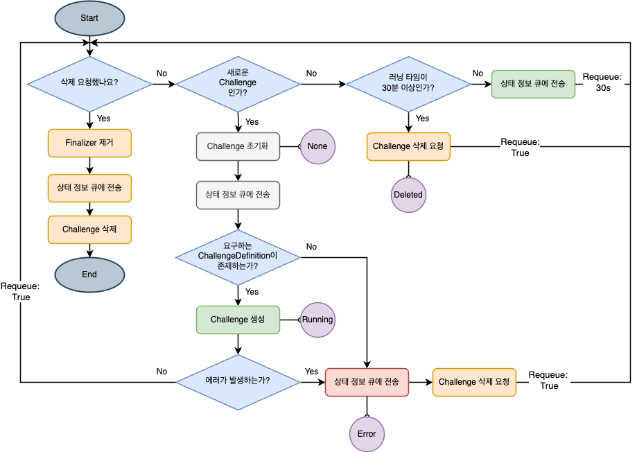

이전 글에는 상태를 어떻게 정의했는지 설명했습니다. 지금부터 어떻게 Challenge를 생성, 삭제할 수 있는지 설명하겠습니다.

## 조건 생각하기

우선 생성과 삭제 로직을 설명하기 이전에 생성과 삭제 시 무조건 수행되어야 하는 조건을 정리해야 합니다.

- 생성
  - Deployment, Service 생성
- 삭제
  - 조건에 따라 30분 후 삭제 -> 생성일 기준으로 종료일 지정
  - Challenge 삭제 시 관련 Deployment, Service 삭제 -> 무언가를 통해 연결되어야 함

주로 **삭제 로직을 중심**으로 컨트롤러를 구현했습니다. 삭제를 제대로 제어하지 않으면 고아 리소스가 생기는 문제가 발생하기 때문입니다.

## Builder를 통해 Controller를 설정한다.

공식 문서에 의하면 Builder는 controller-runtime을 감싸며, 일반적인 controller를 구축하기 위한 패턴을 제공한다고 합니다.

이전 글에서 제가 했던 이야기 생각 나시나요? **오퍼레이터를 만든다는 것은 대상 리소스를 제어하는 controller와 Controller를 관리하는 Mananger를 만든다**는 것이고, **Kubebuilder는 controller를 빌드하는 프로그램**이라고 말했습니다.

> **Manager**
> controller를 제작하는데 필요하며 client, caches, schemes등 의 공유 디펜던시를 제공한다. 컨트롤러는 Manager.Start를 호출하여 시작되어야 한다.
> [공식 문서 ](https://pkg.go.dev/sigs.k8s.io/controller-runtime/pkg/manager)

실제 코드 상에서는 kubebuilder가 Manager라는 객체 생성해줍니다.(`cmd/main.go`)

> Manager는 고가용성을 위해 Controller들의 leader election도 수행합니다.

```go
	mgr, err := ctrl.NewManager(ctrl.GetConfigOrDie(), ctrl.Options{
		Scheme:                 scheme,
		Metrics:                metricsServerOptions,
		WebhookServer:          webhookServer,
		HealthProbeBindAddress: probeAddr,
		LeaderElection:         enableLeaderElection,
		LeaderElectionID:       "958dbbf6.hexactf.io",
		// LeaderElectionReleaseOnCancel defines if the leader should step down voluntarily
		// when the Manager ends. This requires the binary to immediately end when the
		// Manager is stopped, otherwise, this setting is unsafe. Setting this significantly
		// speeds up voluntary leader transitions as the new leader don't have to wait
		// LeaseDuration time first.
		//
		// In the default scaffold provided, the program ends immediately after
		// the manager stops, so would be fine to enable this option. However,
		// if you are doing or is intended to do any operation such as perform cleanups
		// after the manager stops then its usage might be unsafe.
		// LeaderElectionReleaseOnCancel: true,
	})
	if err != nil {
		setupLog.Error(err, "unable to start manager")
		os.Exit(1)
	}
```

요구사항에 따라서 하나의 프로젝트에 2개 이상의 controller를 생성할 수 있습니다. 현재 저희 대회에서는 Challenge Controller 하나만 필요하기 때문에 하나만 만든 것 뿐입니다.
Manager는 Controller를 제어하는 역할을 가진다고 설명했죠? **처음 Mananger가 여러개의 controller를 제어하기 위해서는 Manager에 Controller 등록 작업이 필요합니다.** 그리고 이 부분은 라이브러리가 controller 파일 생성 시 자동으로 제공합니다.

다시 돌아와서 Builder는 Challenge Controller를 생성하기 위해 어떤 정보가 필요할까요?

- Controller를 제어할 Manager
- Controller 대상 리소스
- Controller에 삽입할 Reconcile 함수

kubebuilder를 통해 자동으로 controller를 생성하면 아래와 같이 빌드 로직을 확인할 수 있습니다.

```go
// SetupWithManager sets up the controller with the Manager.
func (r *ChallengeReconciler) SetupWithManager(mgr ctrl.Manager) error {
	// Builder 초기화
	return ctrl.NewControllerManagedBy(mgr)
		// Challenge라는 대상 리소스
		For(&hexactfproj.Challenge{}).
		Owns(&appsv1.Deployment{}).
		Owns(&corev1.Service{})./
		Named("challenge").
		// Controller에 ChallengeReconciler를 삽입
		Complete(r)
}
```

## Controller는 Reconciler를 통해 Reconcile()를 실행한다.

Controller는 타겟 리소스(Challenge)를 모니터링하고 변경 시 `Reconciler` 함수를 실행시킵니다. Reconciler 함수는 kube-apiserver를 통해 대상 리소스의 변경 사항을 확인합니다. 만약에 변경 사항이 감지가 되었다면 `Reconcile` 함수를 실행시킵니다.

맨 첫부분에 말한 조건은 모두 `Reconcile` 함수 내에 구현하게 됩니다.

> 구체적인 내용은 [Kubernetes Operator series 6 — controller-runtime component — Controller | by Masato Naka | Medium](https://nakamasato.medium.com/kubernetes-operator-series-6-controller-runtime-component-controller-604c8905a1e1) 읽는 것을 추천드립니다.

## Challenge 리소스 생성

### 쉽게 삭제할 수 있도록 Challenge를 만들자!

Challenge는 Deployment, Service를 하나의 컴포넌트로 구성하여 생성하게 됩니다. **삭제 시 고아 리소스가 발생하지 않도록 생성하는 것이 중요합니다.**
위의 과제를 달성하기 위해서 Challenge-Deployment, Service간 부모-자식 관계를 지정했습니다.

> Owns에 대해서 소유 관계라고 말하는 사람이 있고, 어느 책에서는 부모-자식 관계라고 설명하기도 했습니다. 저는 상하 관계를 뚜렷하게 표현할 수 있어 **부모-자식 관계**로 설명하겠습니다.

쉽게 말해 커스텀 리소스(Challenge) 부모이고 Deployment, Service 자식 관계라고 생각하시면 됩니다. Challenge가 Deployment과 연관된다는 것은 Deployment에 변경 사항 발생 시 Reconcile()이 발생한다는 것입니다.

부모-자식 관계를 사용한 이유는 삭제 시 편리하기 때문입니다. 구체적으로 말하자면 **자식 리소스가 부모 리소스에 소속된 것으로 설정되어 있다면 부모 리소스 삭제 쿠버네티스의 가비지 컬렉션은 모든 자식 리소스를 자동으로 정리**합니다.

#### 구현

생성 시 아래의 로직을 따릅니다.

1. Challenge 객체 초기화
2. LoadDefinition을 로드
3. LoadDefinition 기반으로 Deployment, Service를 생성(부모-자식 관계)
4. Challenge에 필요 레이블을 추가

여기서 초기화 부분에 `challenge.Status.StartedAt` 를 현재 시간으로 저장했습니다. 이 속성값은 초기화 혹은 추후 30분 후에 삭제하기 위해 비교값으로 활용됩니다.

```go
// 처음 생성 시 StartedAt 등 Status 초기화
	if challenge.Status.StartedAt == nil {

		if err := r.Get(ctx, req.NamespacedName, &challenge); err != nil {
			return r.handleError(ctx, req, &challenge, err)
		}
		now := metav1.Now()
		challenge.Status.StartedAt = &now
		challenge.Status.CurrentStatus = *hexactfproj.NewCurrentStatus()
		if err := r.Status().Update(ctx, &challenge); err != nil {
			log.Error(err, "Failed to initialize status")
			return r.handleError(ctx, req, &challenge, err)
		}
	}

	// 최신 상태로 갱신
	if err := r.Get(ctx, req.NamespacedName, &challenge); err != nil {
		// NotFound 에러 등은 무시
		return r.handleError(ctx, req, &challenge, err)
	}

	// 현재 상태에 따라 분기
	switch {
	case challenge.Status.CurrentStatus.IsNone():
		// ...

		if err := r.Get(ctx, req.NamespacedName, &challenge); err != nil {
			return r.handleError(ctx, req, &challenge, err)
		}
		// 실제 Challenge에 필요한 리소스들(Deployment, Service 등) 생성 로직
		err := r.loadChallengeDefinition(ctx, req, &challenge)
		if err != nil {
			return r.handleError(ctx, req, &challenge, err)
		}

		// 한 번 더 재큐(Requeue)하여 바로 다음 단계 확인
		return ctrl.Result{Requeue: true}, nil
```

Deployment, Service 생성 시 Challenge에 대한 `SetControllerReference` 를 설정합니다. 그리고 `Client.Create`를 통해 Deployment,Service를 생성합니다.

```go
	// Deployment가 존재하는지 확인
	err := r.Get(ctx, client.ObjectKey{
		Namespace: challenge.Namespace,
		Name:      deploy.Name,
	}, deploy)

	if err != nil {
		if errors.IsNotFound(err) {
			log.Info("Creating Deployment", "Deployment.Namespace", deploy.Namespace, "Deployment.Name", deploy.Name)

			// Owner Reference 설정
			if err := ctrl.SetControllerReference(challenge, deploy, r.Scheme); err != nil {
				log.Error(err, "failed to set controller reference")
				return err
			}
			// Deployment 생성
			err = r.Client.Create(ctx, deploy)
			if err != nil {
				log.Error(err, "failed to create Deployment")
				return err
			}
		} else {
			log.Error(err, "failed to get Deployment")
			return err
		}
	}
```

그리고 컨트롤러 Builder 초기화 부분에서 소유 관계를 명확히 구현하시면 됩니다.

```go
// SetupWithManager sets up the controller with the Manager.
func (r *ChallengeReconciler) SetupWithManager(mgr ctrl.Manager) error {
	// Builder를 초기화
	return ctrl.NewControllerManagedBy(mgr)
		// Challenge(부모 리소스)
		For(&hexactfproj.Challenge{}).
		// Deployment(자식 리소스)
		Owns(&appsv1.Deployment{}).
		// Service(자식 리소스)
		Owns(&corev1.Service{})./
		Named("challenge").
		// Controller에 ChallengeReconciler를 삽입
		Complete(r)
}
```

### 상태를 감지하고 변경하는 방법

완전 새로운 Challenge라면 상태 값과 같은 기타 정보를 초기화하여 필요 리소스를 생성합니다. 이 과정에서 None -> Running 상태로 변경하게 되는데, 코드 상에서 참조하고 있는 challenge의 status 값을 Running를 변경하여 새로운 상태를 쿠버네티스에 업데이트합니다.

```go
		challenge.Status.CurrentStatus.SetRunning()
		now := metav1.Now()
		challenge.Status.StartedAt = &now
		if err := r.Status().Update(ctx, &challenge); err != nil {
			return r.handleError(ctx, req, &challenge, err)
		}
```

### 컨트롤러 구현에 중요한 것은? - 멱등성

컨트롤러에서 말하는 **멱등성**은 변경 되지 않는 리소스의 조정 요청이 여러번 있더라도 **매번 동일한 결과**를 가져와야 한다는 의미입니다. 만약에 하나의 부모 리소스에 Deployment 1개로 구성된 자식 리소스를 가져야 한다고 가정해봅시다. 무슨 일이 발생하더라도 하나의 부모 리소스에 무조건 하나의 Deployment를 가져야 합니다. 중간에 추가적인 요청이 발생하여 Deployment가 2개 생성된다면 이것은 멱등성이 깨진 것입니다.

멱등성은 Challenge Controller를 구현하면서 현재까지도 가장 어려워하는 부분이기도 합니다.
Challenge는 쿠버네티스의 기본 리소스를 가지고 있지만 절차에 따라 레이블, 상태 값이 업데이트 됩니다. 변경 사항이 많은 탓에 **Reconcile 로직을 구현할 때는 최신의 Challenge를 불러오도록 구현**해야 합니다.

```go
if err := r.Get(ctx, req.NamespacedName, &challenge); err != nil {
	return r.handleError(ctx, req, &challenge, err)
}
```

그렇지 않으면 Kubernetes Client가 이용하는 Kubernetes Cache에 있는 상태 값과 실제 데이터에 불일치가 발생해 문제가 발생하게 됩니다.

```json
{
  "controller": "challenge",
  "controllerGroup": "apps.hexactf.io",
  "controllerKind": "Challenge",
  "Challenge": {
    "name": "challenge-59-sample",
    "namespace": "default"
  },
  "namespace": "default",
  "name": "challenge-59-sample",
  "reconcileID": "bf0eee44-a54d-417d-8322-7dc81e52152e",
  "error": "Operation cannot be fulfilled on challenges.apps.hexactf.io \"challenge-59-sample\": the object has been modified; please apply your changes to the latest version and try again"
}
```

## Challenge 리소스 삭제

### 삭제 상태를 알리기 위한 Finalizer 이용

상황에 따라 특별한 정리 로직이 필요한 경우가 있습니다. 이럴 경우 Finzliazer를 통해 리소스를 삭제하지 못하게 할 수 있습니다. 대표적인 예시로 pvc-protection가 있으며 이상 파드가 적극적으로 사용되지 않을때까지 pvc의 삭제가 연기됩니다.

> 실제로 Finalizer를 사용하지 않으면 삭제는 빠르게 발생됩니다.

프로젝트에서는 리소스 간 종속적인 관계를 가지지 않고 모두 독립적으로 사용됩니다. 그러므로 pvc 사례처럼 Finalizer가 필요 없다고 생각할 수 있습니다.
그러나 저희 프로젝트는 삭제 상태 정보를 설정하여 외부에 보내야 합니다. 뒤에서 말씀하겠지만 상태 정보를 큐를 통해 전송하게 되는데, 이때 삭제 요청 -> 상태 메세지 전송 -> 삭제 로직이 구현이 되어야 합니다. 결국 리소스 정리가 아니더라도 **삭제가 되었다는 상태 정보를 다른 애플리케이션에게 알려줘야 하는 시간이 필요하게 됩니다.**
저는 이러한 로직을 구현하기 위해 Finalizer를 사용하게 되었습니다.

```go
const (
	challengeFinalizer = "challenge.hexactf.io/finalizer"
)

func (r *ChallengeReconciler) addFinalizer(ctx context.Context, challenge *hexactfproj.Challenge) (ctrl.Result, error) {
	challenge.Finalizers = append(challenge.Finalizers, challengeFinalizer)
	if err := r.Update(ctx, challenge); err != nil {
		return ctrl.Result{}, fmt.Errorf("failed to add finalizer: %w", err)
	}
	return ctrl.Result{}, nil
}

```

### 리소스가 삭제되는 2가지 방법

리소스가 삭제되는 방법은 크게 두 가지입니다.

1. 사용자가 삭제를 요청한다.
2. 이용 시간이 30분 이상이면 삭제를 요청한다.

삭제 요청은 "삭제 요청하겠습니다!" 라는 `deletionTimestamp `속성만 기록되는 것 뿐입니다. 실제로는 `deletionTimestamp`가 설정된 것을 확인하고 Finalizer가 제거된 후에 대상 리소스가 삭제된 것입니다.

```go
func (r *ChallengeReconciler) handleDeletion(ctx context.Context, challenge *hexactfproj.Challenge) (ctrl.Result, error) {
	log.Info("Processing deletion", "challenge", challenge.Name)
	crStatusMetric.WithLabelValues(challenge.Labels["apps.hexactf.io/challengeId"], challenge.Name, challenge.Labels["apps.hexactf.io/user"], challenge.Namespace).Set(2)

	// Finalizer가 남아있는지 확인
	if controllerutil.ContainsFinalizer(challenge, "challenge.hexactf.io/finalizer") {

		// 파이널라이저 제거
		controllerutil.RemoveFinalizer(challenge, "challenge.hexactf.io/finalizer")

		// 메타데이터 업데이트
		if err := r.Update(ctx, challenge); err != nil {
			log.Error(err, "Failed to remove finalizer")
			// 재시도 위해 Requeue
			return ctrl.Result{RequeueAfter: time.Second * 5}, err
		}

		// 필요하다면 Deleted 이벤트 전송
		err := r.KafkaClient.SendStatusChange(
			challenge.Labels["apps.hexactf.io/user"],
			challenge.Labels["apps.hexactf.io/challengeId"],
			"Deleted",
		)
		if err != nil {
			log.Error(err, "Failed to send status change message")
			// 여기서도 에러 시 재시도
			return ctrl.Result{}, err
		}
	}

	go func() {
		time.Sleep(1 * time.Minute) // scrape_interval이 30초라면 1분 정도 기다리면 안전
		crStatusMetric.DeleteLabelValues(challenge.Labels["apps.hexactf.io/challengeId"], challenge.Name, challenge.Labels["apps.hexactf.io/user"], challenge.Namespace)
	}()
	log.Info("Successfully completed deletion process")
	// 이 시점에서 finalizers가 비어 있으므로, K8s가 오브젝트를 실제 삭제함
	return ctrl.Result{}, nil
}
```

1. 사용자가 삭제를 요청한다.
   사용자가 삭제를 요청하는 것은 사용자가 삭제 이벤트를 직접 하는 것과 같습니다. 요청 이후에는 자동으로 deletionTimestamp가 기록될 것 입니다.

아래 Reconcile() 로직에 의해서 삭제를 수행할 것입니다.

```go
 if !challenge.DeletionTimestamp.IsZero() {
	return r.handleDeletion(ctx, &challenge)
}
```

2. 이용 시간이 30분 이상이면 삭제를 요청한다.
   Challenge 생성 부분에 실행 30분 후 삭제를 구현하기 위해 `startedAt` 를 설정한다고 말했죠? startedAt 기준으로 30분 후에 삭제되도록 구현했습니다.

```go
		if time.Since(challenge.Status.StartedAt.Time) > challengeDuration {
			// 아직 DeletionTimestamp가 없다면 Delete 요청
			if challenge.DeletionTimestamp.IsZero() {

				log.Info("Time exceeded; issuing a Delete request", "challenge", challenge.Name)
				if err := r.Delete(ctx, &challenge); err != nil {
					log.Error(err, "Failed to delete challenge")
					return r.handleError(ctx, req, &challenge, err)
				}
				// Delete 요청 후에는 Kubernetes가 DeletionTimestamp를 설정하고
				// 다시 Reconcile이 호출되면 handleDeletion()이 수행됨
				return ctrl.Result{}, nil
			} else {
				// 이미 Delete 진행중이면 handleDeletion으로
				return r.handleDeletion(ctx, &challenge)
			}
		}
```

## 정리

위의 내용을 흐름도로 정리하면 아래와 같습니다.



## 마치며

글로 정리하다보니 스스로 잘못 생각한 부분을 찾게 되었습니다. 대표적인 예로 Requeue(재시도) 할 필요 없는데 구현한 것처럼 말이죠. 이건 다음에 수정해야 할 것 같습니다.

이번 글을 끝으로 로직 부분 설명은 끝난 것 같습니다. 다음 글에서는 어떻게 커스텀 메트릭을 통해 Challenge를 시각화할 수 있는지 설명하겠습니다.

## 참고

- [Finalizers, ownerReferences](https://kmaster.tistory.com/106)
- [Kubernetes operator 메커니즘](https://togomi.tistory.com/28)
- [Kubernetes Operator series 5— controller-runtime component — Reconciler | by Masato Naka | Medium](https://nakamasato.medium.com/kubernetes-operator-series-5-controller-runtime-component-reconciler-501f71b7397a)
- [Kubernetes Operator series 6 — controller-runtime component — Controller | by Masato Naka | Medium](https://nakamasato.medium.com/kubernetes-operator-series-6-controller-runtime-component-controller-604c8905a1e1)
- 제시슨 제시슨, 조슈아 우드. (2021). 쿠버네티스 오퍼레이터. 에이콘.
