## Prometheus

### 왜 promethues Operator를 사용했을까?

Prometheus는 다양한 대상(target)에서 시간 경과에 따른 지표를 수집하여 저장하는 시계열 데이터베이스입니다. 이러한 데이터를 우리 눈에 쉽게 보여주는 것이 Grafana입니다.

> 프로메테우스 실행 절차는 [wlsdn3004님의 Prometheus 란?](https://wlsdn3004.tistory.com/35)를 참고하시길 바랍니다.

여기서 단순한 쿠버네티스가 아닌 쿠버네티스 오퍼레이터를 활용한 이유는 서비스 모니터를 통해 멀티 클러스터 혹은 다른 네임스페이스 환경에 대응할 수 있기 때문입니다.  
여기서 서비스 모니터가 무엇인지 알아야겠죠? 서비스 모니터(ServiceMonitor)는 동적으로 다수 서비스를 모니터링할 수 있는 방법을 선언적으로 정의한 것입니다. 원하는 구성으로 ServiceMonitor를 적용시키면 Prometheus Operator는 자동으로 새로운 서비스를 찾게 됩니다.

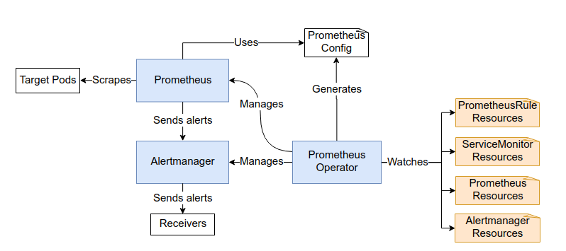

제가 Prometheus Operator를 쓰는 이유는 **다른 Namespace에 있는 Challenge Operator의 메트릭 정보를 얻기 위해서입니다.** 구체적으로 어떻게 설정할지는 아래에서 설명하겠습니다.

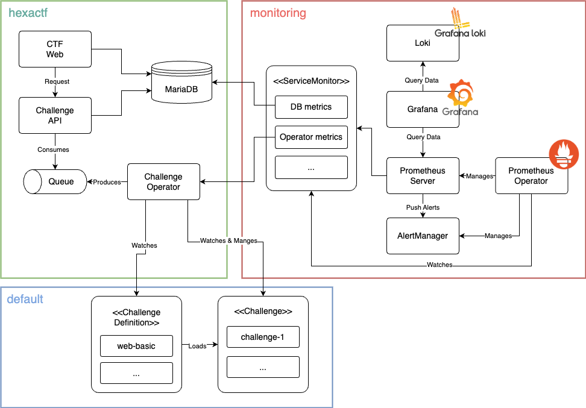

## Challenge 상태를 나타내는 커스텀 메트릭 제작하기

### Challenge 상태 정보 메트릭의 특징

##### 빠른 문제 해결

현재 저희 대회에서 필요한 것은 Challenge 성능 정보보다 **상태 정보**입니다. 왜냐하면 문제 발생 시 빠르게 대처해야 하기 때문입니다.

여기서 Challenge 내에 있는 Deployment에 대해 이해해야 합니다. 해킹 문제의 경우 취약한 하나의 기능을 구현하여 배포하게 됩니다. 즉, 모든 프로그램 자체가 단순합니다. 또한 한 사람당 하나의 Challenge만 사용하기 때문에 트래픽 문제가 발생할 확률은 높습니다.

> 트래픽 항상 낮게 측정되지 않습니다. 간혹 Brute Force 특징을 가진 해킹 도구를 활용하는 경우가 있습니다. 그러나 이러한 행동은 부정 행위로 간주됩니다.

여기서 말하는 문제는 **서버 생성 실패, 서버 삭제 실패 등 오퍼레이터에 발생하는 문제**를 말하는 것입니다. 빈번하는 아니지만 드물게 삭제가 실패되는 경우가 있어서 Challenge 상태 정보를 중심으로 시각화를 했습니다. 만약에 삭제가 실패되었는데 실행 중이라면 남아 있는 리소스를 삭제하는 것이 우선이겠죠?

좀 더 자세하게 구현하기 위해서는 상태 메트릭뿐만 아니라 로깅과 다른 메트릭을 조합해서 구현해야 할 것 입니다. 그러나 시간 관계 상 구현하지 못했으며 추후 구현할 예정입니다.

#### Challenge 사용 패턴 확인

제가 상태 정보를 우선 제작한 이유이기도 합니다.

대회 이전에는 2가지 궁금증을 가지고 있었습니다. 아래의 질문들은 서버 메모리 용량을 산정할때 필요합니다.

1. 사람들은 한번에 몇개의 서버를 만들고 방치할까? -> 한 사람당 최대 몇개의 서버
2. 문제 분야마다 푸는 패턴이 있을까? -> Challenge 리소스 양과 분야 별 비율

사용 패턴은 현재보다는 미래를 위한 메트릭 지표라고 보면 됩니다.

> **여담**
> 글 작성 시점으로 대회를 성공적으로 마무리했습니다. 사용자 패턴에 대해서는 다른 글에서 뵙겠습니다.

### 어떤 메트릭을 활용할까

[Prometheus 공식 문서](https://prometheus.io/docs/concepts/metric_types/)에 의하면 메트릭은 4개가 있습니다.

- Guage: 임의로 올라가거나 내려갈 수 있는 단일 숫자값을 나타내느 메트릭
- Counter : 누적되는 메트릭 값. 감소가 없음
- Histogram :지연 시간, 처리시간과 같이 연속형 값을 다룰때 사용
- Summary : 연속적인 데이터 값의 분포를 측정

#### 선택 기준은?

저는 최종적으로 **Gauge**를 선택하게 되었습니다.

- n시간 마다 수집되어야 함
- Running, Deleted, Error 개수의 증감을 표현할 수 있어야 함

```go
var (
	crStatusMetric = prometheus.NewGaugeVec(
		prometheus.GaugeOpts{
			Name: "challenge_resource_status",
			Help: "Tracks the status of the custom resource",
		},
		[]string{"challeng_id", "challenge_name", "username", "namespace"},
	)
)

func init() {
	metrics.Registry.MustRegister(crStatusMetric)
}

```

### Label은 어떻게 설정할까?

Prometheus의 Label은 키-값 쌍으로 이뤄져 있으며, Proemtheus가 시계열 데이터를 식별하는데 메트릭 이름과 더불어서 사용합니다.

제가 원하는 상태 정보는 크게 세 가지 입니다. 제가 위해서 말한 2가지 목적에 대입하면 아래와 같습니다.

- 상태별 Challenge 개수
  - 전체 Challenge 현황을 파악하기 위해
- **사용자, 문제 별** Challenge 상태
  - 사용자 패턴 파악
  - Error 문제 발생 시 빠르게 문제를 대처하기 위해
- 문제별 실행 중/에러 커스텀 리소스 수
  - 사용자 패턴 파악
  - 오류 사항이 있는 Challenge를 찾기 위해

그렇다면 Label로 무조건 지정할 것은 **사용자 식별자, 문제 식별자**입니다. 이 두가지를 포함하여 Challenge 이름과 Namespace도 추가했습니다.

> 본래 종류에 따라 Namespace를 분리할 예정이었습니다. 그러나 시간 관계 상 못하게 되어 코드에 남게 되었습니다.

그리고 상태 정보를 값으로 설정했습니다. Gauge의 특징 중에 하나는 값을 증감할 수 있다고 했죠? 이 기능을 활용할 예정입니다.

- Running: 1
- Deleted: 2
- Error: 3

실제 코드로 작성하면 아래와 같습니다.

```go
var (
	crStatusMetric = prometheus.NewGaugeVec(
		prometheus.GaugeOpts{
			Name: "challenge_resource_status",
			Help: "Tracks the status of the custom resource",
		},
		[]string{"challeng_id", "challenge_name", "username", "namespace"},
	)
)

func init() {
	metrics.Registry.MustRegister(crStatusMetric)
}

// ...
crStatusMetric.WithLabelValues(challenge.Labels["apps.hexactf.io/challengeId"], challenge.Name, challenge.Labels["apps.hexactf.io/user"], challenge.Namespace).Set(1)
```

### 추가: Deleted 상태 정보는 언제까지 가지고 있어야 할까?

메트릭 구현 부분에서 "Deleted 상태 정보는 언제까지 가지고 있어야 할까?"가 난제이지 않을까 싶습니다.  
Promethues는 기본적으로 30초 간격으로 `/metrics` 내용을 스크랩합니다.

저에게는 두 가지 고민이 있었습니다.

1. 삭제 요청 시 메트릭을 Deleted(3)로 설정 -> `/metrics`에 불필요한 데이터가 쌓임. 대회가 끝날때마다 주기적으로 삭제하는 작업이 필요
2. 삭제 요청 시 메트릭을 Deleted 상태로 변경 후 **즉시 삭제** -> Prometheus가 Deleted 상태를 스크랩할 수 있도록 시간 조정이 필요

대회 시기에는 Running, Error를 중점적으로 볼 예정이기 때문에 **두 번째 방법**을 선택하게 되었습니다.  
다만 Prometheus가 Deleted 상태를 한번 스크랩하고 삭제되어야 하기 때문에 **고루틴을 활용하여 1분 후에 메트릭이 삭제될 수 있도록 구현**했습니다.

```go
func (r *ChallengeReconciler) handleDeletion(ctx context.Context, challenge *hexactfproj.Challenge) (ctrl.Result, error) {
	log.Info("Processing deletion", "challenge", challenge.Name)
	crStatusMetric.WithLabelValues(challenge.Labels["apps.hexactf.io/challengeId"], challenge.Name, challenge.Labels["apps.hexactf.io/user"], challenge.Namespace).Set(2)

	// ...

	go func() {
		time.Sleep(1 * time.Minute) // scrape_interval이 30초라면 1분 정도 기다리면 안전
		crStatusMetric.DeleteLabelValues(challenge.Labels["apps.hexactf.io/challengeId"], challenge.Name, challenge.Labels["apps.hexactf.io/user"], challenge.Namespace)
	}()
	log.Info("Successfully completed deletion process")
	// 이 시점에서 finalizers가 비어 있으므로, K8s가 오브젝트를 실제 삭제함
	return ctrl.Result{}, nil
}
```

## Challenge Operator 쿠버네티스에 배포하기

### metrics endpoint 설정

kubebuilder는 CNCF 프로젝트인만큼 [프로메테우스 엔드포인트를 개방할 수 있는 ServiceMonitor를 자동으로 설정할 수 있습니다.](https://book.kubebuilder.io/reference/metrics) 단, **kubebuilder에 내장되어 있는 kustomize를 활용해야 간단한 설정으로 사용할 수 있게 됩니다.** 그러나 저는 kustomize를 활용하지 않을 예정이므로 다른 방법을 찾아봐야 합니다.

kustomize는 배포 도구일뿐 근본적으로 kubebuilder에는 메트릭을 export 해줄 수 있는 함수가 있다고 생각해도 될 것 같습니다.  
`main.go` 에 가보시면 metricServer의 속성을 프로그램 속성 값으로 받아서 설정하고 있습니다. 즉 프로그램 실행시킬때 적절한 속성값을 넣어주면 됩니다.

```go
	var metricsAddr string
	var enableLeaderElection bool
	var probeAddr string
	var secureMetrics bool
	var enableHTTP2 bool
	var tlsOpts []func(*tls.Config)
	flag.StringVar(&metricsAddr, "metrics-bind-address", ":8080", "The address the metrics endpoint binds to. "+
		"Use :8443 for HTTPS or :8080 for HTTP, or leave as 0 to disable the metrics service.")
	flag.StringVar(&probeAddr, "health-probe-bind-address", ":8081", "The address the probe endpoint binds to.")
	flag.BoolVar(&enableLeaderElection, "leader-elect", false,
		"Enable leader election for controller manager. "+
			"Enabling this will ensure there is only one active controller manager.")
	// Prometheus metrics http 사용
	flag.BoolVar(&secureMetrics, "metrics-secure", false,
		"If set, the metrics endpoint is served securely via HTTPS. Use --metrics-secure=false to use HTTP instead.")
	flag.BoolVar(&enableHTTP2, "enable-http2", false,
		"If set, HTTP/2 will be enabled for the metrics and webhook servers")
	opts := zap.Options{
		Development: true,
	}
	opts.BindFlags(flag.CommandLine)
	flag.Parse()

// ...
	metricsServerOptions := metricsserver.Options{
		BindAddress:   metricsAddr,
		SecureServing: false,
	}
```

### Helm 으로 배포하기

위의 글에서 Kustomize를 활용하지 않을 것이라고 말씀 드렸습니다. 이유는 단순하게 **Helm이 가장 익숙**하기 때문입니다.  
그래도 차이점은 확인해봐야겠죠? [SEOWOO님의 블로그 - Helm과 Kustomize, 무엇을 쓸까?](https://www.gomgomshrimp.com/posts/k8s/helm-and-kustomize) 일부 참고해서 핵심적인 차이점을 설명하겠습니다.

- Helm
  - 여러 템플릿의 모음으로 구성할 수 있으며 values.yaml을 매개변수화하여 값을 전달
  - 애플리케이션 전체 패키지 관리 및 배포에 더 중심
- Kustomize
  - 상속의 개념을 활용해서 필요한 부분만 작성할 수 있음
  - 환경별 배포 구성 관리에 적합

Challenge Operator를 배포할때 Deployment를 활용했습니다. Operator의 철학에서도 Operator는 단일 Deployment로 배포되어야 한다고 설명했습니다.

> 1. Operators should install as a single deployment e.g. `kubectl create -f https://coreos.com/operators/etcd/latest/deployment.yaml` and take no additional action once installed.
>
> - 출처: [Introducing Operators: Putting Operational Knowledge into Software](https://www.redhat.com/en/blog/introducing-operators-putting-operational-knowledge-into-software)

여기서 주목해야 할 부분은 `--metrics-bind-address=:8080` 부분입니다.
앞서 말했듯이 kubebuilder는 내부적으로 메트릭 서버를 만들었습니다. 이를 외부에 접근할 수 있도록 `:8080(http)` 를 설정해야 합니다.

```yaml
apiVersion: apps/v1
kind: Deployment
metadata:
  name: {{ .Release.Name }}-operator
  annotations:
    "helm.sh/hook-weight": "0"
spec:
  replicas: 1
  selector:
    matchLabels:
      app: challenge-operator
  template:
    metadata:
      labels:
        app: challenge-operator
    spec:
      nodeSelector:
        hexactf/env: mgmt
      serviceAccountName: {{ .Release.Name }}-operator
      containers:
        - name: operator
          image: {{ .Values.operator.image.repository }}:{{ .Values.operator.image.tag }}
          imagePullPolicy: {{ .Values.operator.image.pullPolicy }}
          ports:
            - containerPort: 8080
          # Add the args section here
          args:
            # Use --metrics-bind-address and substitute the environment variable METRICS_ADDR
            - "--metrics-bind-address=:8080"

```

### ServiceMonitor 설정하기

Prometheus ServiceMonitor는 차례로 해당 엔드포인트를 검색하고 파드를 모니터링하도록 프로메테우스를 구성합니다. 어떤 엔드포인트의 어떤 포트를 통해 메트릭을 스크래핑하고 어떤 매개변수를 활용할지 구성하게 됩니다. 쉽게 말해 **검색 대상을 Prometheus Operator가 일괄적으로 처리할 수 있도록 ServiceMonitor라는 리소스에 정의한 것입니다.**

Operator에 메트릭 서버의 포트를 열었다면 Helm에서 Port를 열어주고, Port를 연결해준 ServiceMonitor가 필요하겠죠?

```yaml
apiVersion: v1
kind: Service
metadata:
  name: {{ .Release.Name }}-operator-metrics
  namespace: hexactf
  labels:
    app.kubernetes.io/name: challenge-operator
    app.kubernetes.io/instance: challenge-operator
    app.kubernetes.io/component: metrics
spec:
  selector:
    app: challenge-operator
  ports:
    - name: operator-metrics
      protocol: TCP
      port: 8080
      targetPort: 8080

```

```yaml
apiVersion: monitoring.coreos.com/v1
kind: ServiceMonitor
metadata:
  name: {{ .Release.Name }}-operator-monitor
  namespace: monitoring  # Prometheus Operator가 설치된 ns
  labels:
    release: prometheus  # Prometheus Operator의 label select
spec:
  selector:
    matchLabels: # Challenge Operator service matchlabel
      app.kubernetes.io/name: challenge-operator
      app.kubernetes.io/component: metrics
  namespaceSelector: # 스크랩할 ns
    matchNames:
      - hexactf # Challenge Operator가 배포되는 ns
      - default
  endpoints:
    - port: operator-metrics
      interval: 30s
      scrapeTimeout: 10s
      path: /metrics
      scheme: http

```

프로메테우스를 확인하면 아래와 같이 서비스를 확인할 수 있습니다.

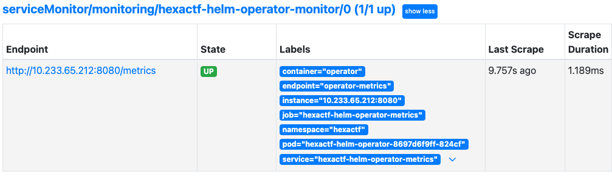

## 시각화

저희가 시각화 할 목록은 크게 3가지입니다.

- 상태별 Challenge 개수
- **사용자, 문제 별** Challenge 상태
- 문제별 실행 중/에러 커스텀 리소스 수

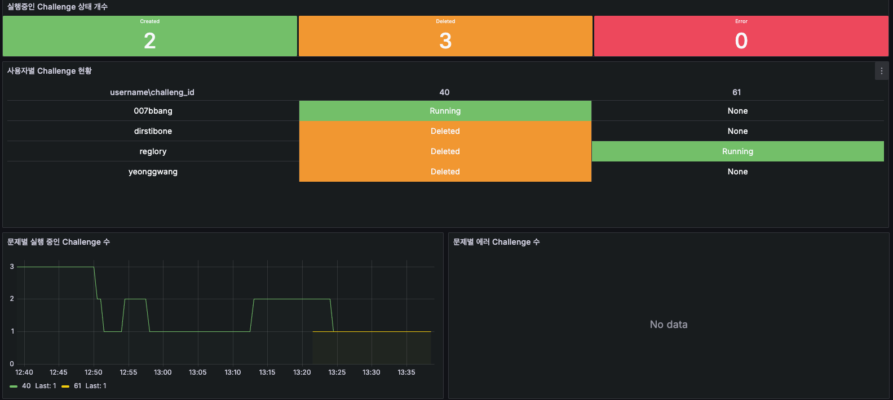

저는 그 중 상태별 Challenge 개수와 사용자, 문제 별 Challenge 상태를 보여드리겠습니다.

> 자세한 사항은 [Grafana 공식 문서](https://grafana.com/docs/grafana/latest/panels-visualizations/query-transform-data/transform-data/)를 참고하시길 바랍니다.
> 참고로 저는 하나하나씩 다 해봤습니다. 🥹

### 상태별 Challenge 개수

2시간 동안 가장 마지막 값이 1(Running)인 경우를 count 해주는 명령어를 사용했습니다.

> 2시간은 임의의 숫자로 실제 대회에서는 6시간을 기준으로 집계했습니다.

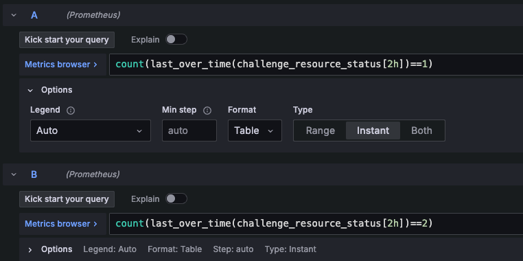

하나의 패널에 2개 이상 메트릭을 설정하게 되면 Value에 알파벳이 붙습니다. 그러므로 맨 아래 Override를 활용하여 임의로 정해진 값을 수정합니다.
더 나은 시각화를 위해 Color scheme을 통해 색도 설정했습니다.

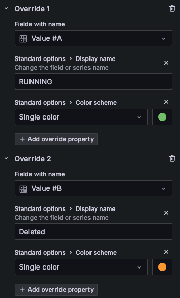

그리고 설정한 색을 Background에 보일 수 있도록 Stat styles에 설정했습니다.

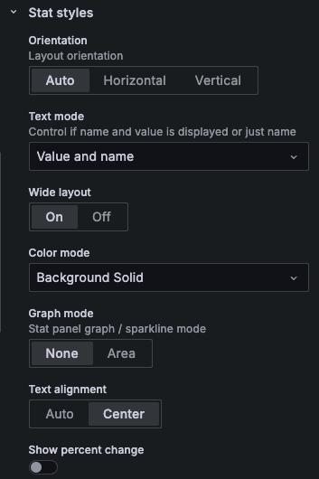

아래와 같이 시각화를 할 수 있습니다.

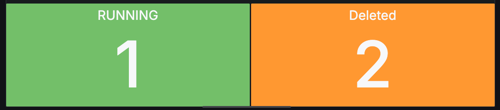

### 사용자, 문제 별 Challenge 상태

위와 동일하게 최근 상태 정보만 가져오면 되기 때문에 집계 시간 중 가장 최신의 데이터를 가져옵니다.

```
last_over_time(challenge_resource_status[2h])
```

Gauge는 숫자로 값을 설정합니다. 그러므로 Value mappings를 활용하여 문자로 변환합니다.

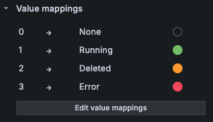

PromQL은 쉬운 대신 Transform을 설정해야 합니다.

1. Oragnaize field by name : challenge_id, username, status 값을 제외하고 전부 제거합니다.
2. Group by: Challenge_id, username을 그룹핑하여 중복을 없애고 Status는 가장 최신 값을 가져옵니다.
3. Grouping to Matrix: Grouping한 값을 가지고 새로운 Matrix를 활용합니다.

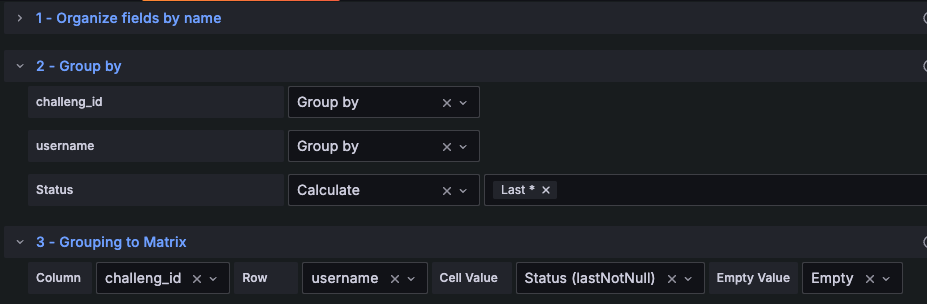

테이블 형태로 시각화 하면 아래와 같은 결과를 얻을 수 있습니다.

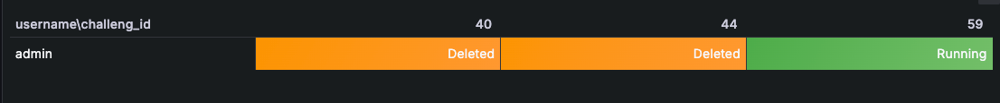

## 마치며

Challenge Operator와 관련된 글을 모두 작성했습니다.

다음 글에서는 실질적으로 클라이언트가 요청을 보내는 Challenge Control API에 대해 설명하겠습니다.

## References

- [Prometheus 란?](https://wlsdn3004.tistory.com/35)
- [Metric types | Prometheus](https://prometheus.io/docs/concepts/metric_types/)
- [Helm과 Kustomize, 무엇을 쓸까?](https://www.gomgomshrimp.com/posts/k8s/helm-and-kustomize)
- [Transform data | Grafana documentation](https://grafana.com/docs/grafana/latest/panels-visualizations/query-transform-data/transform-data/)
- 정현석, 진미란 . (2023). 모니터링의 새로운 미래 관측 가능성. 제이펍.
