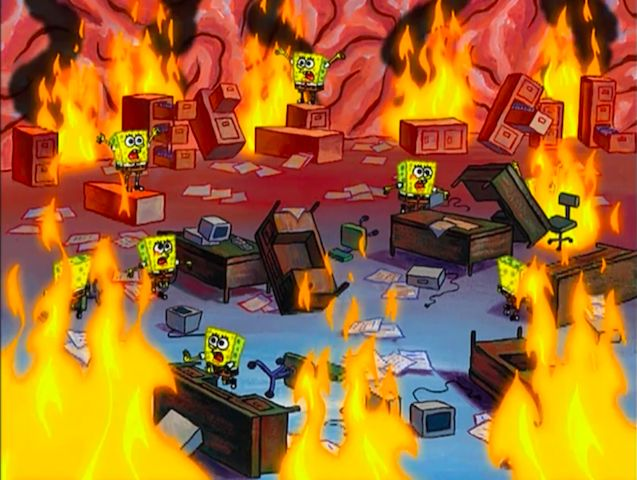
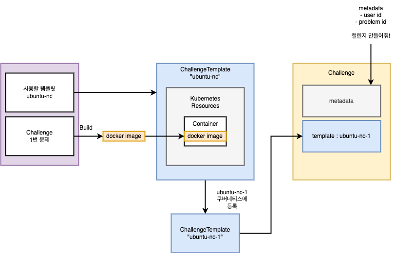
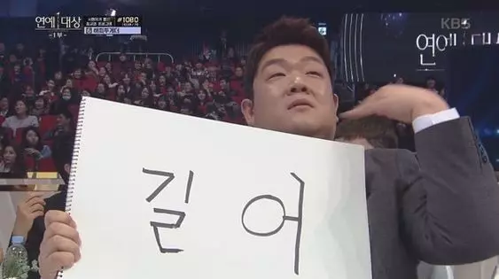

> 해당 게시글은 재미를 위해 각종 밈이 포함되어 있습니다.

## 인사말

안녕하세요.  
2024년 11월부터 2025년 3월까지 5개월이라는 긴 시간 동안 HexaCTF 시리즈 글이 마무리 되었습니다.

취업하기 전에 글을 마무리하는 것이 목표였는데 달성했네요. 🥹
HexaCTF 시리즈는 제가 프로젝트를 하면서 작성한 글입니다. 그래서 대회를 마친 시점에서 보면 색다르게 느껴집니다. 제 감상을 기반으로 상을 주려고 합니다.

## 수상 목록

- 설명하기 난감해상
- 혼란상
- 구성이 아쉽상
- 아이디어 실천상
- 최선의 선택상

## 수상 발표

### 설명하기 난감해상

글로 풀어 쓰기 어려운 글에게 주는 상입니다.

- 👑 Top 1. [HexaCTF 8. 커스텀 컨트롤러를 통한 Challenge 생성 및 삭제 구현](https://s0okju.github.io/p/hexactf-8/)

이 부분에서 잠깐 글쓰기를 포기할 뻔 했습니다. Operator 패턴은 클라우드 네이티브 환경에서 많이 쓰이면서 정작 로직 관련 글이 많이 없었습니다. 그래서 제한된 정보를 가지고 글을 써야 했습니다. 확신도 많이 없었구요... 일단 제가 이해한 내용 기반으로 작성하긴 했지만 나중에 더 깊게 공부하면 수정해야 할 것 같습니다.

> 저에게 정말 큰 좌절감을 안겨줬기 때문에 설명하기 난감해상 1등 자리를 줬습니다.

- Top 2. [HexaCTF 11. 오픈 스택 서버 네트워크 개선기 - 서버에 NIC 2개 삽입한 이유](https://s0okju.github.io/p/hexactf-11/)

머리 속으로는 그림이 그려지는데 글로 절대 안써집니다. 네트워크 인터페이스인데 NIC로 연결해서 생성된 네트워크 인터페이스와 가상 네트워크 인터페이스도 분리해서 써줘야 합니다.  
제일 머리 아픈 것은 같은 사설 IP인데 라우터에서 스위치를 통해 할당받은 IP인지 아니면 가상 네트워크 인터페이스에서 할당된 IP인지 구분하는 것입니다.

그래서 네트워크 관련 글에는 예시가 들어가 있습니다.

> 동일한 네트워크 대역을 가지기 위해 NIC는 **모두 동일한 스위치에 연결**됩니다. 192.168.50.1/24 대역이라면 서버는 192.168.50.27로 할당받고 Floating IP로도 192.168.50.122 이런 식으로 할당받는 것이죠. 이처럼 **Provider Network는 서버와 동일한 대역의 IP를 가지게 됩니다.**

제가 글을 쓰면서 느끼는 것은 네트워크 분야는 글이 아니라 그림으로 표현하는게 훨씬 효율적이라는 것입니다. 왜냐하면 블록(범위) 단위로 시스템을 바라보기 때문이죠.

> 머리 속 그림은 그려지지만 적절한 단어 선정과 손이 따라주지 않아서 설명하기 난감해상 2등 자리를 줬습니다.(이게 1등보다 더 열받는 부분일지도...)

### 혼란상

글 쓰는 당시에도 지금도 혼란스러운 글에게 주는 상입니다.

- 👑 Top 1. [HexaCTF 8. 커스텀 컨트롤러를 통한 Challenge 생성 및 삭제 구현](https://s0okju.github.io/p/hexactf-8/)

설명하기 난감해 상과 똑같은 이유입니다. 정보가 많이 없습니다. Kubebuilder 공식 문서에는 "너 Operator 패턴 알지?" 와 같이 교수님 마인드로 작성되어 있습니다.  
그래서 Kubebuilder에서 제시된 키워드를 일리리 검색해서 각각의 컴포넌트가 무슨 역할을 하는지 다 찾아봐야 합니다.

정보를 찾고 나서 하나로 정리하는 작업이 필요한데, 여기서 머리가 어지러웠습니다.

- "원래는 Builder가 있는데 Kubebuilder 공식 사이트에는 왜 Builder가 없는거지?"
- "Manager는 어떻게 Controller를 만드는거야? 이게 코드로 구현이 가능해?"
- "왜 누군가는 Operator로 말하고 누군가는 Controller라고 부르는 거야?"

원래 시스템 그림을 보고 구현 방식을 어렴풋이 파악하는 편인데, 이번에는 하나도 파악하지 못했습니다. 실제로 KubeBuilder 소스코드 분석을 도전했습니다. 그러나 Go를 제대로 사용한 경험이 없어서 실패하게 되었습니다. Go 공부를 다시 해야겠군요.

> 저에게 영원한 혼란스러움을 안겨줘 혼란상 1등을 줬습니다.

### 구성이 아쉽상

구성이 아쉬운 글에게 주는 상입니다.

- 👑 Top 1. [HexaCTF - 1. 인프라 플랫폼 선정과 서버 이전 시 마주한 문제](https://s0okju.github.io/p/hexactf-1/)

vlan 네트워크 구성한 이유와 실패했지만 그 대신 어떻게 했는지 설명했으면 괜찮은 글이라고 생각합니다. 그러나 글만 보면 선택의 이유가 명확해 보이지 않습니다.  
글 작성 시점이 5개월 전이라 저때 당시 무슨 기준점을 가지고 저런 선택을 했는지 기억이 나지 않습니다.

> 대체 내가 무슨 생각으로 저 글을 썼는지 의문이 가서 구성이 아쉽상 1등을 드립니다.

- Top 2. [HexaCTF - 3. Jenkins를 활용한 CI 환경 구성하기](https://s0okju.github.io/p/hexactf-3/)

저희 프로젝트에서는 Jenkins를 두 가지 이유로 사용됩니다. 하나는 CTF에 출제할 문제의 이미지를 빌드하기 위해 하나는 CTF 웹 애플리케이션 이미지를 빌드하기 위해 사용됩니다. 글 작성 당시에는 저것까지 생각을 안하고 글을 쓴 것 같다는 생각이 듭니다.

> 젠킨스 사용 목적에 대해 명확하게 작성하지 않았으므로 구성이 아쉽상 2등을 드립니다.

- Top 3. [HexaCTF 7. Challenge CR 상태 정의와 Operator 개념 정리](https://s0okju.github.io/p/hexactf-7/)

Challenge CR 글을 작성하다가 갑자기 Operator의 개념이 나온 글입니다. 이때의 감정은 아직도 생생한데요. 본래 계획이라면 Challenge CR를 설명하고 HexaCTF 8에서 설명한 내용을 정리할 예정이었습니다.  
그러나 글로 서술하는 과정에서 **"Operator는 근본적으로 무엇을 만드는거지?"** 라는 의문점을 가지게 되었고, 쿠버네티스 시스템 관점에서 Operator의 개념에 대해 작성하게 되었습니다.

> 거의 의식의 흐름으로 글을 전개했으므로 구성이 아쉽상 3등을 드립니다.

### 아이디어 실천상

나름 만족한 아이디어를 실천한 글에게 주는 상입니다.

- 👑 Top 1. [HexaCTF 6. Kubebuilder를 활용한 ChallengeDefinition&Challenge Type 구현](https://s0okju.github.io/p/hexactf-6/)

Challenge 구조를 설계할 당시 AWS SysOps 자격증을 준비하고 있었습니다. CloudFormation 범위를 중심으로 공부하고 있었는데, **"Template이라는 개념을 프로젝트에 대입할 수 있을까?"** 라는 생각이 들었고 직접 적용하기로 결심했습니다.  
지금은 ChallengeDefinition이지만 초기 이름은 ChallengeTemplate이었습니다. 자주 사용하는 플랫폼 구성을 작은 Template으로 구성하여 CloudFormation 처럼 여러 개의 Template를 참조할 수 있도록 설계했습니다. 그렇다면 사용자는 사용할 템플릿과 필요한 소수의 정보만으로 Challenge를 생성할 수 있게 됩니다.

그런데 중간 점검에 팀원과 상의하는 과정에서 이러한 방식은 사용자에게 오히려 혼란을 야기할 수 있다는 의견을 받았습니다. 의견을 일부 수용하여 구성 파일에는 쿠버네티스 구성 형식을 따르기로 결정했고 ChallengeTemplate 대신 ChallengeDefinition으로 이름을 바꾸게 됩니다.

> 아이디어를 직접 구현한 것과 더불어 아이디어에 서사가 있어 아이디어 실천상 1등을 드립니다.

- Top 2. [HexaCTF 10. 아키텍쳐 설계 및 Challenge Control API 제작](https://s0okju.github.io/p/hexactf-10/#control-api-operator-%EC%82%AC%EC%9D%B4%EC%97%90-%ED%81%90%EB%A5%BC-%EB%91%94-%EC%9D%B4%EC%9C%A0)

Challenge API를 별도로 생성하여 기존의 쿠버네티스 요청 방식이 아닌 독자적인 규격으로 생성을 요청할 수 있도록 구현했습니다. 즉 json 3개의 키-값만으로 하나의 Challenge를 만들 수 있는 것이죠.

> Challenge API와 Operator를 활용하여 Challenge만의 독자적인 오케스트레이터를 만들었으므로 아이디어 실천상 2등을 드립니다.

### 최선의 선택상

- 👑 공동 Top 1. HexaCTF의 모든 글들

시간 차를 두고 글을 쓰다 보면 "왜 나는 이런 선택을 했지?" 라는 생각을 하곤 합니다. 냉정한 평가는 뒤로 미루고 **그때의 선택이 최선이었음을 인정하는 것도 중요하다고 생각합니다.**

부족한 부분이 있으면 앞으로 고치면 되니까요. 😄

> 스스로에게 고생했다는 의미에서 HexaCTF의 모든 글에게 최선의 선택상을 드리겠습니다.

## 수상 소감

모든 글이 잘 썼다는 것이 아닙니다. 오히려 아쉬운 점을 나열하라고 하면 블로그로 몇편을 더 쓸 수 있을 것 같습니다.  
본래 글쓰기를 잘하는 편이 아니지만 서투른 필력으로 13편(12 + 후기)을 작성한 건 나름 자랑스럽습니다.  
이렇게 꾸준히 하다보면 저의 실력도 글쓰기 실력도 늘어나겠죠.

HexaCTF 시리즈 끝.

