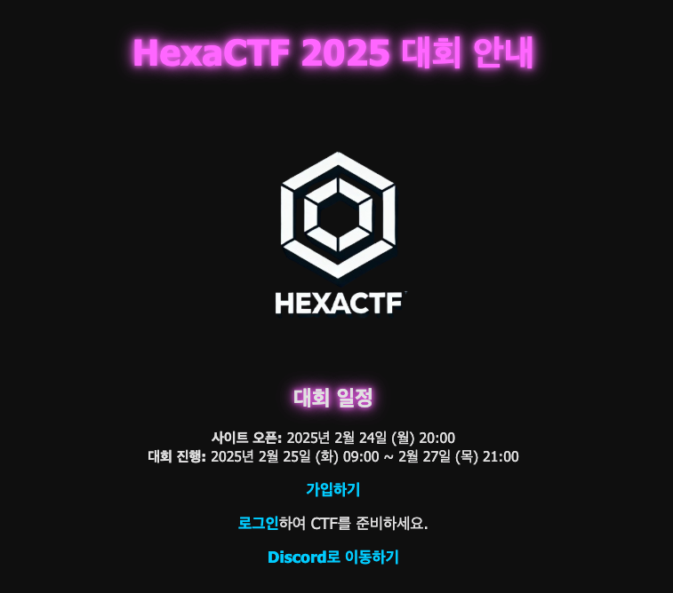
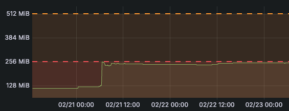
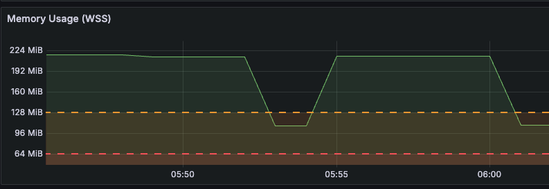
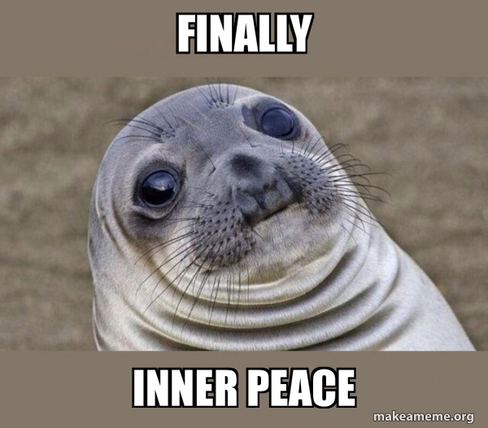
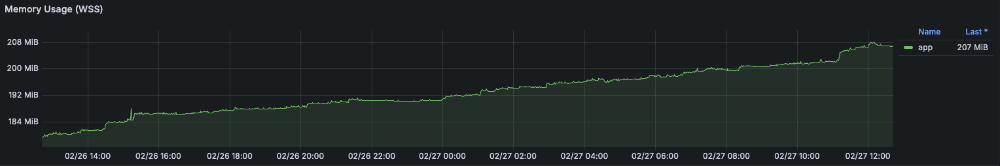
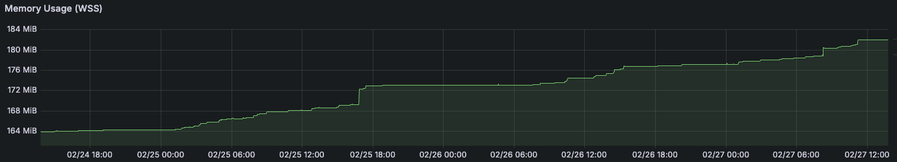
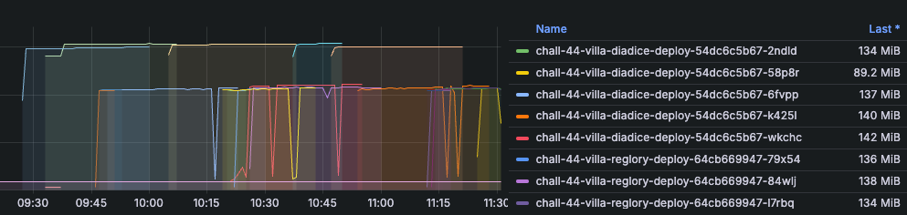

4개월 동안 여러 오류의 신세계의 맛본 결과 드디어 대회를 개최하게 되었습니다. 여타 CTF 대회와 다르게 3일이라는 긴 시간 동안 이뤄졌습니다.

## 사전 점검

대회 하루 전에 전반적인 검토를 수행하게 되었습니다. ~~시간이 여유로울 때는 오류가 보이지 않았는데 왜 하루 이틀 전에 잘 보일까..~~

### 서버가 좀 버벅거려요.

중간에 웹 페이지에 멈춤 현상이 있다고 해서 웹을 담당하는 파드를 확인했습니다.  
다중 접속한 것도 아니고 어떠한 행위를 하지 않았는데 request 한 메모리 양에 근접하게 사용하게 되었습니다.

웹 부분이 이런건 처음이 아니였습니다. 초기에는 Flask는 메모리를 적게 사용되지 않을까 하고 request, limits를 적게 잡았다가 pod가 강제 종료되기도 했습니다.

메모리 사용 패턴이 짐작이 가지 않았다. 어쩔때는 팍 튀는 형태로 나타나기도 하고, 어쩔때는 메모리 양이 수직 상승하다가 지속적으로 유지되기도 했습니다.

그래서 request, limits를 지정하지 않았습니다.(~~실제로 이렇게 하면 안됩니다.~~)
근본적으로 저 문제를 해결하려면 애플리케이션을 우선 최적화해야 한다고 생각했습니다. 문제를 즉시 파악하고 해결하는데 시간이 부족하니 메모리 사용 패턴을 확인할 겸 과감하게 리소스 제한을 풀게 되었습니다.

> 여담
> 서버 메모리가 생각보다 널널해서 리소스 제한을 풀었습니다. 그러나 다음 대회에서는 꼭 부하 테스트를 해서 적절하게 리소스를 제한을 설정할 것입니다.

### Challenge가 안열려요..

#### 금쪽이 Challenge Controller

Challenge Controller 부분의 고질적인 문제는 바로 가끔 오류를 반환한다는 점이었습니다. 근본적인 원인은 사전에 파악은 하고 있었지만 관련 팀원과 함께 대공사가 필요하기에 바로 문제를 해결하지 않았습니다.

## 대회 당일

저는 전반적인 인프라 관리와 Challenge 관리를 담당하게 되었습니다. 앞서 말했다싶이 Challenge Controller가 오류를 자주 반환한다고 말씀 드렸죠?  
그래서 대회 하루 이틀 동안은 아래와 같은 표정으로 모니터를 바라봤습니다.

예상보다 Challenge Operator 쪽에는 별다른 문제는 없었습니다.  
가끔 Challenge가 생성이 안된다고 연락이 오다가 "다시 해보니 됩니다."라는 메세지를 많이 받았습니다.

마지막 날에는 사용자도 요령을 익혔는지 Challenge 시스템과 관련된 문의는 없었습니다. ~~나름 평화로웠습니다.~~

## 대회 후기 - 다음 과제

일단 기간이 긴 대회인만큼 트래픽이 많이 몰린다는 이벤트는 없었습니다. 그래서 큰 문제 없이 대회를 마무리할 수 있었던 것 같습니다.

첫 대회에 큰 의미가 있지만 기술적으로 부족한 부분을 확실히 파악하게 된 것 같습니다.

### Challenge Controller 고치기

Chllanege Controller 관련해서 두 가지 문제점이 있습니다.

1. 데이터베이스 스키마의 설계적인 문제점
2. 프론트엔드가 실시간으로 Challenge 정보를 가져오지 못해서 발생하는 문제점

2번 문제는 프론트엔드가 Controller에게 요청을 보내고 5초 동안 대기를 수행한 후에 Challenge 정보를 얻습니다. 문제에 따라서는 빌드 시간이 5초가 넘을때가 있습니다. 이럴 경우에 클라이언트 측에서는 오류가 뜨지만 실제로 Challenge는 생성되게 됩니다.

이번 대회 이후에는 위의 두 문제를 우선 고쳐야 할 것 같습니다.

### 메모리가 계속 증가한다. - Flask 최적화

사전 점검때도 말했지만 메모리가 지속적으로 증가하며 이를 해결하기 위해서는 코드를 수정해야 한다고 말씀 드렸습니다.

개인적으로 가장 심각하게 봤던 부분이 바로 메모리 사용량입니다.

CTF 대회 특성상 아래의 문제 패턴이 있습니다.

1. 문제 파일을 다운로드한 후 다른 도구로 문제를 해결하여 웹사이트에 정답를 입력한다.
2. Challenge를 생성하여 문제를 해결한 후 웹사이트에 정답을 입력한다.

웹사이트는 "정답 입력"을 위주로 활용됩니다.  
그렇다면 사용자가 문제를 해결할때 문제를 푸는 시간이 길까요? 입력하는 시간이 길까요? **당연 다른 도구로 문제 푸는 시간이 깁니다.** 대회를 운영하면서 애플리케이션은 나름 상승폭이 적고 안정적인 메모리 사용량을 가질 것이라고 예상했습니다.

아래는 웹사이트 메모리 사용량입니다. 점진적으로 증가하죠? 개인적으로 불필요한 메모리를 활용하고 있다고 생각했습니다. (웹사이트 부분은 프론트와 백엔드가 하나로 합쳐져 있습니다.)

Challenge Controller 부분도 똑같이 메모리가 쌓이는 문제를 가지고 있습니다.

Flask를 깊게 공부해서 메모리 상승 원인과 해결책을 찾아야겠습니다.

### Challenge 리소스 용량 산정

대회 끝나고 대시보드를 보니 Challenge 문제마다 메모리 최대 사용량은 일정합니다.  
문제 등록할때는 Request, limits를 넉넉하게 256MiB, 512MiB로 잡았습니다. 다음부터는 문제마다 섬세하게 리소스 용량를 고려해야 할 것 같습니다.

저는 CPU보다 메모리 용량이 상대적으로 부족하다고 느끼고 있습니다. 그래서 메모리 사용량을 유심히 살펴보고 있습니다.  
여기서 "웹 애플리케이션 부분에서는 메모리가 널널하다고 하시지 않았나요?" 라고 물어볼 수 있을 것입니다.
쿠버네티스에서 멀티 노드를 구현할때 node1은 웹 애플리케이션과 기타 도구, node2는 Challenge를 위한 공간으로 분리했습니다. 즉 웹 애플리케이션이 있는 공간은 애플리케이션이 추가되지 않는 불변의 환경이고, Challenge는 언제 어디든지 리소스가 생성될 수 있는 가변의 환경입니다. 때에 따라서 메모리가 부족할 수도 널널할 수 있습니다.  
사람들의 문제 푸는 패턴을 보니 Challenge를 생성하고 삭제하는 것을 잊습니다. 즉, 한 사람당 2~3개를 생성한 후 방치한다는 의미입니다. **만약에 10명 이상의 사람이 만든 Challenge가 모두 살아있다면?** 이 부분은 고민을 해야봐야겠습니다.

## 대회는 계속된다...

다음 대회 일정이 잡혔습니다.
위의 내용은 주요 문제점일 뿐 실제로 크고 작은 다양한 수정사항들이 있습니다. 열심히 수정해야겠죠?

