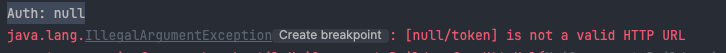

## RestTemplate vs WebClient

둘은 Rest 방식 API를 호출할 수 있는 클래스이다. 
RestTemplate = Blocking, WebClient = Non Blokcing 방식이라고 한다. 물론 WebClient도 Blocking 방식은 지원한다.   
여러 이유 중에서 [특정 임계점을 넘게 되면 RestTemplate는 급격하게 속도가 저하](https://dzone.com/articles/raw-performance-numbers-spring-boot-2-webflux-vs-s)된다. 그러므로 **규모가 있는 프로젝트에서 WebClient를 쓰는게 더 좋다**. 


> 요즘은  WebClient를 쓰는 추세라고 한다.

물론 모아리움 프로젝트는 소규모라 Blocking 방식으로 트래픽을 감당할 수 있다. 그러므로 RestTemplate를 채택했다. 

## API 개발 시 마주한 문제들
### 이슈 2. CamelCase로 인한 Google API Bad Request 문제 

Google API 요청은 확인했으나 access_token이 필요하다며 bad request를 보여줬다. 문제가 무엇이나 고민하던 찰나 공식 문서를 봤더니, request, response가 snake case였다. 그래서 Request, Response DTO는 [JsonNaming](https://d-life93.tistory.com/411)을 활용를 Snake Case로 변경시켰다. 

```java
@AllArgsConstructor
@NoArgsConstructor
@Data
@Builder
@JsonNaming(PropertyNamingStrategies.SnakeCaseStrategy.class) // camel case -> snake case
public class GoogleOAuthLoginReqDto{
    private String clientId;
    private String redirectUri;
    private String clientSecret;
    private String grantType;
    private String code;
}
```

### 이슈 2.  [[Spring - @Value ]] getter가 null이 되는 경우 

```java
@Component  
@Data  
public class GoogleOAuthLoginApiClient implements OAuthLoginApiClient<GoogleOAuthProfile>{  
    @Value("${google.auth.url}")  
    private String googleAuthUrl;  
  
    @Value("${google.login.url}")  
    private String googleLoginUrl;  
  
    @Value("${google.auth.scope}")  
    private String scopes;  
  
    private RestTemplate restTemplate = new RestTemplateBuilder().errorHandler(new RestTemplateResponseErrorHandler()).build();  
    private ObjectMapper objectMapper = new ObjectMapper();  
  
    @Override  
    public String getTokenURI() {  
        System.out.println("Auth: " +getGoogleAuthUrl());  
        return UriComponentsBuilder.fromHttpUrl(getGoogleAuthUrl()+"/token").toUriString();  
    }
```



`getGoogleAuthUrl()` 가 계속 null을 출력해서 해결책을 모색하고자 했다. 
1. Properties가 잘 적용되었는가? -> Yes
2. @Value를 쓰는 클래스에 Bean을 잘 등록했는가? -> Yes 
3. GoogleOAuthLoginApiClient의 의존성 주입을 잘 수행했는가? -> No

결국 3번의 문제였다. 바로 의존성 주입하지 않고 new 생성자를 만든 것이었다.

```java
@Service
public class OAuthLoginService {
    public GoogleOAuthProfile requestGoogleOAuthLogin(String authCode){
        OAuthLoginApiClient<GoogleOAuthProfile> client = new GoogleOAuthLoginApiClient();
        try {
            String accessToken = client.requestOAuthClientAccessToken(authCode);
            return client.requestOauthInfo(accessToken);
        } catch (JsonProcessingException e) {
            throw new RuntimeException(e);
        }
    }

}
```

> Spring에서 싱글톤으로 관리되는 빈이 아닌 새로운 객체로 생성하게 되면 @Value 애노테이션으로 설정 파일을 읽어들이는 변수는 null로 값이 저장되지 않습니다.
>
> 출처 - [gyucheolk 티스토리,  [Spring] @Value 애노테이션 null 점검](https://gyucheolk.tistory.com/88)

그래서 새로운 객체가 아닌 의존성 주입으로 코드를 수정했다. 

```java
@Service  
public class OAuthLoginService {  
    private final GoogleOAuthLoginApiClient authLoginApiClient;  
    public OAuthLoginService(GoogleOAuthLoginApiClient authLoginApiClient) {  
        this.authLoginApiClient = authLoginApiClient;  
    }  
  
  
    public GoogleOAuthProfile requestGoogleOAuthLogin(String authCode){  
        OAuthLoginApiClient<GoogleOAuthProfile> client = authLoginApiClient;  
  
        try {  
            String accessToken = client.requestOAuthClientAccessToken(authCode);  
            return client.requestOauthInfo(accessToken);  
        } catch (JsonProcessingException e) {  
            throw new RuntimeException(e);  
        }  
    }  
  
}
```

팀원에게 조언을 얻었는데, 서비스 컨트롤러가 아닌 것을 주입할때 명시하는 것이 좋다고 한다. 