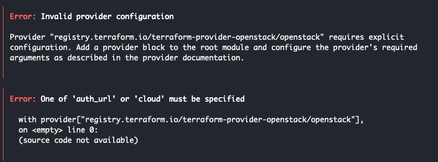

## Openstack 설치

[im2sh.log velog](https://velog.io/@im2sh/Ubuntu-22.04%EC%97%90%EC%84%9C-Devstack-%EC%84%A4%EC%B9%98)을 참고해서 Devstack을 활용해 Openstack을 설치하면 된다. 다만 로컬 환경에서만 수행할 예정이므로 가상 public ip 대역 생성은 제외했다.

### 이미지 생성

Nova에 올린 이미지를 생성한다. Ubuntu보다 Debian이 가볍고 커스텀하기 용이해서 선택[^1]하게 되었다.
아래의 명령어는 [debian 공식 홈페이지](https://cloud.debian.org/cdimage/cloud/OpenStack/current-10/)를 참고했다.

```bash
wget https://cloud.debian.org/cdimage/cloud/OpenStack/current-10/debian-10-openstack-amd64.qcow2

openstack image create \
        --container-format bare \
        --disk-format qcow2 \
        --file debian-10-openstack-amd64.qcow2 \
        debian-10-openstack-amd64
```

dashboard를 보면 정상적으로 이미지가 업로드된 것을 알 수 있다.


## Kubespray를 활용한 Kubernetes 구축

- OS - Ubuntu 24.04
- Openstack - 2024.1
- Kubespray - v2.21.0
- Terraform - v1.9.3

전반적인 설치 과정은 [변재한님의 velog](https://velog.io/@jaehan/Openstack-%EA%B8%B0%EB%B0%98-Kubernets-%EA%B5%AC%EC%B6%95-with-Kubespray)를 참고했습니다.

> openstack v2, v3 API는 다른점이 많습니다. 만약에 v2 버전으로 하고 싶다면 운영체제와 kubespray, terraform 버전을 맞추는 것이 좋습니다.

### ssh 통신을 위한 공개키 생성

쿠버네티스 환경 설정을 위해 Ansible를 사용한다. Ansible은 ssh를 활용하여 대상에 접속할 수 있다. 이 키는 추후 Kubernetes에서 노드끼리 통신할 수 있는 openstack의 keypair로써 활용된다.

```bash
ssh-keygen -t ed25519 -N '' -f ~/.ssh/id_rsa.kubespray

eval $(ssh-agent -s)

ssh-add ~/.ssh/id_rsa.kubespray
```

## 오류 - One of auth_url or cloud must be specified

결론부터 말하자면 클라이언트와 관련된 환경 변수가 저장되지 않아서 생긴 일이다.

### 해결 과정

아래의 오류를 읽어보면 openstack의 provider를 정의하는 tf파일에 속성이 정의되어 있지 않다고 한다.



`~/kubespray/contrib/terraform/openstack/version.tf` 를 보면 provider가 정의되어 있다.


[공식 홈페이지](https://registry.terraform.io/providers/terraform-provider-openstack/openstack/1.54.1/docs)를 보면 설정값을 추가할 수 있는데 전부다 선택사항이지만 **Openstack 설정과 관련 환경변수가 반드시 저장**되어 있어야 한다. 그렇지 않으면 terraform에 별도로 설정해야 한다.

```hcl
# Configure the OpenStack Provider
provider "openstack" {
  user_name   = "admin"
  tenant_name = "admin"
  password    = "pwd"
  auth_url    = "http://myauthurl:5000/v3"
  region      = "RegionOne"
}
```

즉 위와 같은 문제가 발생한 것은 클라이언트와 identity 서비스가 상호 작용을 위한 환경 변수가 없어서 생긴 일인 것이다.

다만 수동으로 terraform 파일에 작성하거나 환경변수를 설정하게 되면 Domain 정보가 부정확하다는 에러 메세지를 마주할 수 있다. openstack 버전에 따라서 지원하는 환경 변수도 다르거나, 같은 조건에 사람마다 실행 가능 여부가 다른 등 복합적인 이유가 존재한 것 같았다.[^2]


### 해결책

Openstack에서 제공해주는 [클라이언트 환경 스크립트(openrc)](https://docs.openstack.org/liberty/ko_KR/install-guide-obs/keystone-openrc.html)를 사용하면 된다.

horizon에 사용자를 클릭하면 openstack rc 파일이 있는데, 이를 다운로드해서 실행시키면 된다.


Linux에서 환경 변수는 bash를 exit하는 순간 사라진다.[^3] 컴퓨터가 한번 꺼지게 되면 openrc 스크립트를 계속 실행시켜줘야 한다.
환경변수를 영속적으로 저장하는 방법은 `~/.bashrc`를 설정하는 것이다. 다운로드한 rc 파일을 실행시키도록 파일을 설정한다.

```bash
if [ -f ~/rc/k8s-openrc.sh ]; then
        . ~/rc/k8s-openrc.sh
fi
```

중간에 비밀번호를 입력 받아야 하므로 openrc 스크립트에 비밀번호를 넣는다. 개인적으로 이런 방법은 보안 측면에서는 좋지 않아 보인다.

```sh
export OS_USERNAME="k8s"
# With Keystone you pass the keystone password.
# echo "Please enter your OpenStack Password for project $OS_PROJECT_NAME as user $OS_USERNAME: "
# read -sr OS_PASSWORD_INPUT
export OS_PASSWORD="yourpassword"
```

`source ~/.bashrc`를 수행하면 아래와 같이 환경 변수가 정상적으로 설정된다.


다시 terraform으로 kubernetes를 설치하면 정상적으로 실행된다.


[^1]: https://www.quora.com/Which-Linux-distribution-is-best-suited-for-a-cloud-server-environment-and-why
[^2]: https://github.com/terraform-provider-openstack/terraform-provider-openstack/issues/267
[^3]: https://askubuntu.com/questions/395212/why-environment-variable-disappears-after-terminal-reopen
