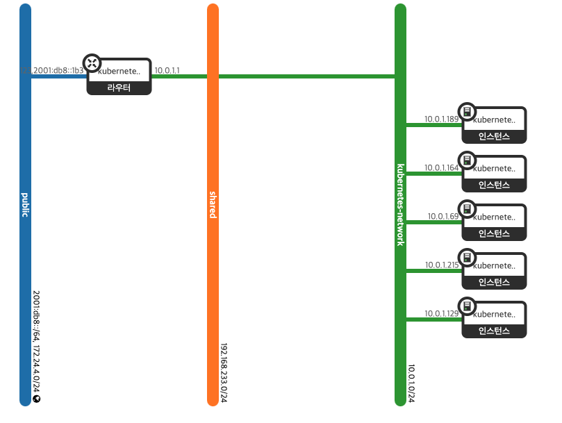
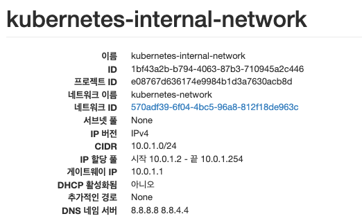

Kubernetes 설치는 [변재한님의 블로그](https://velog.io/@jaehan/Openstack-%EA%B8%B0%EB%B0%98-Kubernets-%EA%B5%AC%EC%B6%95-with-Kubespray)를 참고했습니다.

## Ansible Ping 문제

Ansible Ping 수행 시 모든 노드에 아래와 같은 오류가 발생했다. 에러 메세지를 확인해보니 ssh 키가 제대로 적용되지 않은 것처럼 보였다.

```
Kubernetes-k8s-node-nf-2 | UNREACHABLE! => {
    "changed": false,
    "msg": "Data could not be sent to remote host \"10.0.2.176\". Make sure this host can be reached over ssh: kex_exchange_identification: Connection closed by remote host\r\nConnection closed by UNKNOWN port 65535\r\n",
    "unreachable": true
}
```

> Ansible은 ssh를 활용하여 target 노드와 통신한다.

### 해결책 1. 공개키 알고리즘 변경

openstack log를 확인해보니 debian image에 공개키가 authorized_keys에 제대로 복사되지 않아 ssh 통신을 제대로 수행하지 못한 것이었다.


ssh 키를 ed25519 알고리즘으로 생성하면 키가 제대로 복사되지 않았지만 rsa로 변경하면 아래와 같이 키가 복사된다.


> 보안을 고려하면 rsa보다는 ed25519 알고리즘이 권장된다.[^1]

다시 ping을 수행하면 제대로 수행된다.


### 해결책 2. ssh-agent 실행

만약에 원격으로 openstack 서버에 접속한다고 가정해보자. 사용자를 변경하거나 세션을 한번 끊게 되면 동일한 이유로 문제가 생긴다.

우선 우리가 초기에 ansible를 세팅할 때 ssh-agent를 실행하고 private key를 추가하는 작업을 한다. ssh-agent는 ssh-add 명령어를 활용하여 키를 기억하고 사용하게 된다.

```
# 백그라운드에 agent 실행
eval "$(ssh-agent -s)"
# 키 추가
ssh-add ~/.ssh/id_rsa
```

ssh-agent는 프로세스로써 작동돼 중간에 ssh가 중단되더라도 프로세스가 남아있다. 그러므로 **현재 사용자(stack)가 실행시킨 프로세스를 먼저 없애고 ssh-agent를 실행시키도록 구현**하면 된다.

openstack은 stack 사용자가 관리한다. stack 사용자의 `~/.bashrc` 에 ssh-agent를 추가하여 stack 사용자로 로그인 성공할때마다 실행할 수 있도록 한다.

```bash
# Ansible ssh agent
## Delete used ssh-agent
if [ -f ~/scripts/delete_ssh_agent.sh ]; then
        . ~/scripts/delete_ssh_agent.sh
fi

## Create new ssh-agent
eval $(ssh-agent -s)
ssh-add ~/.ssh/id_rsa.kubespray
```

`delete_ssh_agent.sh` 은 openstack을 관리하는 사용자(stack)가 가지고 있는 ssh-agent를 삭제하는 스크립트이다.

```sh
#!/bin/bash

# Get all PIDs of ssh-agent processes owned by the user 'stack'
pids=$(pgrep -u stack ssh-agent)

# Check if any PIDs were found
if [ -z "$pids" ]; then
  echo "No ssh-agent processes found for user 'stack'."
  exit 1
else
  # Loop through each PID and attempt to kill the process
  for pid in $pids; do
    echo "Killing ssh-agent process with PID $pid..."
    kill "$pid"

    sleep 1

    # Check if the process was successfully killed
    if pgrep -u stack -x ssh-agent > /dev/null; then
      echo "Failed to kill process with PID $pid. You may need to use sudo."
    else
      echo "Successfully killed process with PID $pid."
    fi
  done
fi
```

새롭게 접속하면 아래와 같이 정상적으로 실행되는 것을 알 수 있다.


> 이 방식은 단일 사용자만 관리한다는 가정하에서 만든 해결책이다.

## Nameserver 문제

playbook를 배포해보자.

```bash
ansible-playbook --become -i inventory/test-cluster/hosts cluster.yml
```

nameserver로 인해 문제가 발생했다. 보통 이런 문제는 nameserver의 설정이 잘못된 경우에 발생되며 안전한 google dns(8.8.8.8, 8.8.4.4)로 설정하면 해결된다.

```
   "msg": "E: Failed to fetch http://security.debian.org/debian-security/pool/updates/main/p/python-apt/python-apt-common_1.8.4.3_all.deb  Temporary failure resolving 'deb.debian.org'\nE: Failed to fetch http://security.debian.org/debian-security/pool/updates/main/p/python-apt/python3-apt_1.8.4.3_amd64.deb  Temporary failure resolving 'deb.debian.org'\nE: Unable to fetch some archives, maybe run apt-get update or try with --fix-missing?",
```

### 해결책 1. resolv.conf 수정(잘못된 접근)

DNS를 설정하는 `resolv.conf` 를 확인해보면 127.0.0.53로 설정되어 있다. 안전하게 google dns 서버로 변경해보자

```
# Dynamic resolv.conf(5) file for glibc resolver(3) generated by resolvconf(8)
#     DO NOT EDIT THIS FILE BY HAND -- YOUR CHANGES WILL BE OVERWRITTEN
nameserver 127.0.0.53
```

실제로는 **우리가 직접 변경하면 안된다.**

> DO NOT EDIT THIS FILE BY HAND -- YOUR CHANGES WILL BE OVERWRITTEN

resolv.conf은 /run 폴더 내에 심볼링 링크가 되어 있기 때문에 마음대로 수정하는 것은 권장하지 않는다.[^2]


실제로 [virt-customize](https://libguestfs.org/virt-customize.1.html) 를 활용해서 resolv.conf를 수정하는 이미지를 별도로 만들었지만 의미가 없었다.

### 해결책 2. Terraform 수정

가장 안전한 접근법이다.
네트워크 토폴로지를 보면 쿠버네티스 노드들이 kubernetes-network subnet를 활용한다.



Openstack의 subnet에 DNS nameserver를 명시할 수 있다. 그러므로 Openstack 인스턴스를 배포하는 terraform 파일을 수정한다.
`~/kubespray/contrib/terraform/openstack/modules/network/main.tf` 내에 `dns_nameservers` 를 google dns로 변경시킨다.

```tf
resource "openstack_networking_subnet_v2" "k8s" {
  name            = "${var.cluster_name}-internal-network"
  count           = var.use_neutron
  network_id      = openstack_networking_network_v2.k8s[count.index].id
  cidr            = var.subnet_cidr
  ip_version      = 4
  dns_nameservers = ["8.8.8.8","8.8.4.4"]
}
```

원래라면 variables.tf를 수정해야 했지만 제대로 적용이 되지 않았고, google dns server는 거의 불변에 가깝기 때문에 main.tf에 직접 작성해도 된다고 판단했다.

아래와 같이 제대로 적용된다.



## 그 이외의 debian 문제들

그 이후부터 debian에는 잡다한 문제가 발생했다.


### 해결책 1. 클라우드 이미지를 ubuntu로 변경

클라우드 이미지를 debian에서 ubuntu로 변경했다. ssh 키를 ed25519 알고리즘으로 적용해도 정상적으로 작동된다.
Ansible playbook를 작동시키면 정상적으로 kubernetes가 배포된다.

[^1]: https://dev.to/ccoveille/how-to-generate-a-secure-and-robust-ssh-key-in-2024-3f4f
[^2]: https://askubuntu.com/questions/351168/diffrence-between-the-dns-setting-in-etc-resolv-conf-and-etc-network-interfaces
