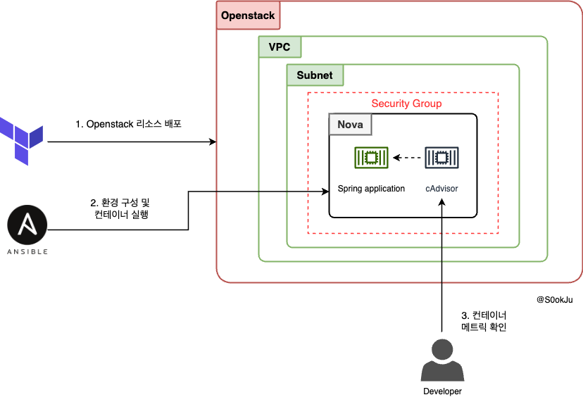

## 시나리오

Hello World를 반환해주는 springboot 도커 서비스가 있다. 배포해보자!

## 환경

- ubuntu 22.04
- openstack 2024.01

## 순서

1. Terraform을 활용한 인프라 구성
2. Ansible를 활용한 환경 구성 및 빌드
3. cAdvisor를 활용한 모니터링

### cAdvisor를 선택한 이유

cAdvsior는 컨테이너의 Metrix를 모니터링할 수 있는 도구입니다. **기본적인 컨테이너 메트릭 정보를 우선 확인**하기 위해 선택하게 되었습니다.

## 전체 구성도



## Terraform을 활용한 리소스 배포

배포해야 할 것은 아래와 같습니다.

- Nova Instance
- Network
  - Subnet
  - Router
  - Floating ip
- Security
  - Security Group
    - ssh, spring web port(8080), cAdvisor(8081)를 위한 rule 생성
- ssh 통신을 위한 keypair

### Terraform code

terraform은 절차 지향적이기 때문에 리소스 작성 순서가 중요합니다.그래서 간단한 nova 인스턴스 배포의 경우 아래와 같은 순서를 따랐습니다.

1. 네트워크
2. 인스턴스 생성
3. floating ip 할당

> 전체 코드는 [깃허브](https://github.com/S0okJu/OpsAthlan/tree/sc/1/scenario_01/terraform)를 참고하길 바랍니다.

네트워크를 생성한 이후 subnet를 생성한다. 외부와 통신하기 위해서는 external_network와 서브넷과의 연결이 필요합니다. 그러므로 `router`를 생성한 후 `router_interface`를 통해 external_network와 서브넷이 연결하게 됩니다.

```tf
# Network 생성
resource "openstack_networking_network_v2" "opsathlan_network" {
  name                  = "opsathlan-${var.scenario_id}-network"
  admin_state_up        = true
  port_security_enabled = var.port_security_enabled
}

# Subnet 생성
resource "openstack_networking_subnet_v2" "opsathlan_subnet" {
  name            = "opsathlan-${var.scenario_id}-subnet"
  network_id      = openstack_networking_network_v2.opsathlan_network.id
  cidr            = var.subnet_cidr
  ip_version      = 4
  dns_nameservers = ["8.8.8.8", "8.8.4.4"]
}

# Router 생성
resource "openstack_networking_router_v2" "opsathlan_router" {
  name                = "opsathlan-${var.scenario_id}-router"
  admin_state_up      = true
  external_network_id = data.openstack_networking_network_v2.ext_network.id
}

# Router Interface 생성
resource "openstack_networking_router_interface_v2" "router_interface" {
  router_id = openstack_networking_router_v2.opsathlan_router.id
  subnet_id = openstack_networking_subnet_v2.opsathlan_subnet.id
}
```

### 인스턴스 생성

인스턴스에 접근하는데 사용되는 keypair를 생성합니다.

```
# Keypair 생성
resource "openstack_compute_keypair_v2" "opsathlan_keypair" {
  name       = "opsathlan-${var.scenario_id}-keypair"
  public_key = file(var.pubkey_file_path)
}
```

Nova 인스턴스의 접근 제어를 관리하는 Security group를 설정합니다. security group rule은 `variables.tf` 에서 리스트로 받은 후에 적용할 수 있도록 구성합니다.

```
# Security Group 생성
resource "openstack_networking_secgroup_v2" "opsathlan_secgroup" {
  name                 = "opsathlan-${var.scenario_id}-secgroup"
  description          = "OpsAthaln Security Group"
  delete_default_rules = false
}

# Security Group Rule 생성
resource "openstack_networking_secgroup_rule_v2" "secgroup_rules" {
  count             = length(var.allowed_ports)
  direction         = "ingress"
  ethertype         = "IPv4"
  protocol          = lookup(var.allowed_ports[count.index], "protocol", "tcp")
  port_range_min    = lookup(var.allowed_ports[count.index], "port_range_min")
  port_range_max    = lookup(var.allowed_ports[count.index], "port_range_max")
  remote_ip_prefix  = lookup(var.allowed_ports[count.index], "remote_ip_prefix", "0.0.0.0/0")
  security_group_id = openstack_networking_secgroup_v2.opsathlan_secgroup.id
}
```

`variables.tf` 에서는 외부에서 접근할 수 있는 포트를 설정합니다.

- ssh
- spring boot application(8080)
- cAdvisor(8081)

```
// variables.tf
variable "allowed_ports" {
  description = "List of maps defining allowed ports for the security group. Each map should include protocol, port_range_min, port_range_max, and optionally remote_ip_prefix."
  type = list(object({
    protocol         = string
    port_range_min   = number
    port_range_max   = number
    remote_ip_prefix = optional(string, "0.0.0.0/0")
  }))
  default = [
    {
      protocol       = "tcp"
      port_range_min = 22
      port_range_max = 22
    },
    {
      protocol       = "tcp"
      port_range_min = 8080
      port_range_max = 8080
    },
    {
      protocol       = "tcp"
      port_range_min = 8081
      port_range_max = 8081
    }
  ]
}
```

### Floating ip 할당 및 설정

floating ip를 생성한 후에 nova instance에 붙힙니다.

```
# 5. Floating IP 생성 및 연결
resource "openstack_networking_floatingip_v2" "floating_ip" {
  pool = data.openstack_networking_network_v2.ext_network.name
}

# 4. Nova Instance 생성
resource "openstack_compute_instance_v2" "nova_instance" {
  name            = "opsathlan-${var.scenario_id}-instance"
  image_name      = var.image_name
  flavor_name     = var.flavor_name
  key_pair        = openstack_compute_keypair_v2.opsathlan_keypair.name
  security_groups = [openstack_networking_secgroup_v2.opsathlan_secgroup.name]

  network {
    uuid = openstack_networking_network_v2.opsathlan_network.id
  }

  depends_on = [openstack_networking_subnet_v2.opsathlan_subnet]

}

resource "openstack_compute_floatingip_associate_v2" "floating_ip_association" {
  floating_ip = openstack_networking_floatingip_v2.floating_ip.address
  instance_id = openstack_compute_instance_v2.nova_instance.id
}
```

## Ansible를 활용한 환경 구성 및 컨테이너 실행

Ansible를 활용하여 **컨테이너 이미지를 빌드하고 실행시킬 수 있는 환경을 구성**해야 합니다. 그래서 총 4개의 role를 만들었습니다.

- java 설치
- docker 설치
- springboot 이미지 빌드 및 수행
- cAdvisor 실행

> 🤔 **여담**
>
> Jenkins와 같이 자동화 도구를 사용할 수 있지만 초반에는 불필요하다고 생각했습니다. 배포하고자 하는 애플리케이션의 규모는 현저하게 작았고, 난이도가 있어 잘못하면 예상보다 시간을 많이 할애할 수 있다고 판단했습니다.

### spring boot application 배포

#### application 소개

배포 애플리케이션은 간단하게 hello world만 반환하는 웹 서비스입니다.

```java
@RestController
public class EchoController {

    @GetMapping("/echo")
    public String echo() {
        return "Hello, World!";
    }
}
```

#### 빌드 및 실행

Ansible를 활용하여 spring boot application 컨테이너를 실행합니다. 이때 컨테이너는 8080 외부 포트로 열어둡니다.

**순서**

1. Repository clone
2. Spring boot application build
3. Container Image build
4. Docker 실행

```yml
---
- name: Clone Spring Boot application repository
  git:
    repo: "https://github.com/S0okJu/OpsAthlan.git"
    dest: /home/ubuntu/app/spring-boot-app
    version: sc/1

- name: Build Spring Boot application using Gradle
  command: ./gradlew clean build
  args:
    chdir: /home/ubuntu/app/spring-boot-app/scenario_01/spring_echo
  register: gradle_build
  failed_when: gradle_build.rc != 0

- name: Check if JAR file exists
  stat:
    path: /home/ubuntu/app/spring-boot-app/scenario_01/spring_echo/build/libs/
  register: jar_dir

- name: Fail if JAR file does not exist
  fail:
    msg: "JAR file was not built successfully."
  when: jar_dir.stat.exists == False or jar_dir.stat.isdir == False
- name: Copy Dockerfile for Spring Boot
  copy:
    src: Dockerfile
    dest: /home/ubuntu/app/spring-boot-app/scenario_01/spring_echo/Dockerfile

- name: Build Docker image for Spring Boot application
  docker_image:
    name: echo-springboot-app
    tag: latest
    source: build
    build:
      path: /home/ubuntu/app/spring-boot-app/scenario_01/spring_echo

- name: Run Spring Boot container
  docker_container:
    name: sc1-springboot-app
    image: echo-springboot-app:latest
    state: started
    ports:
      - "8080:8080"
```

자세한 코드는 [github](https://github.com/S0okJu/OpsAthlan/tree/sc/1/scenario_01/ansible) 참고 바랍니다.

### cAdvisor

cAdvisor는 컨테이너 이미지를 다운받고 컨테이너를 실행할 수 있도록 구성합니다. 컨테이너는 8081로 외부포트를 열어 개발자가 대시보드를 확인할 수 있도록 설정합니다.

```yml
---
- name: Pull cAdvisor image
  docker_image:
    name: google/cadvisor:latest
    source: pull

- name: Run cAdvisor container
  docker_container:
    name: cadvisor
    image: google/cadvisor:latest
    state: started
    ports:
      - "8081:8080"
    volumes:
      - "/:/rootfs:ro"
      - "/var/run:/var/run:ro"
      - "/sys:/sys:ro"
      - "/var/lib/docker/:/var/lib/docker:ro"
```

## 컨테이너 지표 모니터링

### cAdvisor 접속

{floating_ip}:8081에 접속합니다.
container 창에 들어가 springboot application을 확인합니다.

 

springboot application에 대한 기본적인 지표를 확인할 수 있습니다.


### Test

자체적으로 만든 test 도구인 [gonetworker](https://github.com/S0okJu/GoNetWorker)를 활용하겠습니다.

> **GoNetWorker**
>
> 자체적으로 만든 네트워크 테스트 도구입니다. 서버에 request를 연속에서 요청한다는 특징이 있습니다.

블로그 작성 기준 GoNetWorker는 동시로 전송하는 기능이 없어 **순차적으로 request를 요청**합니다. request 요청 이후 무작위로 sleep합니다. 연속적으로 리소스를 사용하지 않을 것이라고 예상할 수 있습니다.

#### Network

네트워크 처리율을 보면 처리가 되었다가 0byte로 떨어졌다가 다시 상승합니다. 이는 저희가 사용한 도구인 GoNetWorker의 특징 때문에 발생한 그래프입니다.


그 이외에도 아래와 같은 특징을 알 수 있습니다.

- 평균적으로 1200bytes를 넘어가지 않는다.

#### Memory

그에 비해 memory는 점진적으로 상승하는 그래프를 보여주고 있습니다. 그래프를 보니 **웹 애플리케이션이 불필요한 메모리 자원을 낭비한다**고 생각했습니다.


원인을 구체적으로 파악하기 위해서는 springboot에 대한 메트릭이 필요합니다. cAdvisor 만으로는 정교한 메트릭 수집에 한계가 있으므로 프로메테우스를 활용해야 할 것 같습니다.

## 다음편에는 ...

다음 편에는 프로메테우스를 활용하여 springboot 관련 메트릭스를 수집하고 문제를 해결해 보겠습니다.
