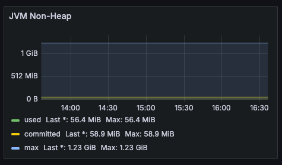
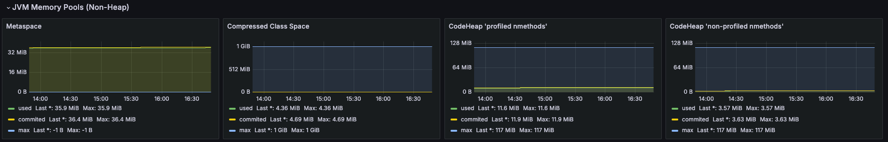

## JVM의 메모리 사용 형태

JVM에는 3가지 메모리 사용 형태가 있습니다.

- used: JVM이 사용 중인 메모리 양
- committed: JVM이 시스템에게 요청한 메모리 양
- max : 실행 중인 환경에서 최대로 할당할 수 있는 메모리 양

메모리 용량은 used <= committed <= max를 따르는데, used 메모리 양이 committed, max 메모리보다 크게 된다면 OOM(Out Of Memory)이 발생[^1]하게 됩니다.


그라파나를 확인해보면 3가지의 메모리 형태를 알 수 있습니다.


### Committed Memory의 역할

> [YGwan님의 블로그: JVM Memory의 3가지 메트릭 지표 - Committed Memory란?](https://swmobenz.tistory.com/37)를 읽어보는 것을 추천드립니다.

**메모리를 할당하고 해제하는데 필요한 오버헤드를 줄일 수 있다는 특징**을 가지고 있습니다.  
JVM이 시스템을 통해 미리 메모리를 할당하여 사용 시 가지고 있는 여유 메모리 공간을 활용합니다. 이를 통해 메모리를 즉시 사용할 수 있으며 메모리를 할당하는데 발생하는 오버헤드를 줄일 수 있게 됩니다.

## Advanced echo server jvm 메트릭 특징

이전 글에서 스프링부트 컨테이너의 메모리가 지속적으로 증가한다고 언급했습니다. 그래서 저는 jvm에 문제가 있을 수 있겠다는 생각이 들어 관련 지표를 확인해보겠습니다.  
처음에 눈여겨 봤던 것은 JVM의 committed 메모리 양이 점진적으로 증가하고 있다는 점이었습니다.

😂 사진에서는 잘 보이지 않지만 자세히 보면 1MB씩 상승하고 있습니다.


자세히 알아보기 전에 heap과 non-heap 메모리에 대해 알아봅시다.

- Java Heap : Instance와 객체가 저장되는 공간으로 모든 Thread에 의해 공유되는 영역[^2]
- Native Area(non-heap) : OS레벨에서 관리하는 영역으로 JVM 크기에 강제되지 않기 때문에 **프로세스가 이용할 수 있는 메모리 자원을 최대한 활용할 수 있습니다.**


다시 돌아와 제가 운영하고 있는 웹 애플리케이션을 확인해 볼까요.  
정말 간단한 EchoController와 프로메테우스 metric 수집을 위한 MetricController가 있습니다.

```java
@RestController
public class EchoController {

    @GetMapping("/echo")
    public String echo() {
        return "Hello, World!";
    }
}
```

웹 애플리케이션이 비교적 단순하기 때문에 Heap 영역의 문제는 아니라고 생각했습니다.  
그래도 JVM Heap를 확인해 보겠습니다. 힙 메모리의 사용량은 매우 적게 사용되었고, 안정적으로 유지되었습니다.


non-heap 영역을 봐봅시다.  
변화폭이 적어서 차이를 모르겠지만 메모리가 사용량이 조금씩 증가하고 있습니다.



우선 [프로파일링](<https://ko.wikipedia.org/wiki/%ED%94%84%EB%A1%9C%ED%8C%8C%EC%9D%BC%EB%A7%81_(%EC%BB%B4%ED%93%A8%ED%84%B0_%ED%94%84%EB%A1%9C%EA%B7%B8%EB%9E%98%EB%B0%8D)>)은 무엇을 의미할까요. [hudi.blog: 스프링 애플리케이션 배포 직후 발생하는 Latency의 원인과 이를 해결하기 위한 JVM Warm-up](https://hudi.blog/jvm-warm-up/)를 참고하겠습니다.

> **JIT 컴파일러**는 애플리케이션에서 **자주 실행된다고 판단되는 특정 부분만을 기계어로 컴파일**한다. 이 부분을 **핫스팟(Hotspot)** 이라고 부른다. JIT 컴파일러는 실행중인 애플리케이션의 동작을 분석하고 코드 실행 횟수, 루프 반복 횟수, 메소드 호출 등의 정보를 측정하고 기록한다. 이를 **프로파일링**이라고 한다.  
> JIT 컴파일러는 프로파일링 결과를 토대로 핫스팟을 식별한다. 핫스팟이 식별되었다면, JIT 컴파일러는 **메소드 단위로 바이트 코드를 기계어로 번역**한다.
> JIT 컴파일러는 이렇게 번역된 기계어를 **코드 캐시(Code Cache)** 라는 캐시공간에 저장한다.
>
> 출처 - https://hudi.blog/jvm-warm-up/

JIT는 전체 코드를 컴파일 하는 것이 아닌 자주 실행되는 부분에만 컴파일하며 이에 대한 데이터를 Code Cache에 저장하게 됩니다.

Non Heap과 관련된 지표를 확인해봅시다.  
아래의 세 가지 지표가 미세하게 증가하고 있습니다.

- Metaspace : JVM이 로드한 메타데이터를 저장
- CodeHeap : JIT 컴파일러 관련 지표
  - profiled nmethods
  - non-profiled nmethods



하지만 **장기적인 관점에서 바라봤을때 메모리 낭비일 수 있겠다는 생각**이 들었습니다.  
특히 Metaspace는 JVM 크기에 강제되지 않기 때문에 프로세스가 사용할 수 있는 메모리 자원을 최대한 활용할 수 있게 됩니다. 그러므로 Metaspace 메모리를 제한하여 운영할 필요가 있습니다.  
이러한 성능 제한은 Metaspace에만 적용되는 것이 아니라 다른 영역에서의 메모리 사이즈 제한이 필요합니다.


안전하게 애플리케이션을 운영하기 위해서는 각 메모리 영역에 맞는 요구사항을 고려하여 결정하는 것이 바람직합니다.

> Java 어플리케이션은 크게 위의 Heap과 Off-Heap 두 공간을 활용하여 동작하는데, 따라서 어플리케이션을 배포할 때 메모리 몇 GB를 할당해야 하는지 결정하기 위해서는 단순히 Xmx(Heap 메모리 최대치를 결정하는 Java 옵션) 값만 생각하면 OOME에 빠지기 쉽다. 실제로는 **Xmx에 MaxMetaspace값을 더하고, 추가로 프로그램에서 NIO를 사용해 Native Memory를 직접 할당받는 로직을 고려해서 Heap + Native Memory 사용총량으로 할당을 해야 비교적 정확**하다. 특히 컨테이너의 경우 계산을 좀 더 정확하게 해야 시스템에서 OOM killed되는 상황을 면할 수 있다.
>
> 출처 - https://www.samsungsds.com/kr/insights/1232761_4627.html

## 정리

실제로 배포해보면서 컨테이너의 지속적인 메모리 사용량이 증가하는 것에 의문점을 가지게 되었습니다. 자바 컨테이너의 메모리 사용은 JVM이 컨트롤할 수 없는 부분이 많아 추적하기 어렵습니다[^3].  
그래서 자세히 확인할 수 있는 JVM 위주로 확인하게 되었습니다. non-heap 영역이 미세하게 상승하고 있었고, 이는 정상적인 지표라고 생각했습니다. 그러나 장기적으로는 메모리 낭비가 될 수 있으므로 메모리 사이즈를 제한하여 운영해야 합니다.

## Reference

- https://swmobenz.tistory.com/37
- https://hudi.blog/jvm-warm-up/
- https://velog.io/@dongvelop/Spring-Boot-%EC%84%9C%EB%B2%84-%EB%AA%A8%EB%8B%88%ED%84%B0%EB%A7%81-%EB%8C%80%EC%8B%9C%EB%B3%B4%EB%93%9C%EB%B3%84-%EC%84%A4%EB%AA%85-%EB%B0%8F-%EC%9C%A0%EC%9D%98%EC%82%AC%ED%95%AD#codeheap-non-profiled-nmethods-non-heap
- https://www.samsungsds.com/kr/insights/1232761_4627.html
- https://obv-cloud.com/41

[^1]: https://swmobenz.tistory.com/37
[^2]: https://12bme.tistory.com/382
[^3]: https://stackoverflow.com/questions/53451103/java-using-much-more-memory-than-heap-size-or-size-correctly-docker-memory-limi
