## 시나리오

데이터베이스를 설치하고 읽기와 쓰기를 탐색해보자

#### 구성도

1. Jenkins를 활용한 컨테이너 자동 빌드 및 docker-compose 배포
2. Nova에 Mysql 서버 설치 및 volume에 데이터 저장

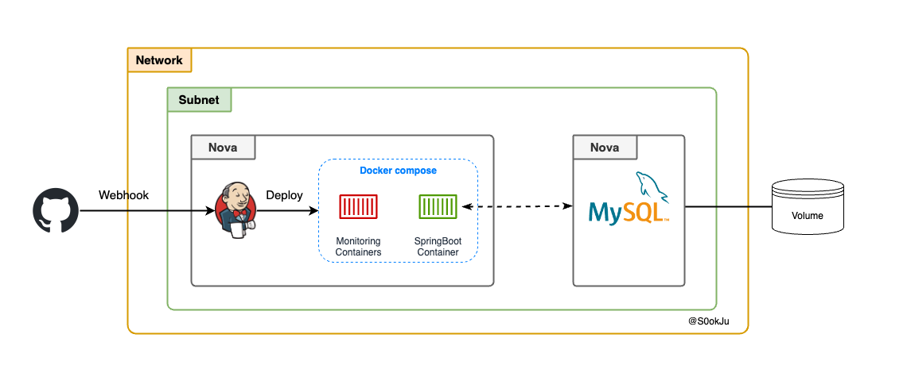

## Trove 설치 실패

초기 설계에서는 RDS와 유사하다고 생각한[^1] 서비스인 Trove를 활용해서 구성할 예정이었습니다. 그런데 따로 네트워크를 구축하고 설치해보면서 다양한 오류사항을 마주했습니다. 원인은 대략적으로 찾았으나 구체적인 해결 방안을 찾지 못해서 **Nova 인스턴스에 mysql 서버를 사용하는 방식으로 전환**했습니다.

#### 오류사항

우선 Trove가 무엇인지 알아봅시다. [공식문서](https://wiki.openstack.org/wiki/Trove)에 의하면 trove는 다른 퍼블릭 클라우드의 데이터베이스 서비스과 유사한 기능을 가지고 있습니다. 안정성을 위한 대부분의 기능을 제공합니다.

> Trove is **Database as a Service** for OpenStack. It's designed to run entirely on [OpenStack](https://wiki.openstack.org/wiki/OpenStack "OpenStack"), with the goal of allowing users to quickly and easily utilize the features of a relational or non-relational database without the burden of handling complex administrative tasks.
> ... Initially, the service will focus on providing resource isolation at high performance while **automating complex administrative tasks including deployment, configuration, patching, backups, restores, and monitoring.**

저는 Kolla-Ansible를 사용하고 있어 쉽게 리소스를 추가할 수 있습니다. `globals.yml` 에서 trove 리소스 부분을 yes로 바꾸기만 하면 됩니다. 설정을 추가하고 재배포하면 총 3개의 trove 컨테이너가 생성됩니다.

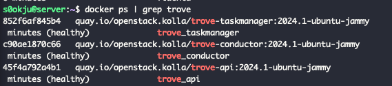

Trove는 Nova 인스턴스 내에서 작동됩니다. 관련 이미지를 다운로드 받아서 glace에 업로드한 후 datastore version을 정의할때 사용합니다.

```sh
# Image 다운로드
wget https://tarballs.opendev.org/openstack/trove/images/trove-master-guest-ubuntu-jammy.qcow2

# 이미지 Glance로 업로드
openstack image create Trove-Ubuntu --disk-format qcow2 --container-format bare --public --tag trove --tag mysql --file trove-master-guest-ubuntu-jammy.qcow2

# datastore version 정의
openstack datastore version create 5.7.29 mysql mysql "" --image-tags trove,mysql --active --default --version-number 5.7.29

```

위의 명령어를 모두 수행한 후 아래의 명령어를 확인해보면 mysql에 해당되는 datastore를 확인할 수 있습니다.

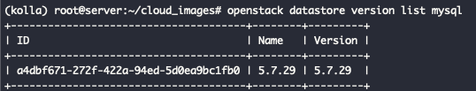

그리고 trove 관리 네트워크를 따로 만든 후에 데이터베이스를 생성했습니다.

```sh
openstack database instance create test_db \
    --flavor m1.medium \
    --size 10 \
    --nic net-id={custom trove manangement network id} \
     --database testdb \
     --users tester:mypassword \
     --datastore mysql \
     --datastore-version 5.7.29 \
     --allowed-cidr 0.0.0.0/0
```

명령어 수행 이후 빌드 시간이 길었습니다. Timeout 에러가 발생할 것이라고 예상했고, 생각한대로 오류가 발생했습니다.

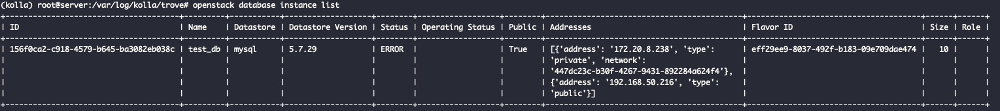

trove - api 에서 taskmanager로 작업을 수행할때 message bus 부분에서 문제가 생긴 것 같습니다.

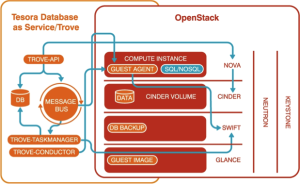

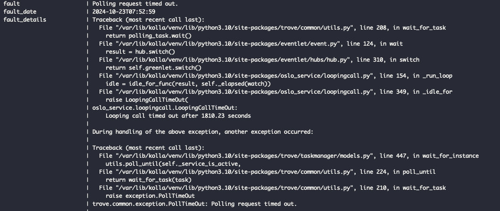

우리의 목적은 간단하게 API를 테스트하는 것이기 때문에 대규모에 적합한 데이터베이스 시스템이 아니여도 괜찮습니다. 그러므로 **간단하게 Nova 인스턴스 내에 Mysql 서버를 설치하는 방법**을 선택했습니다.

## 프로비저닝(Provisioning)

> 프로비저닝(Provisioning) 이란 의미는 영어 직역한 그대로 "제공하는것" 이다. 
> 어떤 종류의 서비스든 **사용자의 요구에 맞게 시스템 자체를 제공 하는 것**을 프로비저닝이라고 하며 제공해줄 수 있는 것은 인프라 자원이나 서비스, 또는 장비가 될 수도 있다.
>
> 출처 - [Jins' Dev Inside - 프로비저닝이란?](https://jins-dev.tistory.com/entry/%ED%94%84%EB%A1%9C%EB%B9%84%EC%A0%80%EB%8B%9DProvisioning-%EC%9D%B4%EB%9E%80)

앞으로는 인프라를 생성, 환경을 설정 과정을 프로비저닝이라는 용어로 칭하겠습니다.

#### 리소스 생성

저희는 크게 2가지의 Nova 인스턴스가 필요합니다.

1. Docker, Jenkins 서버가 설치되어 있는 인스턴스 -> **Nova 인스턴스**
2. Block Storage(Cinder)와 연결되어 있으며 MySQL Server가 설치된 인스턴스 -> Block **Storage(Cinder)가 연결된 Nova 인스턴스**


Openstack에서는 Nova 인스턴스를 생성할 때 Volume(Block Storage)을 추가할 수 있습니다. 쉽게 AWS의 EBS라고 생각하시면 됩니다.  
앞서 말했듯이 Trove 서비스 설치를 실패하게 되면서 대안책으로 Nova에 MySQL 서버를 설치하는 방안을 선택하게 되었습니다. Volume이 연결된 Nova Instance를 활용하여 **데이터베이스의 데이터가 Block Storage에 영구적으로 저장할 수 있게 구성**했습니다.

```hcl
# Block Storage Volume for MySQL Instance
resource "openstack_blockstorage_volume_v3" "db_volume" {
  name = "${var.project_name}-db-volume"
  size = var.volume_size
}

# Nova Instance with Volume (MySQL Server)
resource "openstack_compute_instance_v2" "db_instance" {
  name            = "${var.project_name}-db-instance"
  image_name      = var.image
  flavor_name     = var.flavor
  key_pair        = openstack_compute_keypair_v2.keypair.name

  network {
    port = openstack_networking_port_v2.db_port.id
  }

  metadata = {
    ssh_user = "ubuntu"
  }
}

# Attach Volume to MySQL Instance
resource "openstack_compute_volume_attach_v2" "db_volume_attach" {
  instance_id = openstack_compute_instance_v2.db_instance.id
  volume_id   = openstack_blockstorage_volume_v3.db_volume.id
}
```

위의 코드를 포함한 2개의 Nova Instance를 생성하면 아래와 같은 네트워크 토폴로지를 확인할 수 있습니다.

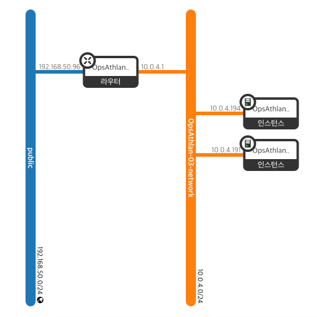

본래라면 관리 네트워크와 외부 네트워크가 분리되어야 하지만 통합되어 있는 관계로 모두 floating ip를 할당하게 되었습니다.  
만약에 네트워크가 역할에 따라 분명하게 분리되어 있다면 web-instance는 외부 네트워크로 구성하고 db-instance는 관리 네트워크 ip를 할당받아야 할 것입니다.

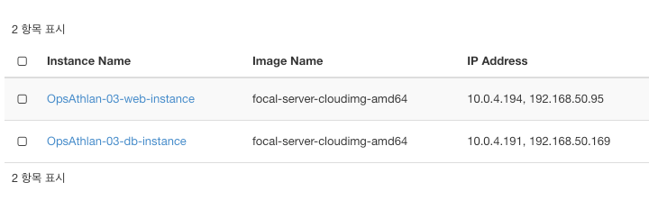

데이터 베이스 서버를 설치할 `OpsAthlan-03-db-instance` 인스턴스를 확인해 보겠습니다. 해당 정보에 들어가보면 `OpsAthlan-03-db-volume` **volume이 인스턴스의 /dev/vdb 경로로 마운팅**되었음을 확인했습니다.

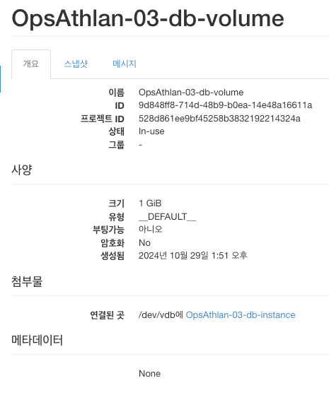

#### MySQL 서버 설치

처음에는 Ansible를 활용하여 한번에 MySQL 서버를 설치할 예정이었습니다. 그러나 저장 경로 수정 작업이 요구되면서 자동화는 힘들다고 판단했습니다.

> 상당히 작업이 번거로운 관계로 [JONGSKY님의 블로그(시간의 농도) - MySQL 저장경로 변경하기(feat. ubuntu)](https://jongsky.tistory.com/81) 로 대체하겠습니다.

위의 방법을 모두 따라하면 mysql 서버 설치가 완료됩니다.

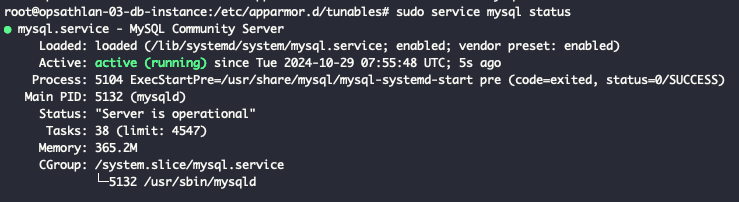

`web-instance` 에 mysql client를 설치하여 테스트를 수행해 보겠습니다. mysql 서버에 계정을 만든 후 테스트를 해보면 연결할 수 없다는 오류를 볼 수 있습니다. **`db-instance` security group에 mysql 서버 포트인 3306 규칙을 추가해도 똑같은 오류가 발생**됩니다.

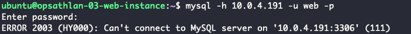

`/etc/mysql/mysql.conf.d/mysqld.cnf` mysql 설정 파일에 외부 통신을 허용해주면 정상적으로 연결할 수 있게 됩니다.

```
bind-address = 0.0.0.0
```

## 다음 이야기

데이터베이스 서버를 구성했으니 jenkins를 통한 CI/CD를 구축해보겠습니다.

[^1]: 완전 관리형 서비스는 아닙니다!
