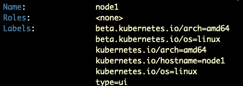
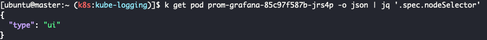

## 서버 상태

지금까지 Multipass 를 활용하여 쿠버네티스 환경을 만들고, 실제로 적용하는 과정을 거쳤다.
현재 3개의 노드로 구성되어 있으며, nfs, mysql, mongo와 같이 데이터베이스가 있는 인스턴스는 nfs, 젠킨스 서버는 ops 인스턴스에 저장했다.


왜 데이터베이스를 쿠버네티스의 statefulset으로 정의하지 않고 별도로 설치했는지 궁금할 것이다. 이유는 최대한 클라우드 스토리지처럼 구현하고 싶어서였다.

## 대시보드 확인하기

일단 쿠버네티스 내에서는 외부와 통신할 수 있는 기능은 크게 두 가지이다.

- Ingress
- Nodeport

일단 사설 네트워크 내에서만 사용할 예정이므로 Nodeport 방식을 사용하도록 하겠다.

### 예제 - Grafana ui 확인하기

예로 프로메테우스를 사용한다고 가정해보자. grafana 대시보드에 접근할 필요성이 있을 것이다.


grafana ui와 관련된 애플리케이션의 service type를 nodeport로 변경해준 후에 Host server(192.168.50.27)에 방화벽을 설정하면 192.168.50.27 주소로 Grafana ui에 접근할 수 있다.
그러나 문제도 존재한다. 서버에 문제가 생기면 재배포하게 되는데, 쿠버네티스 스케줄러에 따라서 다른 노드에 배치될 수 있다. 이럴 경우 배치된 노드를 확인해가며 기존의 방화벽을 닫고, 새로운 방화벽을 열어줘야 한다.

쿠버네티스에서는 여러 스케줄링 방식이 있는데[^1], 그 중 간단한 `nodeSelector` 로 node1에 강제 배치하여 정적으로 사용할 수 있도록 구성했다.


#### nodeSelector 설정

node1에 label를 type=ui로 설정한다.

```bash
kubectl label nodes node1 type=ui
```



#### grafana ui service type 변경

Prometheus, Grafana의 원활한 설치를 위해 [kube-prometheus helm](https://github.com/prometheus-operator/kube-prometheus)을 사용했다. helm 차트의 특성상 values.yaml를 설정하여 값을 주입하므로 **values.yaml** 를 확인해야 한다.
kube-prometheus helm 차트는 여러 helm 차트로 구성되어 있어, 설정하고 싶은 서비스의 **values.yaml**를 설정하면 된다.

`kube-prometheus-stack/charts/grafana/values.yaml` 파일에 대략 216번째 줄에 아래와 같은 서비스 타입을 Nodeport로 변경한다.

```yaml
## Expose the grafana service to be accessed from outside the cluster (LoadBalancer service).
## or access it from within the cluster (ClusterIP service). Set the service type and the port to serve it.
## ref: http://kubernetes.io/docs/user-guide/services/
##
service:
  enabled:
    true
    # type: ClusterIP
  type: NodePort # Custom
  loadBalancerIP: ""
  loadBalancerClass: ""
  loadBalancerSourceRanges: []
  port: 80
  targetPort: 3000
  nodePort: 30060 # Custom
```

#### helm nodeSelector 설정

`kube-prometheus-stack/charts/grafana/values.yaml` 의 314번째 줄에 node1에 배치되도록 설정했다.

```yaml
## Node labels for pod assignment
## ref: https://kubernetes.io/docs/user-guide/node-selection/
#
nodeSelector:
  type: ui
```

helm으로 배포한 후 pod 리스트를 보면 **{helm으로 배포한 이름}-grafana-{문자열}** 보이는데, 파드 내부에는 grafana와 관련된 컨테이너가 포함되어 있다. 즉, 우리가 찾던 ui도 grafana pod 내부에 있다는 것이다.


grafana 파드의 정보를 보면 nodeSelector가 정상적으로 적용되었음을 알 수 있다.



#### 방화벽 설정

node1 인스턴스의 nodeport(30060)에 트래픽이 들어올 수 있도록 허용한다.

```bash
sudo iptables -t nat -I PREROUTING -i enp3s0 -p tcp --dport 30060 -j DNAT --to-destination 10.120.52.23:30060
sudo iptables -I FORWARD 1 -p tcp -d 10.120.52.23 --dport 30060 -j ACCEPT
```

1. 30060 포트로 enp3s0 인터페이스에 들어오는 트래픽을 10.120.52.23:30060로 리다이렉션한다.
2. 10.120.52.23:30060에 접속하는 트래픽을 허용한다.

서버의 IP로 접속하면 그라파나 대시보드를 확인할 수 있다.


## 문제점

Multipass로 인스턴스를 만들고, 외부와의 접속을 위해 트래픽을 제어하는 것은 문제점이 있다.

1. 외부와의 접속을 할때마다 iptable를 설정해야 한다.

   - 서버가 shutdown이 될 경우 이전에 설정했던 iptables rule이 사라진다. 이럴 경우 규칙을 다시 설정하거나, 이를 대비해서 별도의 패키지를 설치해서 iptables이 영속성이 있도록 설정[^2]해야 한다.

2. 인스턴스가 많으면 많을수록 관리하기 어렵다.

   - 쿠버네티스 이외에도 다양한 인스턴스가 있지만 일리리 명령어로 상태를 확인하고, 설정하는 것은 번거롭다. 그러므로 **오케스트레이션 도구가 필요**했다.

위의 해결책으로 [OpenStack](https://www.openstack.org/software/project-navigator/openstack-components#openstack-services) 서버를 구축하고자 한다. 인스턴스를 public cloud 처럼 자유자재로 생성 및 삭제할 수 있으며, 네트워크 설정이 용이했다. 또한 클라우드에 사용되는 기술을 대부분 활용할 수 있어 클라우드를 알아가는데 좋은 도구라고 생각했다.

다음 포스팅은 기존의 서버를 포맷시키고, openstack 서버 구축기로 찾아오겠다.

[^1]: https://kubernetes.io/ko/docs/tasks/configure-pod-container/assign-pods-nodes/
[^2]: https://unix.stackexchange.com/questions/52376/why-do-iptables-rules-disappear-when-restarting-my-debian-system
