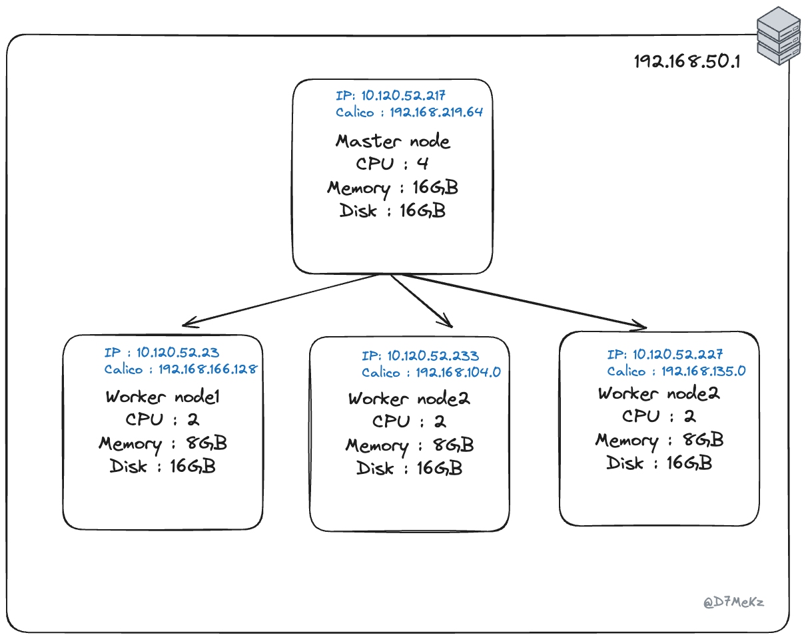

사이드 프로젝트를 직접 운영하기 위해 서버를 구축하기로 결심했다. 그래서 기존에 있는 Windows 데스크톱을 ubuntu 20.04 서버 환경으로 세팅했다.

## RTL8125 오류

여기서 문제가 발생했다. LAN 카드 정보 확인 결과, 네트워크 인터페이스가 제대로 인식되지 않았던 것이었다. 랜카드가 RTL8125의 경우에는 별도의 드라이버 설치가 필요했다. 하나의 모순이 생겼다. 우리가 패키지를 설치할때는 네트워크 연결이 필수지만, 네트워크에 문제가 생겨 외부 패키지를 다운받을 수 없던 것이었다.
물론 해결책이 없던 것이 아니였다.

- 안드로이드 폰을 이용해 tethering해서 네트워크 연결을 시키고 해당 라이브러리를 설치[^1]
- 20.04 은 커널 버전을 5.4를 쓰는데 이 버전에서 LAN이 인식이 안돼 5.8 이상 버전을 설치 [^2]

슬프게도 나는 두 방법에 실패하게 되었고 **22.04LTS를 설치**하게 되었다. 그리고 깔끔하게 성공했다.

## 구축

쿠버네티스의 구축 자체는 생각보다 간단하지만 상업 환경에서 안전하고 가용성 있게 지속적으로 관리하는 것은 어렵다. 그래서 자체 호스팅하는 것은 권장하지 않는다고 한다. [^3]

그러나 교육의 관점에서는 자체 호스팅해서 사용하는 것은 좋은 선택이라고 생각한다. 퍼블릭 클라우드를 사용하다가 요금을 폭탄맞을 수 있기 때문이다.

### Multipass 선택한 이유

리눅스 기반 가상 머신은 선택지가 생각보다 다양하게 있다. 나는 vagrant, multipass 중에서 고민했다. Multipass를 선택한 이유는 사용하기 쉬워서이다.

vagrant의 장점은 다양한 이미지를 사용할 수 있다는 점과 Vagrantfile를 통해 자동화 스크립트를 만들 수 있다는 점이었다. 하지만 단점이 존재했는데, 스크립트를 짜는 법을 알아야한다는 점과 내가 쿠버네티스 구축하는 전반적인 방식을 이해하지 못해 디버깅 하지 못한다는 것이었다. 실제로 깃허브의 오픈소스를 clone해서 구성해봤는데, 네트워크 할당이 제대로 되지 않아 많은 시간을 쓰기도 했다.

multipass는 Canonical에서 만들었으며 Ubuntu의 가상화환경(VM)을 쉽게 구성할 수 있도록 해주는 도구[^4]이다. 즉 우분투 보급사가 만든 가상환경이라고 보면 된다. 우분투 외의 리눅스를 써야한다면 multipass는 좋은 선택지는 아니지만 centOS Linux가 더이상 지원되지 않는다는 점[^5]에서 쓸 수 있는 건 우분투 밖에 없는 것 같다.

### 쿠베네티스 구성

자세한 설치는 [enumclass tistory](https://enumclass.tistory.com/261)를 참고했다.

### Calico 선택한 이유

CNI 플러그인에서 가장 대중적으로 쓰이는 것은 [Calico](https://docs.tigera.io/calico/latest/getting-started/kubernetes/quickstart)이다. CNI 플러그인 벤치마크를 보면 리소스 사용률이나, 속도 측면에서 Calico가 우수한 편이다.

CNI의 특징은 Pod에 IP를 할당한다. 이러한 특징이 대규모 환경에서는 IP 부족으로 이어질 수 있다. [^6] 그러나 소규모 프로젝트는 많은 pod를 생성하지 않으므로 IP는 부족하지 않을 것이다.

## 결과

10.120.52.x IP는 multipass instance의 IP이고, 192.168.x.x는 calico의 IP이다.

실제로 파드를 생성해 실행시켜 보면 아래와 같은 결과를 얻을 수 있다.

[^1]: https://physical-world.tistory.com/56
[^2]: https://romillion.tistory.com/96
[^3]: 쿠버네티스를 활용한 클라우드 네이티브 데브옵스, 존 어렌들, 저스틴 도밍거스 지음, 한빛 미디어
[^4]: https://kim-dragon.tistory.com/176
[^5]: https://arstechnica.com/gadgets/2020/12/centos-shifts-from-red-hat-unbranded-to-red-hat-beta/
[^6]: https://dobby-isfree.tistory.com/201
