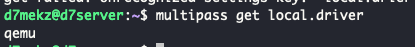

## 들어가며

쿠버네티스에서 유상태 애플리케이션을 실행할때 주로 PV, PVC를 활용해서 데이터를 저장한다. 위치에 따라 내부, 외부 저장 유무를 결정하는데, 내부적으로 저장하는 것은 접근성도 떨어질 뿐만 아니라 노드를 운용하는데 비효율적이라고 판단했다. 외부적인 방안은 네트워크를 통한 데이터 저장이다.

그렇다면 **온프로미스 환경에서 네트워크로 통신하여 저장할 수 있는 방법이 있을까?** 직접 쿠버네티스 환경에 구축하여 적용하고자 한다.

## NFS(Network File System)

네트워크에 파일을 저장하는 방식이다. 즉, 원격 컴퓨터에 있는 파일 및 디렉토리에 엑세스하고, 해당 파일 디렉토리가 로컬에 있는 것처럼 사용하는 분산 파일 시스템이다.

> 파일 시스템 중에 ZFS가 있다. 중간에 두 개의 개념이 혼용돼서 NFS에 ZFS 파일 시스템을 설치했다. 그리고 다시 포맷팅했다..
> 자세히 알고 싶으면 [토스 블로그, OpenZFS로 성능과 비용, 두 마리 토끼 잡기](https://toss.tech/article/engineering-note-8) 참고하길 바란다.

## 용량 부족 문제

유상태 애플리케이션은 무엇이 있을까? 대부분 데이터베이스를 꼽을 것이다. 데이터베이스는 생각보다 큰 용량을 차지한다. 자체 서버는 SSD 1TB용량을 가지고 있다. 그러나 4개의 노드 인스턴스와 시스템 데이터, 미래에 추가할 인스턴스까지 더하면 많은 용량이 요구된다. 개인적으로 SSD라는 비싼 저장소를 단순 데이터 보관용으로 사용하기에는 많이 아깝다고 생각했다.

다행히 DAS와 4TB HDD가 있었다. SSD에는 시스템에 활용될 데이터를 저장하고, 그 외의 데이터는 DAS에 저장하도록 구성하려고 한다.

## 구성

가상 환경을 하나 만들어서 NFS 관련 패키지를 설치하고, 각각의 노드가 네트워킹을 통해 접속할 수 있게 구성할 예정이다.

### 구성도

구성을 간략하게 설명하자면 아래와 같다.

1. NFS 서버 전용 가상 머신을 만든다.
2. Host 서버에 DAS를 마운팅하고, NFS Server 인스턴스에 host에 마운팅된 경로를 다시 마운트한다.


## 환경 설정하기

### Disk Format

DAS에 있는 HDD는 4TB로 1TB, 1TB, 1.8TB로 파티셔닝했다.

> 디스크 포맷 및 파티셔닝은 [무중력 인간님의 블로그](https://zero-gravity.tistory.com/297)를 참고하자.


부팅될때마다 자동 마운팅이 될 수 있도록 [fstab 파일을 수정](https://guide.ncloud-docs.com/docs/server-ts-fstab-vpc)했다.

### 문제1. UUID가 없는 경우

ext4로 포맷이 안된경우 PARTITION UUID만 있다. 그러므로 `mkfs.ext4` 를 활용하여 ext4를 포맷시키자.


### 문제 2. Emergency Mode

fsatab를 잘못 설정하면 Linux는 최소한의 권한만 제공하는 emergency mode로 도입하게 된다. fstab 파일을 적절하게 기입하자.

## NFS 설치하기

### NFS Multipass mounting

```bash
multipass mount /mnt/das/vol1 nfs:/nfs/vol1
```


### NFS Server 설치

NFS multipass Instance 내에 NFS 서버 라이브러리를 설치하자. 설정은 [Jung-taek Lim님의 블로그](https://heartsavior.medium.com/%ED%98%B8%EC%8A%A4%ED%8A%B8-%EC%84%9C%EB%B2%84-ubuntu-20-04-%EC%97%90-nfs-%EB%A5%BC-%EC%84%A4%EC%A0%95%ED%95%98%EA%B3%A0-spark-on-kubernetes-%EC%97%90%EC%84%9C-%EB%8F%99%EC%A0%81%EC%9C%BC%EB%A1%9C-%EB%B3%BC%EB%A5%A8%EC%9D%84-%ED%95%A0%EB%8B%B9%EB%B0%9B%EA%B8%B0-6c80bc71e6ed)를 참고했다.

```bash
sudo apt-get install nfs-common nfs-kernel-server rpcbind portmap
systemctl enable nfs-kernel-server
systemctl start nfs-kernel-server

```

네트워크 범위를 10.120.52.0/24로 지정했는데, 이는 multipass instance가 `10.120.52.0/24` 범위 내에 있기 때문이다.

mulitpass에서 사용되는 네트워크 드라이브를 보면 qemu를 사용한다.



네트워크 인터페이스를 보면 사용가능한 IP 범위는 `10.120.52.0/24` 임을 알 수 있다.


```bash
sudo mkdir -p /nfs/vol1
sudo chown nobody:nogroup /nfs/vol1
# nfs가 공유할 수 있는 네트워크 설정
sudo vim /etc/exports/nfs/vol1 10.120.52.0/24(rw,sync,no_subtree_check,no_root_squash)

# 위의 설정 반영
sudo exportfs -r
```

마스터 노드에 showmount하여 NFS가 제대로 작동되었는지 확인했을때 아래와 같이 export list가 잘 보여지면 된다.


## Dynamic Provisioner

쿠버네티스에서 스토리지를 사용하는 방식을 생각해보자. 전역적인 데이터 스토리지에 접근하기 위해서는 [[D K8S- Pod|Pod]]를 생성할때 PVC를 생성하여, 관리자가 생성한 PV와 연결하게 된다. 그러나 파드를 생성할때마다 PV, PVC를 만들어서 스토리지에 접근해야 한다. 이와 같이 번거로움을 해결하고자 자동으로 볼륨을 생성해주는 Dynamic Provisioner를 사용하게 된다.

Provisioner는 [kubernetes-sigs Github에 있는 nfs-subdir-external-provisioner](https://github.com/kubernetes-sigs/nfs-subdir-external-provisioner#with-helm)를 사용했다.

위의 파일을 적절하게 설정하게 test를 실행시키면, 아래와 같이 pvc가 만들어지게 된다. 또한 파드를 삭제하게 되면 자동으로 pvc가 삭제되는 것을 볼 수 있다.


## 참고

- https://gruuuuu.github.io/cloud/k8s-volume/
- https://do-hansung.tistory.com/57
- https://1week.tistory.com/114
