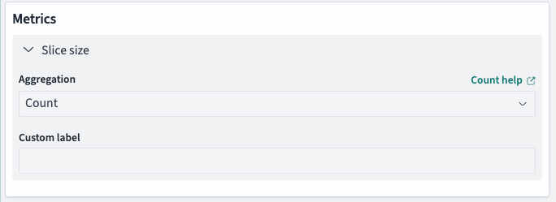
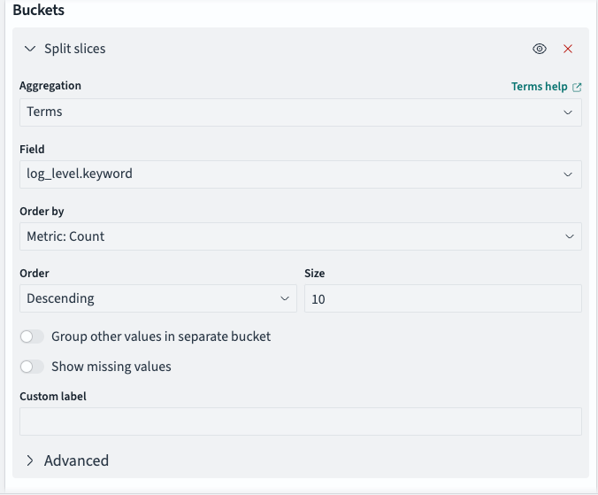
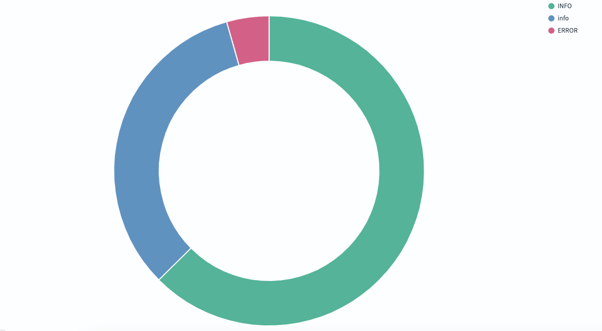
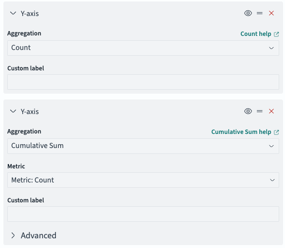
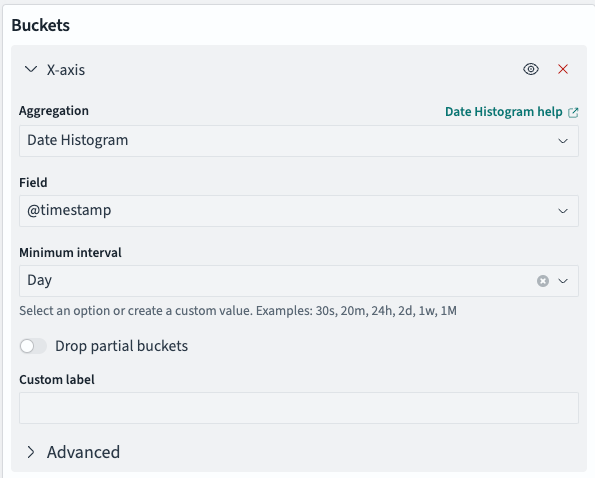
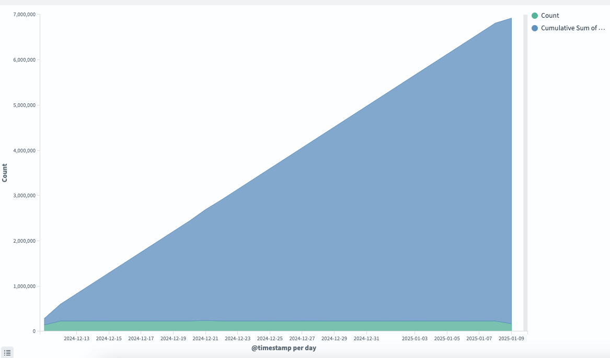
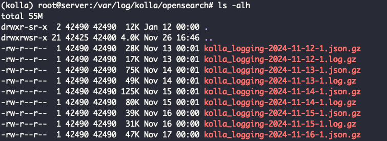
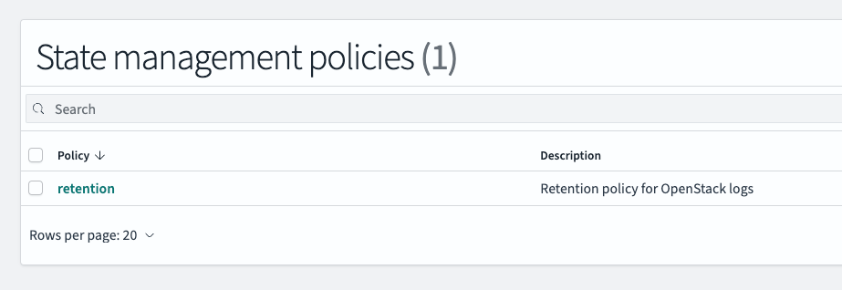

클라우드 로그 관리 사례를 보면서 문득 운영 중인 Openstack 서버에 로그가 얼마나 쌓였는지 궁금해졌습니다. 지금부터 그 과정을 알아가보는 시간을 가지겠습니다.

## Opensearch란?

Elasticsearch 기반 오픈소스 검색 엔진 솔루션입니다. 검색 및 분석을 위한 강력한 도구를 제공하며 기존의 Elasticsearch의 기능을 사용할 수 있습니다.
Elasticsearch가 제품의 라이센스를 변경하면서 Amazon이 기존 프로젝트를 fork하여 OpenSearch를 만들게 되었습니다. [Elasticsearch 측에서 OpenSearch와 Elasticsearch 비교한 글](https://www.elastic.co/kr/elasticsearch/opensearch)이 있으니 참고 바랍니다.

## Opensearch 설치

Kolla-ansible은 Openstack를 구성하기 위한 다양한 배포 도구입니다. Ansible를 활용하여 컨테이너 형태로 컴포넌트를 설치합니다.

> 자세한 사항은 [공식문서](https://docs.openstack.org/kolla-ansible/latest/reference/logging-and-monitoring/central-logging-guide.html)를 참고하길 바랍니다.

기본적으로 중앙 로깅 도구로 Opensearch를 지원해줍니다. `globals.yaml` 에 설정값을 수정하고 다시 배포하면 됩니다.

```yaml
enable_central_logging: "yes"
```

## 시각화

> 인터넷에서 OpenSearch 사용법과 관련된 글을 검색하면 생각보다 검색 결과가 적습니다. 하지만 OpenSearch 대신 Kibana로 검색하면 많은 내용을 확인할 수 있습니다.

로그 데이터를 중심으로 두 개의 그래프를 시각화 할 것입니다.

1. Log Level 분포도
2. 시간에 따른 로그 총 개수

### Log Level 분포도

Log Level 분포도는 다른 의미로 각각의 Log Level의 총 개수를 하나의 그래프에 표현하는 것과 같습니다. 그러므로 Metrics의 집계 기준을`Count`로 잡았습니다.



`log_level.keyword` 용어를 기준으로 그룹화해줍니다.



아래와 같은 분포도를 확인할 수 있습니다.



### 시간에 따른 로그 총 개수

시간 순서대로 집계가 되어야 하면서 매일 생성되는 로그 총합과 누적 로그 총합이 구분되면서 보여야 합니다.
Area Chart로 설정하여 시각화를 수행했습니다.
크게 두 가지가 필요하므로 집계 기준을 Count, Cumulative Sum으로 설정했습니다.



하루 단위로 데이터를 보여줄 수 있도록 Bucket를 설정했습니다.



대략 2주치 로그의 누적 개수를 확인했습니다. 7,000,000개가 넘어가는 것을 보고 많이 놀랐습니다. 저장 공간에 불필요한 로그들이 쌓이는 것 같다는 생각이 들었고 관리 방안을 생각해야 했습니다.



## 로그 관리 방안

### 방향성 잡기

로그는 서버의 로컬 저장소에 저장되기 때문에 저장 용량 관리 측면에서 중요합니다.

Kolla-ansble의 opensearch 로그 파일 경로`/var/log/kolla/opensearch` 를 보면 시간별로 로그 파일이 압축되어 있습니다.



2달치 압축된 로그의 총 용량을 보면 31MB로 상당히 적습니다.

```bash
du -ch *.gz | grep total
```

로그를 보니 Public Cloud의 로그 관리 사례가 생각났습니다.
AWS 경우에는 Object Storage인 S3에 로그를 저장하여 Lifecycle를 관리하기도 합니다.

](image-7.png)

Openstack도 swift라는 Object Storage가 있습니다. SSD로 구성된 로컬 저장소에 로그가 쌓이는 것을 원치 않기 때문에 HDD로 구성된 swift에 로그를 옮기고 싶었습니다.
기본적인 구성으로는 swift에 전송할 수 없으며 추가적인 플러그인 사용을 고려해야 합니다. [그러나 현재까지 공식적으로 swift로 데이터를 전송하는 플러그인은 없는 것 같습니다. ](https://opensearch.org/docs/latest/install-and-configure/plugins/#available-plugins)

그렇다면 보유(retention) 정책을 확인하는 것으로 방향을 잡았습니다.

### State management policies



아래 보유 정책은 크게 3가지 상태가 있습니다.

- open
- close
- delete

이름만 다를 뿐이지 Hot-Warm-Cold 라고 보시면 됩니다.
기본 설정을 보면 open 상태로 로그가 생성되다가 30일 후에 close 상태로 변화하고 60일 후에 delete 상태로 변화가 됩니다.

```yaml
{ "policy": {
      # ...
      "states":
        [
          {
            "name": "open",
            "actions": [],
            "transitions":
              [
                {
                  "state_name": "close",
                  "conditions": { "min_index_age": "30d" },
                },
              ],
          },
          {
            "name": "close",
            "actions":
              [
                {
                  "retry":
                    { "count": 3, "backoff": "exponential", "delay": "1m" },
                  "close": {},
                },
              ],
            "transitions":
              [
                {
                  "state_name": "delete",
                  "conditions": { "min_index_age": "60d" },
                },
              ],
          },
          {
            "name": "delete",
            "actions":
              [
                {
                  "retry":
                    { "count": 3, "backoff": "exponential", "delay": "1m" },
                  "delete": {},
                },
              ],
            "transitions": [],
          },
        ],
    } }
```

**최종적으로 보유 정책을 수정하지 않았습니다.**
로그는 성능 정보에 대한 집계나 디버깅할때 유용합니다. 이때 적절한 과거 데이터를 보관하는 것이 중요하다고 생각합니다. 생각보다 close 상태의 압축된 로그 크기가 작았기 때문에 더욱 줄일 필요는 없었다고 봅니다.

## 마무리

이 글은 취준생일때 작성한 글입니다. 실무에는 어떻게 다룰지는 모르겠습니다.
언젠간 취업하고 나서 잘못된 부분을 확인하면 새로운 글로 찾아오겠습니다.
