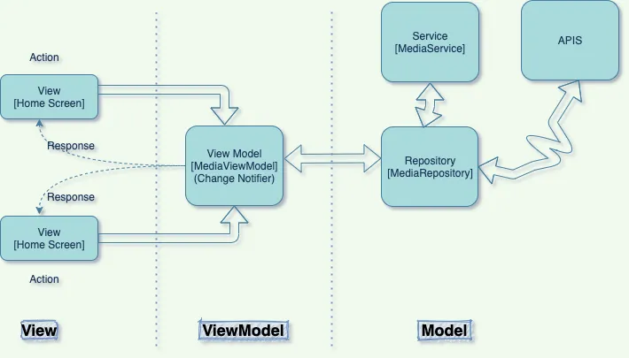

## MVVM 아키텍쳐
- Model, ViewModel, View의 줄임말 
- Model : 애플리케이션의 데이터 및 비즈니스 로직 
- View Model : View에 표시되는 데이터를 관리한다. 상태를 변경시키고 보여주는 로직이 포함되어 있다. 
- View : 애플리케이션의 사용자 인터페이스 

_ 출처 - :  https://medium.com/flutterworld/flutter-mvvm-architecture-f8bed2521958 _

## 상태 관리 도구
위에서 View Model에는 상태를 변경하고 표시해주는 로직이 필요하다고 있다. 이걸 쉽게 해주는 플러터 라이브러리가 있다. 대표적으로 [GetX](https://github.com/jonataslaw/getx), [Provider](https://github.com/rrousselGit/provider), [Riverpod](https://riverpod.dev/docs/introduction/why_riverpod), [bloc](https://bloclibrary.dev/getting-started/)가 있다. 

기술적인 측면에서 본다면 Provider, bloc는 BuildContext를 통해 의존성을 주입한 반면 GetX는 그렇지 않는다. 
GetX가 생산성 측면에서는 더욱 효율적이나 BuildContext를 사용한 의존성 주입의 부재로 예기치 못한 문제가 발생할 수 있다.
RiverPod과 Provider의 개발자는 동일하며, Provider의 단점을 보완하여 Riverpod를 만들었다고 한다. 그래서 전반적인 매커니즘은 비슷하다. [^1]

최종적으로 Riverpod를 선택하게 되었다. 

### BuildContext를 사용한 의존성 주입 
BuildContext는 Flutter가 최상위 위젯 노드부터 하위 노드에게 BuildContext를 전달하면서 그려나간다. 즉, **BuildContext를 통해 최상위 부모 노드를 추적하면서 자신에 대한 여러 정보들을 찾을 수 있다는 것이다.** [^2]

_ 출처 - [라인 블로그, # Flutter 인기 아키텍처 라이브러리 3종 비교 분석 - GetX vs BLoC vs Provider](https://engineering.linecorp.com/ko/blog/flutter-architecture-getx-bloc-provider) 

## 프로젝트 구조 
프로젝트 구조는 총 4개의 폴더로 이뤄져 있다.
- view : 사용자 인터페이스를 나타낸다.
- provider : 상태값을 관리한다. 
- repository : 데이터를 접근하기 위해 사용된다. 서버에 대한 요청도 포함된다. 
- model : 실제로 사용할 데이터를 정의한다. 

### 예시 - TodoPoint Main View
Todopoint는 할일을 마무리하면 포인트를 얻는 앱이다. 그래서 TodoScreen에서 표시되어야 할 상태가 크게 두 가지이다.

- 캘린더에 있는 포인트
- 할일 목록 

사용자 인터페이스로 요청을 보내게 되면, provider를 지나 repository를 활용해 서버와 통신하여 원하는 정보를 얻는다. provider에 상태를 저장(캐싱)하여 다시 사용자에게 보여주도록 구현할 수 있다.  

## Reference
- [Flutter: MVVM Architecture
](https://medium.com/flutterworld/flutter-mvvm-architecture-f8bed2521958)
- [ MVVM Pattern in Flutter 1 -MVVM의 기본 구조](https://velog.io/@mm723/MVVM-Pattern-in-Flutter)
- [라인 블로그, Flutter 인기 아키텍처 라이브러리 3종 비교 분석 - GetX vs BLoC vs Provider](https://engineering.linecorp.com/ko/blog/flutter-architecture-getx-bloc-provider)

[^1]: https://engineering.linecorp.com/ko/blog/flutter-architecture-getx-bloc-provider
[^2]: https://riverpod.dev/docs/from_provider/provider_vs_riverpod#reading-providers-buildcontext